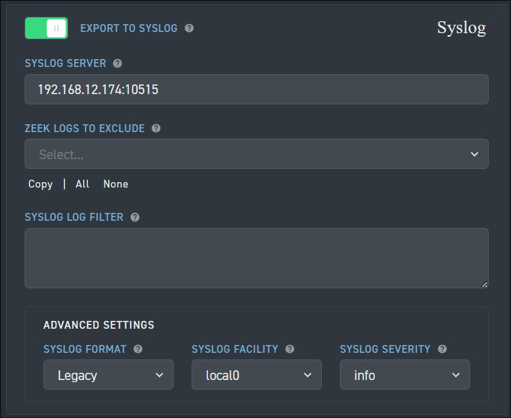

# Collect Corelight Sensor logs

This document describes how you can collect Corelight sensor logs by configuring the Corelight sensor and a Chronicle forwarder. This document also lists the supported log types and this parser supports all Corelight sensors versions from v27.4 and earlier.

For more information, see [Data ingestion to Chronicle](https://cloud.google.com/chronicle/docs/data-ingestion-flow).

## Overview

The following deployment architecture diagram shows how Corelight sensor configured to send logs to  Chronicle . Each customer deployment might differ from this representation and might be more complex.


The architecture diagram shows the following components:

* **Corelight sensor**: The system running the Corelight sensor.

* **The Corelight sensor exporter**: Collects log data from the sensor, and forwards it to the Chronicle forwarder.

* **Chronicle forwarder**: The Chronicle  forwarder is a lightweight software component, deployed in the customer's network, that supports syslog. The Chronicle  forwarder forwards the logs to Chronicle .

*  **Chronicle**: Chronicle  retains and analyzes the logs that the Chronicle sensor.

An ingestion label identifies the parser which normalizes raw log data to structured UDM format. The information in this document applies to the parser with the `CORELIGHT` ingestion label.

## Before you begin

*  Verify the version of your Corelight sensor. The Corelight Chronicle parser was designed for version 27.4 and earlier. Later versions of the Corelight sensor might have additional logs that the parser will not recognize, and those logs might receive limited or no field parsing. However, the log content will still be available in the raw log format in Chronicle.

* Review the parser [Change log for CORELIGHT](https://cloud.google.com/chronicle/docs/ingestion/parser-list/corelight-changelog).

## Configure the Chronicle forwarder

To configure the Chronicle  forwarder, do the following:

1.  Set up a Chronicle forwarder. See [Install and configure the forwarder on Linux](https://cloud.google.com/chronicle/docs/install/forwarder-linux).

2. Configure the Chronicle forwarder to listen for data.

  ```none
    collectors:
      - syslog:
          common:
            enabled: true
            data_type:  CORELIGHT
            data_hint:
            batch_n_seconds: 10
            batch_n_bytes: 1048576
          tcp_address: <Chronicle forwarder listening IP:Port>
          tcp_buffer_size: 524288
          udp_address: <Chronicle forwarder listening IP:Port>
          connection_timeout_sec: 60
  ```

## Configure the Corelight Sensor exporter

1. Log into your Corelight sensor as an adminstrator.
2. Select the **Export** tab.
3. Find and enable **EXPORT TO SYSLOG** option.
4. Under **EXPORT TO SYSLOG**, configure:
   * **SYSLOG SERVER**: Provide the IP and port of the Chronicle forwarder syslog listener.
   * **Advanced Settings: SYSLOG FORMAT**: Change the setting to **Legacy**.
5. Click **Apply Changes**.



## Supported Corelight log types 

The Corelight parser supports the following log types:
 <div class="fixed" translate="no">
  <h4>Log Type</h4>
  <ul>
    <li>conn</li>
    <li>conn_long</li>
    <li>conn_red</li>
    <li>dce_rpc</li>
    <li>dns</li>
    <li>dns_red</li>
    <li>files</li>
    <li>files_red</li>
    <li>http</li>
    <li>http2</li>
    <li>http_red</li>
    <li>intel</li>
    <li>irc</li>
    <li>notice</li>
    <li>rdp</li>
    <li>sip</li>
    <li>smb_files</li>
    <li>smb_mapping</li>
    <li>smtp</li>
    <li>smtp_links</li>
    <li>ssh</li>
    <li>ssl</li>
    <li>ssl_red</li>
    <li>suricata_corelight</li>
    <li>bacnet</li>
    <li>cip</li>
    <li>corelight_burst</li>
    <li>corelight_overall_capture_loss</li>
    <li>corelight_profiling</li>
    <li>datared</li>
    <li>dga</li>
    <li>dhcp</li>
    <li>dnp3</li>
    <li>dpd</li>
    <li>encrypted_dns</li>
    <li>enip</li>
    <li>enip_debug</li>
    <li>enip_list_identity</li>
    <li>etc_viz</li>
    <li>ftp</li>
    <li>generic_dns_tunnels</li>
    <li>generic_icmp_tunnels</li>
    <li>icmp_specific_tunnels</li>
    <li>ipsec</li>
    <li>iso_cotp</li>
    <li>kerberos</li>
    <li>known_certs</li>
    <li>known_devices</li>
    <li>known_domains</li>
    <li>known_hosts</li>
    <li>known_names</li>
    <li>known_remotes</li>
    <li>known_services</li>
    <li>known_users</li>
    <li>ldap</li>
    <li>ldap_search</li>
    <li>local_subnets</li>
    <li>local_subnets_dj</li>
    <li>local_subnets_graphs</li>
    <li>log4shell</li>
    <li>modbus</li>
    <li>mqtt_connect</li>
    <li>mqtt_publish</li>
    <li>mqtt_subscribe</li>
    <li>mysql</li>
    <li>napatech_shunting</li>
    <li>ntlm</li>
    <li>ntp</li>
    <li>pe</li>
    <li>profinet</li>
    <li>profinet_dce_rpc</li>
    <li>profinet_debug</li>
    <li>radius</li>
    <li>reporter</li>
    <li>rfb</li>
    <li>s7comm</li>
    <li>smartpcap</li>
    <li>snmp</li>
    <li>socks</li>
    <li>software</li>
    <li>specific_dns_tunnels</li>
    <li>stepping</li>
    <li>stun</li>
    <li>stun_nat</li>
    <li>suricata_eve</li>
    <li>suricata_stats</li>
    <li>syslog</li>
    <li>tds</li>
    <li>tds_rpc</li>
    <li>tds_sql_batch</li>
    <li>traceroute</li>
    <li>tunnel</li>
    <li>unknown-smartpcap</li>
    <li>vpn</li>
    <li>weird</li>
    <li>weird_red</li>
    <li>wireguard</li>
    <li>x509</li>
    <li>x509_red</li>
  </ul>
</div>

## Field mapping reference

This section explains how the Chronicle  parser maps Corelight fields to Chronicle  Unified Data Model (UDM) fields.
<h3>Field mapping reference: CORELIGHT - Common Fields </h3>

The following table lists common fields of the <code>CORELIGHT</code> log and their corresponding UDM fields.

<div translate="no">
<devsite-filter sortable="0">
<input type="text" placeholder="Type a keyword to find a value.">
<table class="fixed">
<thead>
<tr>
<th>Log field</th>
<th>UDM mapping</th>
<th>Logic</th>
</tr>
</thead>
<tbody class="list">
<tr>
<td></td>
<td><code>metadata.vendor_name</code></td>
<td>The <code>metadata.vendor_name</code> UDM field is set to <code>Corelight</code>.</td>
</tr>
<tr>
<td><code>_path (string)</code></td>
<td><code>metadata.product_event_type</code></td>
<td></td>
</tr>
<tr>
<td><code>_system_name (string)</code></td>
<td><code>observer.hostname</code></td>
<td></td>
</tr>
<tr>
<td><code>ts (time)</code></td>
<td><code>metadata.event_timestamp</code></td>
<td></td>
</tr>
<tr>
<td><code>uid (string)</code></td>
<td><code>about.labels [uid]</code></td>
<td></td>
</tr>
<tr>
<td><code>id.orig_h (string - addr)</code></td>
<td><code>principal.ip</code></td>
<td></td>
</tr>
<tr>
<td><code>id.orig_p (integer - port)</code></td>
<td><code>principal.port</code></td>
<td></td>
</tr>
<tr>
<td><code>id.resp_h (string - addr)</code></td>
<td><code>target.ip</code></td>
<td></td>
</tr>
<tr>
<td><code>id.resp_p (integer - port)</code></td>
<td><code>target.port</code></td>
<td></td>
</tr>
</tbody>
</table>
</devsite-filter>
</div>
<h3>Field mapping reference: CORELIGHT - conn, conn_red, conn_long</h3>

The following table lists the log fields of the <code>conn, conn_red, conn_long</code> log type and their corresponding UDM fields.

<div translate="no">
<devsite-filter sortable="0">
<input type="text" placeholder="Type a keyword to find a value.">
<table class="fixed">
<thead>
<tr>
<th>Log field</th>
<th>UDM mapping</th>
<th>Logic</th>
</tr>
</thead>
<tbody class="list">
<tr>
<td></td>
<td><code>metadata.event_type</code></td>
<td>The <code>metadata.event_type</code> UDM field is set to <code>NETWORK_CONNECTION</code>.</td>
</tr>
<tr>
<td></td>
<td><code>metadata.product_name</code></td>
<td>The <code>metadata.product_name</code> UDM field is set to <code>Zeek</code>.</td>
</tr>
<tr>
<td><code>proto (string - enum)</code></td>
<td><code>network.ip_protocol</code></td>
<td></td>
</tr>
<tr>
<td><code>service (string)</code></td>
<td><code>network.application_protocol</code></td>
<td></td>
</tr>
<tr>
<td><code>duration (number - interval)</code></td>
<td><code>network.session_duration</code></td>
<td></td>
</tr>
<tr>
<td><code>orig_bytes (integer - count)</code></td>
<td><code>network.sent_bytes</code></td>
<td></td>
</tr>
<tr>
<td><code>resp_bytes (integer - count)</code></td>
<td><code>network.received_bytes</code></td>
<td></td>
</tr>
<tr>
<td><code>conn_state (string)</code></td>
<td><code>metadata.description</code></td>
<td>If the <code>conn_state</code> log field value is equal to <code>S0</code>, then the <code>metadata.description</code> UDM field is set to <code>S0: Connection attempt seen, no reply</code>.<br><br>Else, if the <code>conn_state</code> log field value is equal to <code>S1</code>, then the <code>metadata.description</code> UDM field is set to <code>S1: Connection established, not terminated</code>.<br><br>Else, if the <code>conn_state</code> log field value is equal to <code>S2</code>, then the <code>metadata.description</code> UDM field is set to <code>S2: Connection established and close attempt by originator seen (but no reply from responder)</code>.<br><br>Else, if the <code>conn_state</code> log field value is equal to <code>S3</code>, then the <code>metadata.description</code> UDM field is set to <code>S3: Connection established and close attempt by responder seen (but no reply from originator)</code>.<br><br>Else, if the <code>conn_state</code> log field value is equal to <code>SF</code>, then the <code>metadata.description</code> UDM field is set to <code>SF: Normal SYN/FIN completion</code>.<br><br>Else, if the <code>conn_state</code> log field value is equal to <code>REJ</code>, then the <code>metadata.description</code> UDM field is set to <code>REJ: Connection attempt rejected</code>.<br><br>Else, if the <code>conn_state</code> log field value is equal to <code>RSTO</code>, then the <code>metadata.description</code> UDM field is set to <code>RSTO: Connection established, originator aborted (sent a RST)</code>.<br><br>Else, if the <code>conn_state</code> log field value is equal to <code>RSTOS0</code>, then the <code>metadata.description</code> UDM field is set to <code>RSTOS0: Originator sent a SYN followed by a RST, we never saw a SYN-ACK from the responder</code>.<br><br>Else, if the <code>conn_state</code> log field value is equal to <code>RSTOSH</code>, then the <code>metadata.description</code> UDM field is set to <code>RSTOSH: Responder sent a SYN ACK followed by a RST, we never saw a SYN from the (purported) originator</code>.<br><br>Else, if the <code>conn_state</code> log field value is equal to <code>RSTR</code>, then the <code>metadata.description</code> UDM field is set to <code>RSTR: Established, responder aborted</code>.<br><br>Else, if the <code>conn_state</code> log field value is equal to <code>SH</code>, then the <code>metadata.description</code> UDM field is set to <code>SH: Originator sent a SYN followed by a FIN, we never saw a SYN ACK from the responder (hence the connection was "half" open)</code>.<br><br>Else, if the <code>conn_state</code> log field value is equal to <code>SHR</code>, then the <code>metadata.description</code> UDM field is set to <code>SHR: Responder sent a SYN ACK followed by a FIN, we never saw a SYN from the originator</code>.<br><br>Else, if the <code>conn_state</code> log field value is equal to <code>OTH</code>, then the <code>metadata.description</code> UDM field is set to <code>OTH: No SYN seen, just midstream traffic (a partial connection that was not later closed)</code>.</td>
</tr>
<tr>
<td><code>local_orig (boolean - bool)</code></td>
<td><code>about.labels [local_orig]</code></td>
<td></td>
</tr>
<tr>
<td><code>local_resp (boolean - bool)</code></td>
<td><code>about.labels [local_resp]</code></td>
<td></td>
</tr>
<tr>
<td><code>missed_bytes (integer - count)</code></td>
<td><code>about.labels [missed_bytes]</code></td>
<td></td>
</tr>
<tr>
<td><code>history (string)</code></td>
<td><code>about.labels [history]</code></td>
<td></td>
</tr>
<tr>
<td><code>orig_pkts (integer - count)</code></td>
<td><code>network.sent_packets</code></td>
<td></td>
</tr>
<tr>
<td><code>orig_ip_bytes (integer - count)</code></td>
<td><code>principal.labels [orig_ip_bytes]</code></td>
<td></td>
</tr>
<tr>
<td><code>resp_pkts (integer - count)</code></td>
<td><code>network.received_packets</code></td>
<td></td>
</tr>
<tr>
<td><code>resp_ip_bytes (integer - count)</code></td>
<td><code>target.labels [resp_ip_bytes]</code></td>
<td></td>
</tr>
<tr>
<td><code>tunnel_parents (array[string] - set[string])</code></td>
<td><code>intermediary.labels [tunnel_parent]</code></td>
<td></td>
</tr>
<tr>
<td><code>orig_cc (string)</code></td>
<td><code>principal.ip_geo_artifact.location.country_or_region</code></td>
<td></td>
</tr>
<tr>
<td><code>resp_cc (string)</code></td>
<td><code>target.ip_geo_artifact.location.country_or_region</code></td>
<td></td>
</tr>
<tr>
<td><code>suri_ids (array[string] - set[string])</code></td>
<td><code>security_result.rule_id</code></td>
<td></td>
</tr>
<tr>
<td><code>spcap.url (string)</code></td>
<td><code>security_result.url_back_to_product</code></td>
<td></td>
</tr>
<tr>
<td><code>spcap.rule (integer - count)</code></td>
<td><code>security_result.rule_labels [spcap_rule]</code></td>
<td></td>
</tr>
<tr>
<td><code>spcap.trigger (string)</code></td>
<td><code>security_result.detection_fields [spcap_trigger]</code></td>
<td></td>
</tr>
<tr>
<td><code>app (array[string] - vector of string)</code></td>
<td><code>about.application</code></td>
<td></td>
</tr>
<tr>
<td><code>corelight_shunted (boolean - bool)</code></td>
<td><code>about.labels [corelight_shunted]</code></td>
<td></td>
</tr>
<tr>
<td><code>orig_shunted_pkts (integer - count)</code></td>
<td><code>principal.labels [orig_shunted_pkts]</code></td>
<td></td>
</tr>
<tr>
<td><code>orig_shunted_bytes (integer - count)</code></td>
<td><code>principal.labels [orig_shunted_bytes]</code></td>
<td></td>
</tr>
<tr>
<td><code>resp_shunted_pkts (integer - count)</code></td>
<td><code>target.labels [resp_shunted_pkts]</code></td>
<td></td>
</tr>
<tr>
<td><code>resp_shunted_bytes (integer - count)</code></td>
<td><code>target.labels [resp_shunted_bytes]</code></td>
<td></td>
</tr>
<tr>
<td><code>orig_l2_addr (string)</code></td>
<td><code>principal.mac</code></td>
<td></td>
</tr>
<tr>
<td><code>resp_l2_addr (string)</code></td>
<td><code>target.mac</code></td>
<td></td>
</tr>
<tr>
<td><code>id_orig_h_n.src (string)</code></td>
<td><code>principal.labels [id_orig_h_n_src]</code></td>
<td></td>
</tr>
<tr>
<td><code>id_orig_h_n.vals (array[string] - set[string])</code></td>
<td><code>principal.labels [id_orig_h_n_val]</code></td>
<td></td>
</tr>
<tr>
<td><code>id_resp_h_n.src (string)</code></td>
<td><code>target.labels [id_resp_h_n_src]</code></td>
<td></td>
</tr>
<tr>
<td><code>id_resp_h_n.vals (array[string] - set[string])</code></td>
<td><code>target.labels [id_resp_h_n_val]</code></td>
<td></td>
</tr>
<tr>
<td><code>vlan (integer - int)</code></td>
<td><code>intermediary.labels [vlan]</code></td>
<td></td>
</tr>
<tr>
<td><code>inner_vlan (integer - int)</code></td>
<td><code>intermediary.labels [inner_vlan]</code></td>
<td></td>
</tr>
<tr>
<td><code>community_id (string)</code></td>
<td><code>network.community_id</code></td>
<td></td>
</tr>
<tr>
<td></td>
<td><code>security_result.severity</code></td>
<td>The <code>security_result.severity</code> UDM field is set to <code>INFORMATIONAL</code>.</td>
</tr>
</tbody>
</table>
</devsite-filter>
</div>
<h3>Field mapping reference: CORELIGHT - dce_rpc</h3>

The following table lists the log fields of the <code>dce_rpc</code> log type and their corresponding UDM fields.

<div translate="no">
<devsite-filter sortable="0">
<input type="text" placeholder="Type a keyword to find a value.">
<table class="fixed">
<thead>
<tr>
<th>Log field</th>
<th>UDM mapping</th>
<th>Logic</th>
</tr>
</thead>
<tbody class="list">
<tr>
<td></td>
<td><code>metadata.event_type</code></td>
<td>The <code>metadata.event_type</code> UDM field is set to <code>NETWORK_CONNECTION</code>.</td>
</tr>
<tr>
<td></td>
<td><code>metadata.product_name</code></td>
<td>The <code>metadata.product_name</code> UDM field is set to <code>Zeek</code>.</td>
</tr>
<tr>
<td><code>rtt (number - interval)</code></td>
<td><code>network.session_duration</code></td>
<td></td>
</tr>
<tr>
<td><code>named_pipe (string)</code></td>
<td><code>intermediary.resource.name</code></td>
<td></td>
</tr>
<tr>
<td></td>
<td><code>intermediary.resource.resource_type</code></td>
<td>If the <code>named_pipe</code> log field value is <em>not</em> empty, then the <code>intermediary.resource.resource_type</code> UDM field is set to <code>PIPE</code>.</td>
</tr>
<tr>
<td><code>endpoint (string)</code></td>
<td><code>target.labels [endpoint]</code></td>
<td></td>
</tr>
<tr>
<td><code>operation (string)</code></td>
<td><code>target.labels [operation]</code></td>
<td></td>
</tr>
<tr>
<td></td>
<td><code>network.application_protocol</code></td>
<td>The <code>network.application_protocol</code> UDM field is set to <code>DCERPC</code>.</td>
</tr>
<tr>
<td></td>
<td><code>security_result.severity</code></td>
<td>The <code>security_result.severity</code> UDM field is set to <code>INFORMATIONAL</code>.</td>
</tr>
<tr>
<td><code>operation, endpoint, named_pipe (string)</code></td>
<td><code>metadata.description</code></td>
<td>The <code>metadata.description</code> UDM field is set with <code>operation</code>, <code>endpoint</code>, <code>named_pipe</code> log fields as "operation <code>operation</code> on <code>endpoint</code> using named pipe <code>named_pipe</code>".</td>
</tr>
<tr>
<td></td>
<td><code>network.ip_protocol</code></td>
<td>The <code>network.ip_protocol</code> UDM field is set to <code>TCP</code>.</td>
</tr>
</tbody>
</table>
</devsite-filter>
</div>
<h3>Field mapping reference: CORELIGHT - dns, dns_red</h3>

The following table lists the log fields of the <code>dns, dns_red</code> log type and their corresponding UDM fields.

<div translate="no">
<devsite-filter sortable="0">
<input type="text" placeholder="Type a keyword to find a value.">
<table class="fixed">
<thead>
<tr>
<th>Log field</th>
<th>UDM mapping</th>
<th>Logic</th>
</tr>
</thead>
<tbody class="list">
<tr>
<td></td>
<td><code>metadata.product_name</code></td>
<td>The <code>metadata.product_name</code> UDM field is set to <code>Zeek</code>.</td>
</tr>
<tr>
<td></td>
<td><code>metadata.event_type</code></td>
<td>The <code>metadata.event_type</code> UDM field is set to <code>NETWORK_DNS</code>.</td>
</tr>
<tr>
<td></td>
<td><code>network.application_protocol</code></td>
<td>The <code>network.application_protocol</code> UDM field is set to <code>DNS</code>.</td>
</tr>
<tr>
<td><code>proto (string - enum)</code></td>
<td><code>network.ip_protocol</code></td>
<td></td>
</tr>
<tr>
<td><code>trans_id (integer - count)</code></td>
<td><code>network.dns.id</code></td>
<td></td>
</tr>
<tr>
<td><code>rtt (number - interval)</code></td>
<td><code>network.session_duration</code></td>
<td></td>
</tr>
<tr>
<td><code>query (string)</code></td>
<td><code>network.dns.questions.name</code></td>
<td></td>
</tr>
<tr>
<td><code>qclass (integer - count)</code></td>
<td><code>network.dns.questions.class</code></td>
<td></td>
</tr>
<tr>
<td><code>qclass_name (string)</code></td>
<td><code>about.labels [qclass_name]</code></td>
<td></td>
</tr>
<tr>
<td><code>qtype (integer - count)</code></td>
<td><code>network.dns.questions.type</code></td>
<td></td>
</tr>
<tr>
<td><code>qtype_name (string)</code></td>
<td><code>about.labels [qtype_name]</code></td>
<td></td>
</tr>
<tr>
<td><code>rcode (integer - count)</code></td>
<td><code>network.dns.response_code</code></td>
<td></td>
</tr>
<tr>
<td><code>rcode_name (string)</code></td>
<td><code>about.labels [rcode_name]</code></td>
<td></td>
</tr>
<tr>
<td><code>AA (boolean - bool)</code></td>
<td><code>network.dns.authoritative</code></td>
<td></td>
</tr>
<tr>
<td><code>TC (boolean - bool)</code></td>
<td><code>network.dns.truncated</code></td>
<td></td>
</tr>
<tr>
<td><code>RD (boolean - bool)</code></td>
<td><code>network.dns.recursion_desired</code></td>
<td></td>
</tr>
<tr>
<td><code>RA (boolean - bool)</code></td>
<td><code>network.dns.recursion_available</code></td>
<td></td>
</tr>
<tr>
<td><code>Z (integer - count)</code></td>
<td><code>about.labels [Z]</code></td>
<td></td>
</tr>
<tr>
<td><code>answers (array[string] - vector of string)</code></td>
<td><code>network.dns.answers.name</code></td>
<td></td>
</tr>
<tr>
<td><code>TTLs (array[number] - vector of interval)</code></td>
<td><code>network.dns.answers.ttl</code></td>
<td></td>
</tr>
<tr>
<td><code>rejected (boolean - bool)</code></td>
<td><code>network.dns.response</code></td>
<td></td>
</tr>
<tr>
<td><code>is_trusted_domain (string)</code></td>
<td><code>about.labels [is_trusted_domain]</code></td>
<td></td>
</tr>
<tr>
<td><code>icann_host_subdomain (string)</code></td>
<td><code>about.labels [icann_host_subdomain]</code></td>
<td></td>
</tr>
<tr>
<td><code>icann_domain (string)</code></td>
<td><code>network.dns_domain</code></td>
<td></td>
</tr>
<tr>
<td><code>icann_tld (string)</code></td>
<td><code>about.labels [icann_tld]</code></td>
<td></td>
</tr>
<tr>
<td><code>num (integer - count)</code></td>
<td><code>security_result.detection_fields [num]</code></td>
<td></td>
</tr>
</tbody>
</table>
</devsite-filter>
</div>
<h3>Field mapping reference: CORELIGHT - http, http_red, http2</h3>

The following table lists the log fields of the <code>http, http_red, http2</code> log type and their corresponding UDM fields.

<div translate="no">
<devsite-filter sortable="0">
<input type="text" placeholder="Type a keyword to find a value.">
<table class="fixed">
<thead>
<tr>
<th>Log field</th>
<th>UDM mapping</th>
<th>Logic</th>
</tr>
</thead>
<tbody class="list">
<tr>
<td></td>
<td><code>metadata.event_type</code></td>
<td>The <code>metadata.event_type</code> UDM field is set to <code>NETWORK_HTTP</code>.</td>
</tr>
<tr>
<td></td>
<td><code>metadata.product_name</code></td>
<td>The <code>metadata.product_name</code> UDM field is set to <code>Zeek</code>.</td>
</tr>
<tr>
<td><code>trans_depth (integer - count)</code></td>
<td><code>about.labels [trans_depth]</code></td>
<td></td>
</tr>
<tr>
<td><code>method (string)</code></td>
<td><code>network.http.method</code></td>
<td></td>
</tr>
<tr>
<td><code>host (string)</code></td>
<td><code>target.hostname</code></td>
<td></td>
</tr>
<tr>
<td><code>uri (string)</code></td>
<td><code>target.url</code></td>
<td></td>
</tr>
<tr>
<td><code>referrer (string)</code></td>
<td><code>network.http.referral_url</code></td>
<td></td>
</tr>
<tr>
<td><code>version (string)</code></td>
<td><code>network.application_protocol_version</code></td>
<td></td>
</tr>
<tr>
<td><code>user_agent (string)</code></td>
<td><code>network.http.user_agent</code></td>
<td></td>
</tr>
<tr>
<td><code>origin (string)</code></td>
<td><code>principal.hostname</code></td>
<td></td>
</tr>
<tr>
<td><code>request_body_len (integer - count)</code></td>
<td><code>network.sent_bytes</code></td>
<td></td>
</tr>
<tr>
<td><code>response_body_len (integer - count)</code></td>
<td><code>network.received_bytes</code></td>
<td></td>
</tr>
<tr>
<td><code>status_code (integer - count)</code></td>
<td><code>network.http.response_code</code></td>
<td></td>
</tr>
<tr>
<td><code>status_msg (string)</code></td>
<td><code>about.labels [status_msg]</code></td>
<td></td>
</tr>
<tr>
<td><code>info_code (integer - count)</code></td>
<td><code>about.labels [info_code]</code></td>
<td></td>
</tr>
<tr>
<td><code>info_msg (string)</code></td>
<td><code>about.labels [info_msg]</code></td>
<td></td>
</tr>
<tr>
<td><code>tags (array[string] - set[enum])</code></td>
<td><code>about.labels [tags]</code></td>
<td></td>
</tr>
<tr>
<td><code>username (string)</code></td>
<td><code>principal.user.user_display_name</code></td>
<td></td>
</tr>
<tr>
<td><code>password (string)</code></td>
<td><code>extensions.auth.auth_details</code></td>
<td></td>
</tr>
<tr>
<td><code>proxied (array[string] - set[string])</code></td>
<td><code>intermediary.hostname</code></td>
<td></td>
</tr>
<tr>
<td><code>orig_fuids (array[string] - vector of string)</code></td>
<td><code>about.labels [orig_fuid]</code></td>
<td></td>
</tr>
<tr>
<td><code>orig_filenames (array[string] - vector of string)</code></td>
<td><code>src.file.names</code></td>
<td>The <code>orig_filenames</code> log field is mapped to <code>src.file.names</code> UDM field when index value in <code>orig_filenames</code> is equal to <code>0</code>. <br><br>For every other index value, <code>orig_filenames</code> log field is mapped to the <code>about.file.names</code>.
</td>
</tr>
<tr>
<td><code>orig_mime_types (array[string] - vector of string)</code></td>
<td><code>src.file.mime_type</code></td>
<td>The <code>orig_mime_types</code> log field is mapped to <code>src.file.mime_type</code> UDM field when index value in <code>orig_mime_types</code> is equal to <code>0</code>. <br><br>For every other index value, <code>orig_mime_types</code> log field is mapped to the <code>about.file.mime_type</code>.
</td>
</tr>
<tr>
<td><code>resp_fuids (array[string] - vector of string)</code></td>
<td><code>about.labels [resp_fuid]</code></td>
<td></td>
</tr>
<tr>
<td><code>resp_filenames (array[string] - vector of string)</code></td>
<td><code>target.file.names</code></td>
<td>The <code>resp_filenames</code> log field is mapped to <code>target.file.names</code> UDM field when index value in <code>resp_filenames</code> is equal to <code>0</code>. <br><br>For every other index value, <code>resp_filenames</code> log field is mapped to the <code>about.file.names</code>.
</td>
</tr>
<tr>
<td><code>resp_mime_types (array[string] - vector of string)</code></td>
<td><code>target.file.mime_type</code></td>
<td>The <code>resp_mime_types</code> log field is mapped to <code>target.file.mime_type</code> UDM field when index value in <code>resp_mime_types</code> is equal to <code>0</code>. <br><br>For every other index value, <code>resp_mime_types</code> log field is mapped to the <code>about.file.mime_type</code>.
</td>
</tr>
<tr>
<td><code>post_body (string)</code></td>
<td><code>about.labels [post_body]</code></td>
<td></td>
</tr>
<tr>
<td><code>stream_id (integer - count)</code></td>
<td><code>about.labels [stream_id]</code></td>
<td></td>
</tr>
<tr>
<td><code>encoding (string)</code></td>
<td><code>about.labels [encoding]</code></td>
<td></td>
</tr>
<tr>
<td><code>push (boolean - bool)</code></td>
<td><code>about.labels [push]</code></td>
<td></td>
</tr>
</tbody>
</table>
</devsite-filter>
</div>
<h3>Field mapping reference: CORELIGHT - smtp_links</h3>

The following table lists the log fields of the <code>smtp_links</code> log type and their corresponding UDM fields.

<div translate="no">
<devsite-filter sortable="0">
<input type="text" placeholder="Type a keyword to find a value.">
<table class="fixed">
<thead>
<tr>
<th>Log field</th>
<th>UDM mapping</th>
<th>Logic</th>
</tr>
</thead>
<tbody class="list">
<tr>
<td></td>
<td><code>metadata.event_type</code></td>
<td>The <code>metadata.event_type</code> UDM field is set to <code>NETWORK_SMTP</code>.</td>
</tr>
<tr>
<td></td>
<td><code>metadata.product_name</code></td>
<td>The <code>metadata.product_name</code> UDM field is set to <code>Zeek</code>.</td>
</tr>
<tr>
<td></td>
<td><code>network.application_protocol</code></td>
<td>The <code>network.application_protocol</code> UDM field is set to <code>SMTP</code>.</td>
</tr>
<tr>
<td><code>fuid (string)</code></td>
<td><code>about.labels [fuid]</code></td>
<td></td>
</tr>
<tr>
<td><code>link (string)</code></td>
<td><code>about.url</code></td>
<td></td>
</tr>
<tr>
<td><code>domain (string)</code></td>
<td><code>about.domain.name</code></td>
<td></td>
</tr>
</tbody>
</table>
</devsite-filter>
</div>
<h3>Field mapping reference: CORELIGHT - irc</h3>

The following table lists the log fields of the <code>irc</code> log type and their corresponding UDM fields.

<div translate="no">
<devsite-filter sortable="0">
<input type="text" placeholder="Type a keyword to find a value.">
<table class="fixed">
<thead>
<tr>
<th>Log field</th>
<th>UDM mapping</th>
<th>Logic</th>
</tr>
</thead>
<tbody class="list">
<tr>
<td></td>
<td><code>metadata.event_type</code></td>
<td>The <code>metadata.event_type</code> UDM field is set to <code>NETWORK_UNCATEGORIZED</code>.</td>
</tr>
<tr>
<td></td>
<td><code>metadata.product_name</code></td>
<td>The <code>metadata.product_name</code> UDM field is set to <code>Zeek</code>.</td>
</tr>
<tr>
<td><code>nick (string)</code></td>
<td><code>principal.user.user_display_name</code></td>
<td></td>
</tr>
<tr>
<td><code>user (string)</code></td>
<td><code>principal.user.userid</code></td>
<td>If the <code>user</code> log field value is less than or equal to 255, then the <code>user</code> log field is mapped to the <code>principal.user.userid</code> UDM field.<br><br>Else, the <code>user</code> log field is mapped to the <code>about.labels</code> UDM field.</td>
</tr>
<tr>
<td><code>command, value, addl</code></td>
<td><code>principal.process.command_line</code></td>
<td></td>
</tr>
<tr>
<td><code>dcc_file_name (string)</code></td>
<td><code>src.file.names</code></td>
<td></td>
</tr>
<tr>
<td><code>dcc_file_size (integer - count)</code></td>
<td><code>src.file.size</code></td>
<td></td>
</tr>
<tr>
<td><code>dcc_mime_type (string)</code></td>
<td><code>src.file.mime_type</code></td>
<td></td>
</tr>
<tr>
<td><code>fuid (string)</code></td>
<td><code>about.labels [fuid]</code></td>
<td></td>
</tr>
</tbody>
</table>
</devsite-filter>
</div>
<h3>Field mapping reference: CORELIGHT - files, files_red</h3>

The following table lists the log fields of the <code>files, files_red</code> log type and their corresponding UDM fields.

<div translate="no">
<devsite-filter sortable="0">
<input type="text" placeholder="Type a keyword to find a value.">
<table class="fixed">
<thead>
<tr>
<th>Log field</th>
<th>UDM mapping</th>
<th>Logic</th>
</tr>
</thead>
<tbody class="list">
<tr>
<td></td>
<td><code>metadata.event_type</code></td>
<td>The <code>metadata.event_type</code> UDM field is set to <code>NETWORK_UNCATEGORIZED</code>.</td>
</tr>
<tr>
<td></td>
<td><code>metadata.product_name</code></td>
<td>The <code>metadata.product_name</code> UDM field is set to <code>Zeek</code>.</td>
</tr>
<tr>
<td><code>fuid (string)</code></td>
<td><code>about.labels [fuid]</code></td>
<td></td>
</tr>
<tr>
<td><code>tx_hosts (array[string] - set[addr])</code></td>
<td><code>principal.ip</code></td>
<td></td>
</tr>
<tr>
<td><code>rx_hosts (array[string] - set[addr])</code></td>
<td><code>target.ip</code></td>
<td></td>
</tr>
<tr>
<td><code>conn_uids (array[string] - set[string])</code></td>
<td><code>about.labels [conn_uid]</code></td>
<td></td>
</tr>
<tr>
<td><code>source (string)</code></td>
<td><code>about.labels [source]</code></td>
<td></td>
</tr>
<tr>
<td><code>depth (integer - count)</code></td>
<td><code>about.labels [depth]</code></td>
<td></td>
</tr>
<tr>
<td><code>analyzers (array[string] - set[string])</code></td>
<td><code>about.labels [analyzer]</code></td>
<td></td>
</tr>
<tr>
<td><code>mime_type (string)</code></td>
<td><code>about.file.mime_type</code></td>
<td></td>
</tr>
<tr>
<td><code>filename (string)</code></td>
<td><code>about.file.names</code></td>
<td></td>
</tr>
<tr>
<td><code>duration (number - interval)</code></td>
<td><code>about.labels [duration]</code></td>
<td></td>
</tr>
<tr>
<td><code>local_orig (boolean - bool)</code></td>
<td><code>about.labels [local_orig]</code></td>
<td></td>
</tr>
<tr>
<td><code>is_orig (boolean - bool)</code></td>
<td><code>about.labels [is_orig]</code></td>
<td></td>
</tr>
<tr>
<td><code>seen_bytes (integer - count)</code></td>
<td><code>about.file.size</code></td>
<td></td>
</tr>
<tr>
<td><code>total_bytes (integer - count)</code></td>
<td><code>about.labels [total_bytes]</code></td>
<td></td>
</tr>
<tr>
<td><code>missing_bytes (integer - count)</code></td>
<td><code>about.labels [missing_bytes]</code></td>
<td></td>
</tr>
<tr>
<td><code>overflow_bytes (integer - count)</code></td>
<td><code>about.labels [overflow_bytes]</code></td>
<td></td>
</tr>
<tr>
<td><code>timedout (boolean - bool)</code></td>
<td><code>about.labels [timedout]</code></td>
<td></td>
</tr>
<tr>
<td><code>parent_fuid (string)</code></td>
<td><code>about.labels [parent_fuid]</code></td>
<td></td>
</tr>
<tr>
<td><code>md5 (string)</code></td>
<td><code>about.file.md5</code></td>
<td></td>
</tr>
<tr>
<td><code>sha1 (string)</code></td>
<td><code>about.file.sha1</code></td>
<td></td>
</tr>
<tr>
<td><code>sha256 (string)</code></td>
<td><code>about.file.sha256</code></td>
<td></td>
</tr>
<tr>
<td><code>extracted (array[string] - set[string])</code></td>
<td><code>about.file.names</code></td>
<td></td>
</tr>
<tr>
<td><code>extracted_cutoff (boolean - bool)</code></td>
<td><code>about.labels [extracted_cutoff]</code></td>
<td></td>
</tr>
<tr>
<td><code>extracted_size (integer - count)</code></td>
<td><code>about.labels [extracted_size]</code></td>
<td></td>
</tr>
<tr>
<td><code>num (integer - count)</code></td>
<td><code>about.labels [num]</code></td>
<td></td>
</tr>
</tbody>
</table>
</devsite-filter>
</div>
<h3>Field mapping reference: CORELIGHT - notice</h3>

The following table lists the log fields of the <code>notice</code> log type and their corresponding UDM fields.

<div translate="no">
<devsite-filter sortable="0">
<input type="text" placeholder="Type a keyword to find a value.">
<table class="fixed">
<thead>
<tr>
<th>Log field</th>
<th>UDM mapping</th>
<th>Logic</th>
</tr>
</thead>
<tbody class="list">
<tr>
<td></td>
<td><code>metadata.event_type</code></td>
<td>The <code>metadata.event_type</code> UDM field is set to <code>NETWORK_UNCATEGORIZED</code>.</td>
</tr>
<tr>
<td></td>
<td><code>metadata.product_name</code></td>
<td>The <code>metadata.product_name</code> UDM field is set to <code>Zeek</code>.</td>
</tr>
<tr>
<td><code>fuid (string)</code></td>
<td><code>about.labels [fuid]</code></td>
<td></td>
</tr>
<tr>
<td><code>file_mime_type (string)</code></td>
<td><code>target.file.mime_type</code></td>
<td></td>
</tr>
<tr>
<td><code>file_desc (string)</code></td>
<td><code>about.labels [file_desc]</code></td>
<td></td>
</tr>
<tr>
<td><code>proto (string - enum)</code></td>
<td><code>network.ip_protocol</code></td>
<td></td>
</tr>
<tr>
<td><code>note (string - enum)</code></td>
<td><code>security_result.description</code></td>
<td></td>
</tr>
<tr>
<td><code>msg (string)</code></td>
<td><code>metadata.description</code></td>
<td></td>
</tr>
<tr>
<td><code>sub (string)</code></td>
<td><code>about.labels [sub]</code></td>
<td></td>
</tr>
<tr>
<td><code>src (string - addr)</code></td>
<td><code>principal.ip</code></td>
<td></td>
</tr>
<tr>
<td><code>dst (string - addr)</code></td>
<td><code>target.ip</code></td>
<td></td>
</tr>
<tr>
<td><code>p (integer - port)</code></td>
<td><code>about.port</code></td>
<td></td>
</tr>
<tr>
<td><code>n (integer - count)</code></td>
<td><code>about.labels [n]</code></td>
<td></td>
</tr>
<tr>
<td><code>peer_descr (string)</code></td>
<td><code>about.labels [peer_descr]</code></td>
<td></td>
</tr>
<tr>
<td></td>
<td><code>security_result.action </code></td>
<td>The <code>security_result.action</code> UDM field is set to <code>ALLOW</code>.</td>
</tr>
<tr>
<td><code>actions (array[string] - set[enum])</code></td>
<td><code>security_result.action_details</code></td>
<td></td>
</tr>
<tr>
<td><code>suppress_for (number - interval)</code></td>
<td><code>about.labels [suppress_for]</code></td>
<td></td>
</tr>
<tr>
<td><code>remote_location.country_code (string)</code></td>
<td><code>about.location.country_or_region</code></td>
<td>The <code>about.location.country_or_region</code> UDM field is set with <code>remote_location.country_code</code>, <code>remote_location.region</code> log fields as "<code>remote_location.country_code</code>: <code>remote_location.region</code>".</td>
</tr>
<tr>
<td><code>remote_location.region (string)</code></td>
<td><code>about.location.country_or_region</code></td>
<td>The <code>about.location.country_or_region</code> UDM field is set with <code>remote_location.country_code</code>, <code>remote_location.region</code> log fields as "<code>remote_location.country_code</code>: <code>remote_location.region</code>".</td>
</tr>
<tr>
<td><code>remote_location.city (string)</code></td>
<td><code>about.location.city</code></td>
<td></td>
</tr>
<tr>
<td><code>remote_location.latitude (number - double)</code></td>
<td><code>about.location.region_coordinates.latitude</code></td>
<td></td>
</tr>
<tr>
<td><code>remote_location.longitude (number - double)</code></td>
<td><code>about.location.region_coordinates.longitude</code></td>
<td></td>
</tr>
<tr>
<td></td>
<td><code>security_result.severity</code></td>
<td>The <code>security_result.severity</code> UDM field is set to <code>INFORMATIONAL</code>.</td>
</tr>
</tbody>
</table>
</devsite-filter>
</div>
<h3>Field mapping reference: CORELIGHT - smb_files</h3>

The following table lists the log fields of the <code>smb_files</code> log type and their corresponding UDM fields.

<div translate="no">
<devsite-filter sortable="0">
<input type="text" placeholder="Type a keyword to find a value.">
<table class="fixed">
<thead>
<tr>
<th>Log field</th>
<th>UDM mapping</th>
<th>Logic</th>
</tr>
</thead>
<tbody class="list">
<tr>
<td></td>
<td><code>metadata.event_type</code></td>
<td>If the <code>action</code> log field value is equal to <code>SMB::FILE_READ</code>, then the <code>metadata.event_type</code> UDM field is set to <code>FILE_READ</code>.<br><br>Else, if the <code>action</code> log field value is equal to <code>SMB::FILE_WRITE</code>, then the <code>metadata.event_type</code> UDM field is set to <code>FILE_MODIFICATION</code>.<br><br>Else, if the <code>action</code> log field value is equal to <code>SMB::FILE_OPEN</code>, then the <code>metadata.event_type</code> UDM field is set to <code>FILE_OPEN</code>.<br><br>Else, if the <code>action</code> log field value is equal to <code>SMB::FILE_CLOSE</code>, then the <code>metadata.event_type</code> UDM field is set to <code>FILE_UNCATEGORIZED</code>.<br><br>Else, if the <code>action</code> log field value is equal to <code>SMB::FILE_DELETE</code>, then the <code>metadata.event_type</code> UDM field is set to <code>FILE_DELETION</code>.<br><br>Else, if the <code>action</code> log field value is equal to <code>SMB::FILE_RENAME</code>, then the <code>metadata.event_type</code> UDM field is set to <code>FILE_MOVE</code>.<br><br>Else, if the <code>action</code> log field value is equal to <code>SMB::FILE_SET_ATTRIBUTE</code>, then the <code>metadata.event_type</code> UDM field is set to <code>FILE_UNCATEGORIZED</code>.<br><br>Else, the <code>metadata.event_type</code> UDM field is set to <code>FILE_UNCATEGORIZED</code>.</td>
</tr>
<tr>
<td></td>
<td><code>metadata.product_name</code></td>
<td>The <code>metadata.product_name</code> UDM field is set to <code>Zeek</code>.</td>
</tr>
<tr>
<td></td>
<td><code>network.application_protocol</code></td>
<td>The <code>network.application_protocol</code> UDM field is set to <code>SMB</code>.</td>
</tr>
<tr>
<td></td>
<td><code>network.ip_protocol</code></td>
<td>The <code>network.ip_protocol</code> UDM field is set to <code>TCP</code>.</td>
</tr>
<tr>
<td><code>action, name</code></td>
<td><code>metadata.description</code></td>
<td>The <code>metadata.description</code> UDM field is set with <code>action</code>, <code>name</code> log fields as "action: <code>action</code> on: <code>name</code>".</td>
</tr>
<tr>
<td></td>
<td><code>security_result.severity</code></td>
<td>The <code>security_result.severity</code> UDM field is set to <code>INFORMATIONAL</code>.</td>
</tr>
<tr>
<td></td>
<td><code>security_result.action</code></td>
<td>The <code>security_result.action</code> UDM field is set to <code>ALLOW</code>.</td>
</tr>
<tr>
<td><code>fuid (string)</code></td>
<td><code>about.labels [fuid]</code></td>
<td></td>
</tr>
<tr>
<td><code>action (string - enum)</code></td>
<td><code>target.labels [action]</code></td>
<td></td>
</tr>
<tr>
<td><code>path (string)</code></td>
<td><code>target.file.full_path</code></td>
<td></td>
</tr>
<tr>
<td><code>name (string)</code></td>
<td><code>target.file.names</code></td>
<td></td>
</tr>
<tr>
<td><code>size (integer - count)</code></td>
<td><code>target.file.size</code></td>
<td></td>
</tr>
<tr>
<td><code>prev_name (string)</code></td>
<td><code>src.file.names</code></td>
<td></td>
</tr>
<tr>
<td><code>times.modified (time)</code></td>
<td><code>target.file.last_modification_time</code></td>
<td></td>
</tr>
<tr>
<td><code>times.accessed (time)</code></td>
<td><code>target.file.last_seen_time</code></td>
<td></td>
</tr>
<tr>
<td><code>times.created (time)</code></td>
<td><code>target.file.first_seen_time</code></td>
<td></td>
</tr>
<tr>
<td><code>times.changed (time)</code></td>
<td><code>target.labels [times_changed]</code></td>
<td></td>
</tr>
<tr>
<td><code>data_offset_req (integer - count)</code></td>
<td><code>target.labels [data_offset_req]</code></td>
<td></td>
</tr>
<tr>
<td><code>data_len_req (integer - count)</code></td>
<td><code>target.labels [data_len_req]</code></td>
<td></td>
</tr>
<tr>
<td><code>data_len_rsp (integer - count)</code></td>
<td><code>target.labels [data_len_rsp]</code></td>
<td></td>
</tr>
</tbody>
</table>
</devsite-filter>
</div>
<h3>Field mapping reference: CORELIGHT - smb_mapping</h3>

The following table lists the log fields of the <code>smb_mapping</code> log type and their corresponding UDM fields.

<div translate="no">
<devsite-filter sortable="0">
<input type="text" placeholder="Type a keyword to find a value.">
<table class="fixed">
<thead>
<tr>
<th>Log field</th>
<th>UDM mapping</th>
<th>Logic</th>
</tr>
</thead>
<tbody class="list">
<tr>
<td></td>
<td><code>metadata.event_type</code></td>
<td>The <code>metadata.event_type</code> UDM field is set to <code>NETWORK_CONNECTION</code>.</td>
</tr>
<tr>
<td></td>
<td><code>metadata.product_name</code></td>
<td>The <code>metadata.product_name</code> UDM field is set to <code>Zeek</code>.</td>
</tr>
<tr>
<td></td>
<td><code>network.application_protocol</code></td>
<td>The <code>network.application_protocol</code> UDM field is set to <code>SMB</code>.</td>
</tr>
<tr>
<td></td>
<td><code>network.ip_protocol</code></td>
<td>The <code>network.ip_protocol</code> UDM field is set to <code>TCP</code>.</td>
</tr>
<tr>
<td></td>
<td><code>security_result.severity</code></td>
<td>The <code>security_result.severity</code> UDM field is set to <code>INFORMATIONAL</code>.</td>
</tr>
<tr>
<td></td>
<td><code>security_result.action</code></td>
<td>The <code>security_result.action</code> UDM field is set to <code>ALLOW</code>.</td>
</tr>
<tr>
<td><code>path (string)</code></td>
<td><code>target.resource.attribute.labels [path]</code></td>
<td></td>
</tr>
<tr>
<td><code>service (string)</code></td>
<td><code>target.application</code></td>
<td></td>
</tr>
<tr>
<td><code>native_file_system (string)</code></td>
<td><code>target.resource.attribute.labels [native_file_system]</code></td>
<td></td>
</tr>
<tr>
<td><code>share_type (string)</code></td>
<td><code>target.resource.resource_type</code></td>
<td>If the <code>share_type</code> log field value is equal to <code>DISK</code>, then the <code>target.resource.resource_type</code> UDM field is set to <code>STORAGE_OBJECT</code>.<br><br>Else, if the <code>share_type</code> log field value is equal to <code>PIPE</code>, then the <code>target.resource.resource_type</code> UDM field is set to <code>PIPE</code>.<br><br>Else, the <code>target.resource.resource_type</code> UDM field is set to <code>UNSPECIFIED</code>.</td>
</tr>
<tr>
<td><code>share_type (string)</code></td>
<td><code>target.resource.resource_subtype</code></td>
<td></td>
</tr>
</tbody>
</table>
</devsite-filter>
</div>
<h3>Field mapping reference: CORELIGHT - ssl, ssl_red</h3>

The following table lists the log fields of the <code>ssl, ssl_red</code> log type and their corresponding UDM fields.

<div translate="no">
<devsite-filter sortable="0">
<input type="text" placeholder="Type a keyword to find a value.">
<table class="fixed">
<thead>
<tr>
<th>Log field</th>
<th>UDM mapping</th>
<th>Logic</th>
</tr>
</thead>
<tbody class="list">
<tr>
<td></td>
<td><code>metadata.event_type</code></td>
<td>The <code>metadata.event_type</code> UDM field is set to <code>NETWORK_CONNECTION</code>.</td>
</tr>
<tr>
<td></td>
<td><code>metadata.product_name</code></td>
<td>The <code>metadata.product_name</code> UDM field is set to <code>Zeek</code>.</td>
</tr>
<tr>
<td></td>
<td><code>network.application_protocol</code></td>
<td>The <code>network.application_protocol</code> UDM field is set to <code>HTTPS</code>.</td>
</tr>
<tr>
<td></td>
<td><code>network.ip_protocol</code></td>
<td>The <code>network.ip_protocol</code> UDM field is set to <code>TCP</code>.</td>
</tr>
<tr>
<td></td>
<td><code>security_result.severity</code></td>
<td>The <code>security_result.severity</code> UDM field is set to <code>INFORMATIONAL</code>.</td>
</tr>
<tr>
<td></td>
<td><code>security_result.action</code></td>
<td>The <code>security_result.action</code> UDM field is set to <code>ALLOW</code>.</td>
</tr>
<tr>
<td><code>version (string)</code></td>
<td><code>network.tls.version</code></td>
<td></td>
</tr>
<tr>
<td><code>cipher (string)</code></td>
<td><code>network.tls.cipher</code></td>
<td></td>
</tr>
<tr>
<td><code>curve (string)</code></td>
<td><code>network.tls.curve</code></td>
<td></td>
</tr>
<tr>
<td><code>server_name (string)</code></td>
<td><code>network.tls.client.server_name</code></td>
<td></td>
</tr>
<tr>
<td><code>resumed (boolean - bool)</code></td>
<td><code>network.tls.resumed</code></td>
<td></td>
</tr>
<tr>
<td><code>last_alert (string)</code></td>
<td><code>security_result.description</code></td>
<td></td>
</tr>
<tr>
<td><code>next_protocol (string)</code></td>
<td><code>network.tls.next_protocol</code></td>
<td></td>
</tr>
<tr>
<td><code>established (boolean - bool)</code></td>
<td><code>network.tls.established</code></td>
<td></td>
</tr>
<tr>
<td><code>ssl_history (string)</code></td>
<td><code>about.labels [ssl_history]</code></td>
<td></td>
</tr>
<tr>
<td><code>cert_chain_fps (array[string] - vector of string)</code></td>
<td><code>target.labels [cert_chain_fps]</code></td>
<td></td>
</tr>
<tr>
<td><code>client_cert_chain_fps (array[string] - vector of string)</code></td>
<td><code>principal.labels [client_cert_chain_fps]</code></td>
<td></td>
</tr>
<tr>
<td><code>sni_matches_cert (boolean - bool)</code></td>
<td><code>about.labels [sni_matches_cert]</code></td>
<td></td>
</tr>
<tr>
<td><code>validation_status (string)</code></td>
<td><code>security_result.detection_fields [validation_status]</code></td>
<td></td>
</tr>
<tr>
<td><code>ja3 (string)</code></td>
<td><code>network.tls.client.ja3</code></td>
<td></td>
</tr>
<tr>
<td><code>ja3s (string)</code></td>
<td><code>network.tls.server.ja3s</code></td>
<td></td>
</tr>
</tbody>
</table>
</devsite-filter>
</div>
<h3>Field mapping reference: CORELIGHT - rdp</h3>

The following table lists the log fields of the <code>rdp</code> log type and their corresponding UDM fields.

<div translate="no">
<devsite-filter sortable="0">
<input type="text" placeholder="Type a keyword to find a value.">
<table class="fixed">
<thead>
<tr>
<th>Log field</th>
<th>UDM mapping</th>
<th>Logic</th>
</tr>
</thead>
<tbody class="list">
<tr>
<td></td>
<td><code>metadata.event_type</code></td>
<td>The <code>metadata.event_type</code> UDM field is set to <code>NETWORK_CONNECTION</code>.</td>
</tr>
<tr>
<td></td>
<td><code>metadata.product_name</code></td>
<td>The <code>metadata.product_name</code> UDM field is set to <code>Zeek</code>.</td>
</tr>
<tr>
<td><code>cookie (string)</code></td>
<td><code>about.labels [cookie]</code></td>
<td></td>
</tr>
<tr>
<td><code>result (string)</code></td>
<td><code>about.labels [result]</code></td>
<td></td>
</tr>
<tr>
<td><code>security_protocol (string)</code></td>
<td><code>target.labels [security_protocol]</code></td>
<td></td>
</tr>
<tr>
<td><code>client_channels (array[string] - vector of string)</code></td>
<td><code>intermediary.labels [client_channels]</code></td>
<td></td>
</tr>
<tr>
<td><code>keyboard_layout (string)</code></td>
<td><code>principal.labels [keyboard_layout]</code></td>
<td></td>
</tr>
<tr>
<td><code>client_build (string)</code></td>
<td><code>principal.labels [client_build]</code></td>
<td></td>
</tr>
<tr>
<td><code>client_name (string)</code></td>
<td><code>principal.hostname</code></td>
<td></td>
</tr>
<tr>
<td><code>client_dig_product_id (string)</code></td>
<td><code>principal.labels [client_dig_product_id ]</code></td>
<td></td>
</tr>
<tr>
<td><code>desktop_width (integer - count)</code></td>
<td><code>principal.labels [desktop_width]</code></td>
<td></td>
</tr>
<tr>
<td><code>desktop_height (integer - count)</code></td>
<td><code>principal.labels [desktop_height]</code></td>
<td></td>
</tr>
<tr>
<td><code>requested_color_depth (string)</code></td>
<td><code>principal.labels [requested_color_depth]</code></td>
<td></td>
</tr>
<tr>
<td><code>cert_type (string)</code></td>
<td><code>about.labels [cert_type]</code></td>
<td></td>
</tr>
<tr>
<td><code>cert_count (integer - count)</code></td>
<td><code>about.labels [cert_count]</code></td>
<td></td>
</tr>
<tr>
<td><code>cert_permanent (boolean - bool)</code></td>
<td><code>about.labels [cert_permanent ]</code></td>
<td></td>
</tr>
<tr>
<td><code>encryption_level (string)</code></td>
<td><code>about.labels [encryption_level]</code></td>
<td></td>
</tr>
<tr>
<td><code>encryption_method (string)</code></td>
<td><code>about.labels [encryption_method]</code></td>
<td></td>
</tr>
<tr>
<td><code>auth_success (boolean - bool)</code></td>
<td><code>about.labels [auth_success]</code></td>
<td></td>
</tr>
<tr>
<td><code>channels_joined (integer - int)</code></td>
<td><code>intermediary.labels [channels_joined]</code></td>
<td></td>
</tr>
<tr>
<td><code>inferences (array[string] - set[string])</code></td>
<td><code>about.labels [inferences]</code></td>
<td></td>
</tr>
<tr>
<td><code>rdpeudp_uid (string)</code></td>
<td><code>about.labels [rdpeudp_uid]</code></td>
<td></td>
</tr>
<tr>
<td></td>
<td><code>network.ip_protocol</code></td>
<td>The <code>network.ip_protocol</code> UDM field is set to <code>TCP</code>.</td>
</tr>
<tr>
<td><code>rdfp_string (string)</code></td>
<td><code>principal.labels [rdfp_string]</code></td>
<td></td>
</tr>
<tr>
<td><code>rdfp_hash (string)</code></td>
<td><code>principal.labels [rdfp_hash]</code></td>
<td></td>
</tr>
<tr>
<td><code>result, security_protocol</code></td>
<td><code>security_result.description</code></td>
<td>The <code>security_result.description</code> UDM field is set with <code>result</code>, <code>security_protocol</code> log fields as "<code>result</code> connection with security protocol <code>security_protocol</code>".</td>
</tr>
<tr>
<td></td>
<td><code>security_result.severity</code></td>
<td>The <code>security_result.severity</code> UDM field is set to <code>INFORMATIONAL</code>.</td>
</tr>
</tbody>
</table>
</devsite-filter>
</div>
<h3>Field mapping reference: CORELIGHT - sip</h3>

The following table lists the log fields of the <code>sip</code> log type and their corresponding UDM fields.

<div translate="no">
<devsite-filter sortable="0">
<input type="text" placeholder="Type a keyword to find a value.">
<table class="fixed">
<thead>
<tr>
<th>Log field</th>
<th>UDM mapping</th>
<th>Logic</th>
</tr>
</thead>
<tbody class="list">
<tr>
<td></td>
<td><code>metadata.event_type</code></td>
<td>The <code>metadata.event_type</code> UDM field is set to <code>NETWORK_UNCATEGORIZED</code>.</td>
</tr>
<tr>
<td></td>
<td><code>metadata.product_name</code></td>
<td>The <code>metadata.product_name</code> UDM field is set to <code>Zeek</code>.</td>
</tr>
<tr>
<td></td>
<td><code>network.application_protocol</code></td>
<td>The <code>network.application_protocol</code> UDM field is set to <code>SIP</code>.</td>
</tr>
<tr>
<td><code>trans_depth (integer - count)</code></td>
<td><code>about.labels [trans_depth]</code></td>
<td></td>
</tr>
<tr>
<td><code>method (string)</code></td>
<td><code>about.labels [method]</code></td>
<td></td>
</tr>
<tr>
<td><code>uri (string)</code></td>
<td><code>target.url</code></td>
<td></td>
</tr>
<tr>
<td><code>date (string)</code></td>
<td><code>about.labels [date]</code></td>
<td></td>
</tr>
<tr>
<td><code>request_from (string)</code></td>
<td><code>principal.labels [request_from]</code></td>
<td></td>
</tr>
<tr>
<td><code>request_to (string)</code></td>
<td><code>target.labels [request_to]</code></td>
<td></td>
</tr>
<tr>
<td><code>response_from</code></td>
<td><code>principal.labels [response_from]</code></td>
<td></td>
</tr>
<tr>
<td><code>response_to (string)</code></td>
<td><code>target.labels [response_to]</code></td>
<td></td>
</tr>
<tr>
<td><code>reply_to (string)</code></td>
<td><code>about.labels [reply_to]</code></td>
<td></td>
</tr>
<tr>
<td><code>call_id (string)</code></td>
<td><code>network.session_id</code></td>
<td></td>
</tr>
<tr>
<td><code>seq (string)</code></td>
<td><code>about.labels [seq]</code></td>
<td></td>
</tr>
<tr>
<td><code>subject (string)</code></td>
<td><code>about.labels [subject]</code></td>
<td></td>
</tr>
<tr>
<td><code>request_path (array[string] - vector of string)</code></td>
<td><code>about.labels [request_path]</code></td>
<td></td>
</tr>
<tr>
<td><code>response_path (array[string] - vector of string)</code></td>
<td><code>about.labels [response_path]</code></td>
<td></td>
</tr>
<tr>
<td><code>user_agent (string)</code></td>
<td><code>about.labels [user_agent]</code></td>
<td></td>
</tr>
<tr>
<td><code>status_code (integer - count)</code></td>
<td><code>about.labels [status_code]</code></td>
<td></td>
</tr>
<tr>
<td><code>status_msg (string)</code></td>
<td><code>security_result.description</code></td>
<td></td>
</tr>
<tr>
<td><code>warning (string)</code></td>
<td><code>security_result.summary</code></td>
<td></td>
</tr>
<tr>
<td><code>request_body_len (integer - count)</code></td>
<td><code>network.sent_bytes</code></td>
<td></td>
</tr>
<tr>
<td><code>response_body_len (integer - count)</code></td>
<td><code>network.received_bytes</code></td>
<td></td>
</tr>
<tr>
<td><code>content_type (string)</code></td>
<td><code>about.labels [content_type]</code></td>
<td></td>
</tr>
</tbody>
</table>
</devsite-filter>
</div>
<h3>Field mapping reference: CORELIGHT - intel</h3>

The following table lists the log fields of the <code>intel</code> log type and their corresponding UDM fields.

<div translate="no">
<devsite-filter sortable="0">
<input type="text" placeholder="Type a keyword to find a value.">
<table class="fixed">
<thead>
<tr>
<th>Log field</th>
<th>UDM mapping</th>
<th>Logic</th>
</tr>
</thead>
<tbody class="list">
<tr>
<td></td>
<td><code>metadata.event_type</code></td>
<td>The <code>metadata.event_type</code> UDM field is set to <code>SCAN_NETWORK</code>.</td>
</tr>
<tr>
<td></td>
<td><code>metadata.product_name</code></td>
<td>The <code>metadata.product_name</code> UDM field is set to <code>Zeek</code>.</td>
</tr>
<tr>
<td><code>seen.indicator_type (string - enum)</code></td>
<td><code>entity.metadata.entity_type</code></td>
<td>If the <code>indicator.type</code> log field value is equal to <code>Intel::ADDR</code>, then the <code>metadata.entity_type</code> UDM field is set to <code>IP_ADDRESS</code>.<br><br>Else, if the <code>indicator.type</code> log field value is equal to <code>Intel::SUBNET</code> or <code>Intel::SOFTWARE</code> or <code>Intel::CERT_HASH</code> or <code>Intel::PUBKEY_HASH</code>, then the <code>metadata.entity_type</code> UDM field is set to <code>RESOURCE</code>.<br><br>Else, if the <code>indicator.type</code> log field value is equal to <code>Intel::URL</code>, then the <code>metadata.entity_type</code> UDM field is set to <code>URL</code>.<br><br>Else, if the <code>indicator.type</code> log field value is equal to the <code>Intel::EMAIL</code> or <code>Intel::USER_NAME</code>, then the <code>metadata.entity_type</code> UDM field is set to <code>USER</code>.<br><br>Else, if the <code>indicator.type</code> log field value is equal to <code>Intel::DOMAIN</code>, then the <code>metadata.entity_type</code> UDM field is set to <code>DOMAIN_NAME</code>.<br><br>Else, if the <code>indicator.type</code> log field value is equal to the <code>Intel::FILE_HASH</code> or <code>Intel::FILE_NAME</code>, then the <code>metadata.entity_type</code> UDM field is set to <code>FILE</code>.<br><br>Else, the <code>metadata.entity_type</code> UDM field is set to <code>RESOURCE</code>.</td>
</tr>
<tr>
<td><code>seen.indicator (string)</code></td>
<td><code>entity.ip</code></td>
<td>If the <code>indicator.type</code> log field value is equal to <code>Intel::ADDR</code>, then the <code>seen.indicator</code> log field is mapped to the <code>entity.ip</code> UDM field.</td>
</tr>
<tr>
<td><code>seen.indicator (string)</code></td>
<td><code>entity.url</code></td>
<td>If the <code>indicator.type</code> log field value is equal to <code>Intel::URL</code>, then the <code>seen.indicator</code> log field is mapped to the <code>entity.url</code> UDM field.</td>
</tr>
<tr>
<td><code>seen.indicator (string)</code></td>
<td><code>entity.domain.name</code></td>
<td>If the <code>indicator.type</code> log field value is equal to <code>Intel::DOMAIN</code>, then the <code>seen.indicator</code> log field is mapped to the <code>entity.domain.name</code> UDM field.</td>
</tr>
<tr>
<td><code>seen.indicator (string)</code></td>
<td><code>entity.user.email_address</code></td>
<td>If the <code>indicator.type</code> log field value is equal to <code>Intel::USER_NAME</code> or <code>Intel::EMAIL</code>, then the <code>seen.indicator</code> log field is mapped to the <code>entity.user.email_address</code> UDM field.</td>
</tr>
<tr>
<td><code>seen.indicator (string)</code></td>
<td><code>entity.file.names</code></td>
<td>If the <code>indicator.type</code> log field value is equal to <code>Intel::FILE_HASH</code> or <code>Intel::FILE_NAME</code>, then the <code>seen.indicator</code> log field is mapped to the <code>entity.file.full_path</code> UDM field.</td>
</tr>
<tr>
<td><code>seen.indicator (string)</code></td>
<td><code>entity.resource.name</code></td>
<td>If the <code>metadata.entity_type</code> log field value is equal to <code>RESOURCE</code>, then the <code>seen.indicatior</code> log field is mapped to the <code>entity.resource.name</code> UDM field.</td>
</tr>
<tr>
<td></td>
<td><code>entity.resource.resource_type</code></td>
<td>If the <code>indicator.type</code> log field value is equal to <code>Intel::SUBNET</code>, then the <code>entity.resource.resource_name</code> UDM field is set to <code>VPC_NETWORK</code>.</td>
</tr>
<tr>
<td><code>seen.indicator_type (string - enum)</code></td>
<td><code>entity.resource.resource_sub_type</code></td>
<td>If the <code>metadata.entity_type</code> log field value is equal to <code>RESOURCE</code>, then the <code>seen.indicatior_type</code> log field is mapped to the <code>entity.resource.resource_sub_type</code> UDM field.</td>
</tr>
<tr>
<td><code>seen.where (string - enum)</code></td>
<td><code>entity.metadata.source_labels [seen_where]</code></td>
<td></td>
</tr>
<tr>
<td><code>matched (array[string] - set[enum])</code></td>
<td><code>entity.labels [matched]</code></td>
<td></td>
</tr>
<tr>
<td><code>sources (array[string] - set[string])</code></td>
<td><code>entity.metadata.source_labels [source]</code></td>
<td></td>
</tr>
<tr>
<td><code>fuid (string)</code></td>
<td><code>about.labels [fuid]</code></td>
<td></td>
</tr>
<tr>
<td><code>file_mime_type (string)</code></td>
<td><code>entity.file.mime_type</code></td>
<td></td>
</tr>
<tr>
<td><code>file_desc (string)</code></td>
<td><code>metadata.threat.detection_fields [file_desc]</code></td>
<td></td>
</tr>
<tr>
<td><code>desc (array[string] - set[string])</code></td>
<td><code>ioc.description</code></td>
<td>The <code>desc</code> log field is mapped to <code>ioc.description</code> UDM field when index value in <code>desc</code> is equal to <code>0</code>.
<br><br>For every other index value, <code>entity.labels.key</code> UDM field is set to <code>desc</code> and  <code>desc</code> log field is mapped to the <code>entity.labels.value</code>.</td>
</tr>
<tr>
<td><code>url (array[string] - set[string])</code></td>
<td><code>metadata.threat.url_back_to_product</code></td>
<td></td>
</tr>
<tr>
<td><code>confidence (array[number] - set[double])</code></td>
<td><code>ioc.confidence_score</code></td>
<td>The <code>confidence</code> log field is mapped to <code>ioc.confidence_score</code> UDM field when index value in <code>confidence</code> is equal to <code>0</code>.
<br><br>For every other index value, <code>entity.labels.key</code> UDM field is set to <code>confidence</code> and  <code>confidence</code> log field is mapped to the <code>entity.labels.value</code>.</td>
</tr>
<tr>
<td><code>firstseen (array[string] - set[string])</code></td>
<td><code>ioc.active_timerange.start</code></td>
<td>The <code>firstseen</code> log field is mapped to <code>ioc.active_timerange.start</code> UDM field when index value in <code>firstseen</code> is equal to <code>0</code>.
<br><br>For every other index value, <code>entity.labels.key</code> UDM field is set to <code>firstseen</code> and  <code>firstseen</code> log field is mapped to the <code>entity.labels.value</code>.</td>
</tr>
<tr>
<td><code>lastseen (array[string] - set[string])</code></td>
<td><code>ioc.active_timerange.end</code></td>
<td>The <code>lastseen</code> log field is mapped to <code>ioc.active_timerange.end</code> UDM field when index value in <code>lastseen</code> is equal to <code>0</code>.
<br><br>For every other index value, <code>entity.labels.key</code> UDM field is set to <code>lastseen</code> and  <code>lastseen</code> log field is mapped to the <code>entity.labels.value</code>.</td>
</tr>
<tr>
<td><code>associated (array[string] - set[string])</code></td>
<td><code>entity.labels [associated]</code></td>
<td></td>
</tr>
<tr>
<td><code>category (array[string] - set[string])</code></td>
<td><code>ioc.categorization</code></td>
<td>The <code>category</code> log field is mapped to <code>ioc.categorization</code> UDM field when index value in <code>category</code> is equal to <code>0</code>.
<br><br>For every other index value, <code>entity.labels.key</code> UDM field is set to <code>category</code> and  <code>category</code> log field is mapped to the <code>entity.labels.value</code>.</td>
</tr>
<tr>
<td><code>campaigns (array[string] - set[string])</code></td>
<td><code>entity.labels [campaign]</code></td>
<td></td>
</tr>
<tr>
<td><code>reports (array[string] - set[string])</code></td>
<td><code>entity.labels [report]</code></td>
<td></td>
</tr>
</tbody>
</table>
</devsite-filter>
</div>
<h3>Field mapping reference: CORELIGHT - smtp</h3>

The following table lists the log fields of the <code>smtp</code> log type and their corresponding UDM fields.

<div translate="no">
<devsite-filter sortable="0">
<input type="text" placeholder="Type a keyword to find a value.">
<table class="fixed">
<thead>
<tr>
<th>Log field</th>
<th>UDM mapping</th>
<th>Logic</th>
</tr>
</thead>
<tbody class="list">
<tr>
<td></td>
<td><code>metadata.event_type</code></td>
<td>The <code>metadata.event_type</code> UDM field is set to <code>NETWORK_SMTP</code>.</td>
</tr>
<tr>
<td></td>
<td><code>metadata.product_name</code></td>
<td>The <code>metadata.product_name</code> UDM field is set to <code>Zeek</code>.</td>
</tr>
<tr>
<td></td>
<td><code>network.application_protocol</code></td>
<td>The <code>network.application_protocol</code> UDM field is set to <code>SMTP</code>.</td>
</tr>
<tr>
<td><code>trans_depth (integer - count)</code></td>
<td><code>about.labels [trans_depth]</code></td>
<td></td>
</tr>
<tr>
<td><code>helo (string)</code></td>
<td><code>target.domain.name</code></td>
<td></td>
</tr>
<tr>
<td><code>mailfrom (string)</code></td>
<td><code>network.smtp.mail_from</code></td>
<td></td>
</tr>
<tr>
<td><code>rcptto (array[string] - set[string])</code></td>
<td><code>network.smtp.rcpt_to</code></td>
<td></td>
</tr>
<tr>
<td><code>date (string)</code></td>
<td><code>about.labels [date]</code></td>
<td></td>
</tr>
<tr>
<td><code>from (string)</code></td>
<td><code>network.email.from</code></td>
<td></td>
</tr>
<tr>
<td><code>to (array[string] - set[string])</code></td>
<td><code>network.email.to</code></td>
<td></td>
</tr>
<tr>
<td><code>cc (array[string] - set[string])</code></td>
<td><code>network.email.cc</code></td>
<td></td>
</tr>
<tr>
<td><code>reply_to (string)</code></td>
<td><code>network.email.reply_to</code></td>
<td></td>
</tr>
<tr>
<td><code>msg_id (string)</code></td>
<td><code>network.email.mail_id</code></td>
<td></td>
</tr>
<tr>
<td><code>in_reply_to (string)</code></td>
<td><code>about.labels [in_reply_to]</code></td>
<td></td>
</tr>
<tr>
<td><code>subject (string)</code></td>
<td><code>network.email.subject</code></td>
<td></td>
</tr>
<tr>
<td><code>x_originating_ip (string - addr)</code></td>
<td><code>principal.ip</code></td>
<td></td>
</tr>
<tr>
<td><code>first_received (string)</code></td>
<td><code>about.labels [first_received]</code></td>
<td></td>
</tr>
<tr>
<td><code>second_received (string)</code></td>
<td><code>about.labels [second_received]</code></td>
<td></td>
</tr>
<tr>
<td><code>last_reply (string)</code></td>
<td><code>network.smtp.server_response</code></td>
<td></td>
</tr>
<tr>
<td><code>path (array[string] - vector of addr)</code></td>
<td><code>intermediary.ip</code></td>
<td></td>
</tr>
<tr>
<td><code>user_agent (string)</code></td>
<td><code>about.labels [user_agent]</code></td>
<td></td>
</tr>
<tr>
<td><code>tls (boolean - bool)</code></td>
<td><code>network.smtp.is_tls</code></td>
<td></td>
</tr>
<tr>
<td><code>fuids (array[string] - vector of string)</code></td>
<td><code>about.labels [fuid]</code></td>
<td></td>
</tr>
<tr>
<td><code>is_webmail (boolean - bool)</code></td>
<td><code>network.smtp.is_webmail</code></td>
<td></td>
</tr>
<tr>
<td><code>urls (array[string] - set[string])</code></td>
<td><code>about.url</code></td>
<td></td>
</tr>
<tr>
<td><code>domains (array[string] - set[string])</code></td>
<td><code>about.domain.name</code></td>
<td></td>
</tr>
</tbody>
</table>
</devsite-filter>
</div>
<h3>Field mapping reference: CORELIGHT - ssh</h3>

The following table lists the log fields of the <code>ssh</code> log type and their corresponding UDM fields.

<div translate="no">
<devsite-filter sortable="0">
<input type="text" placeholder="Type a keyword to find a value.">
<table class="fixed">
<thead>
<tr>
<th>Log field</th>
<th>UDM mapping</th>
<th>Logic</th>
</tr>
</thead>
<tbody class="list">
<tr>
<td></td>
<td><code>metadata.event_type</code></td>
<td>The <code>metadata.event_type</code> UDM field is set to <code>NETWORK_UNCATEGORIZED</code>.</td>
</tr>
<tr>
<td></td>
<td><code>metadata.product_name</code></td>
<td>The <code>metadata.product_name</code> UDM field is set to <code>Zeek</code>.</td>
</tr>
<tr>
<td></td>
<td><code>network.application_protocol</code></td>
<td>The <code>network.application_protocol</code> UDM field is set to <code>SSH</code>.</td>
</tr>
<tr>
<td><code>version (integer - count)</code></td>
<td><code>network.application_protocol_version</code></td>
<td>The <code>network.application_protocol_version</code> UDM field is set with <code>version</code> log field as "SSH <code>version</code>".</td>
</tr>
<tr>
<td><code>auth_success (boolean - bool)</code></td>
<td><code>security_result.action_details</code></td>
<td></td>
</tr>
<tr>
<td><code>auth_success (boolean - bool)</code></td>
<td><code>security_result.action</code></td>
<td>If the <code>auth_success</code> log field value is <em>not</em> equal to <code>true</code>, then the <code>security_result.action</code> UDM field is set to <code>ALLOW</code>.<br><br>Else, the <code>security_result.action</code> UDM field is set to <code>BLOCK</code>.</td>
</tr>
<tr>
<td><code>auth_attempts (integer - count)</code></td>
<td><code>extensions.auth.auth_details</code></td>
<td>The <code>extensions.auth.auth_details</code> UDM field is set with <code>auth_attempts</code> log field as "auth_attempts: <code>auth_attempts</code>".</td>
</tr>
<tr>
<td><code>direction (string - enum)</code></td>
<td><code>network.direction</code></td>
<td>If the <code>direction</code> log field value is equal to <code>INBOUND</code>, then the <code>network.direction</code> UDM field is set to <code>INBOUND</code>.<br><br>Else, if the <code>direction</code> log field value is equal to <code>OUTBOUND</code>, then the <code>network.direction</code> UDM field is set to <code>OUTBOUND</code>.</td>
</tr>
<tr>
<td><code>client (string)</code></td>
<td><code>principal.application</code></td>
<td></td>
</tr>
<tr>
<td><code>server (string)</code></td>
<td><code>target.application</code></td>
<td></td>
</tr>
<tr>
<td><code>cipher_alg (string)</code></td>
<td><code>network.tls.cipher</code></td>
<td></td>
</tr>
<tr>
<td><code>mac_alg (string)</code></td>
<td><code>security_result.detection_fields [mac_alg]</code></td>
<td></td>
</tr>
<tr>
<td><code>compression_alg (string)</code></td>
<td><code>security_result.detection_fields [compression_alg]</code></td>
<td></td>
</tr>
<tr>
<td><code>kex_alg (string)</code></td>
<td><code>security_result.detection_fields [kex_alg]</code></td>
<td></td>
</tr>
<tr>
<td><code>host_key_alg (string)</code></td>
<td><code>security_result.detection_fields [host_key_alg]</code></td>
<td></td>
</tr>
<tr>
<td><code>host_key (string)</code></td>
<td><code>security_result.detection_fields [host_key]</code></td>
<td></td>
</tr>
<tr>
<td><code>remote_location.country_code (string)</code></td>
<td><code>target.location.country_or_region</code></td>
<td></td>
</tr>
<tr>
<td><code>remote_location.region (string)</code></td>
<td><code>target.location.country_or_region</code></td>
<td></td>
</tr>
<tr>
<td><code>remote_location.city (string)</code></td>
<td><code>target.location.city</code></td>
<td></td>
</tr>
<tr>
<td><code>remote_location.latitude (number - double)</code></td>
<td><code>target.location.region_coordinates.latitude</code></td>
<td></td>
</tr>
<tr>
<td><code>remote_location.longitude (number - double)</code></td>
<td><code>target.location.region_coordinates.longitude</code></td>
<td></td>
</tr>
<tr>
<td><code>hasshVersion (string)</code></td>
<td><code>about.labels [hassh_version]</code></td>
<td></td>
</tr>
<tr>
<td><code>hassh (string)</code></td>
<td><code>principal.labels [hassh]</code></td>
<td></td>
</tr>
<tr>
<td><code>hasshServer (string)</code></td>
<td><code>target.labels [hassh_server]</code></td>
<td></td>
</tr>
<tr>
<td><code>cshka (string)</code></td>
<td><code>about.labels [cshka]</code></td>
<td></td>
</tr>
<tr>
<td><code>hasshAlgorithms (string)</code></td>
<td><code>about.labels [hassh_algorithms]</code></td>
<td></td>
</tr>
<tr>
<td><code>sshka (string)</code></td>
<td><code>about.labels [sshka]</code></td>
<td></td>
</tr>
<tr>
<td><code>hasshServerAlgorithms (string)</code></td>
<td><code>about.labels [hassh_server_algorithms]</code></td>
<td></td>
</tr>
<tr>
<td><code>inferences (array[string] - set[string])</code></td>
<td><code>security_result.summary, security_result.description</code></td>
<td>If the <code>inferences</code> log field value is equal to <code>ABP</code>, then the <code>security_result.summary</code> UDM field is set to <code>Client Authentication Bypass</code> and the <code>security_result.description</code> UDM field is set to <code>A client wasn't adhering to expectations of SSH either through server exploit or by the client and server switching to a protocol other than SSH after enctyption begins</code>.<br><br>
  If the <code>inferences</code> log field value is equal to <code>AFR</code>, then the <code>security_result.summary</code> UDM field is set to <code>SSH Agent Forwarding Requested</code> and the <code>security_result.description</code> UDM field is set to <code>Agent Forwarding is requested by tge Client</code>.<br><br>
  If the <code>inferences</code> log field value is equal to <code>APWA</code>, then the <code>security_result.summary</code> UDM field is set to <code>Automated Password Authentication</code> and the <code>security_result.description</code> UDM field is set to <code>The client authenticated with an automated password tool (like sshpass)</code>.<br><br>
  If the <code>inferences</code> log field value is equal to <code>AUTO</code>, then the <code>security_result.summary</code> UDM field is set to <code>Automated Interaction</code> and the <code>security_result.description</code> UDM field is set to <code>The client is a script automated utility and not driven by a user</code>.<br><br>
  If the <code>inferences</code> log field value is equal to <code>BAN</code>, then the <code>security_result.summary</code> UDM field is set to <code>Server Banner</code> and the <code>security_result.description</code> UDM field is set to <code>The server sent the client a pre-authentication banner, likely for legal reasons</code>.<br><br>
  If the <code>inferences</code> log field value is equal to <code>BF</code>, then the <code>security_result.summary</code> UDM field is set to <code>Client Brute Force Guessing</code> and the <code>security_result.description</code> UDM field is set to <code>A client made a number of authentication attempts that exceeded some configured, pre-connection threshold</code>.<br><br>
  If the <code>inferences</code> log field value is equal to <code>BFS</code>, then the <code>security_result.summary</code> UDM field is set to <code>Client Brute Force Success</code> and the <code>security_result.description</code> UDM field is set to <code>A client made a number of authentication attempts that exceeded some configured, pre-connection threshold</code>.<br><br>
  If the <code>inferences</code> log field value is equal to <code>CTS</code>, then the <code>security_result.summary</code> UDM field is set to <code>Client Trusted Server</code> and the <code>security_result.description</code> UDM field is set to <code>The client already has an entry in its known_hosts file for this server</code>.<br><br>
  If the <code>inferences</code> log field value is equal to <code>CUS</code>, then the <code>security_result.summary</code> UDM field is set to <code>Client Untrusted Server</code> and the <code>security_result.description</code> UDM field is set to <code>The client did not have an entry in its known_hosts file for this server</code>.<br><br>
  If the <code>inferences</code> log field value is equal to <code>IPWA</code>, then the <code>security_result.summary</code> UDM field is set to <code>Interactive Password Authentication</code> and the <code>security_result.description</code> UDM field is set to <code>The client interactively typed their password to authenticate</code>.<br><br>
  If the <code>inferences</code> log field value is equal to <code>KS</code>, then the <code>security_result.summary</code> UDM field is set to <code>Keystrokes</code> and the <code>security_result.description</code> UDM field is set to <code>An interactive session occurred in which the client set user-driven keystrokes to the server</code>.<br><br>
  If the <code>inferences</code> log field value is equal to <code>LFD</code>, then the <code>security_result.summary</code> UDM field is set to <code>Large Client File Donwload</code> and the <code>security_result.description</code> UDM field is set to <code>A file transfer occurred in which the server sent a sequence of bytes to the client</code>.<br><br>
  If the <code>inferences</code> log field value is equal to <code>LFU</code>, then the <code>security_result.summary</code> UDM field is set to <code>Large Client File Upload</code> and the <code>security_result.description</code> UDM field is set to <code>A file transfer occurred in which the client sent a sequence of bytes to the server. Large file are identified dynamically based on trains of MTU-sized packets</code>.<br><br>
  If the <code>inferences</code> log field value is equal to <code>MFA</code>, then the <code>security_result.summary</code> UDM field is set to <code>Multifactor Authentication</code> and the <code>security_result.description</code> UDM field is set to <code>The server required a second form of authentication (a code) after password or public key was accepted, and the client successfully provided it</code>.<br><br>
  If the <code>inferences</code> log field value is equal to <code>NA</code>, then the <code>security_result.summary</code> UDM field is set to <code>None Authentication</code> and the <code>security_result.description</code> UDM field is set to <code>The client successfully authenticated using the None method</code>.<br><br>
  If the <code>inferences</code> log field value is equal to <code>NRC</code>, then the <code>security_result.summary</code> UDM field is set to <code>No Remote Command</code> and the <code>security_result.description</code> UDM field is set to <code>The -N flag was used in SSH authentication</code>.<br><br>
  If the <code>inferences</code> log field value is equal to <code>PKA</code>, then the <code>security_result.summary</code> UDM field is set to <code>Public Key Authentication</code> and the <code>security_result.description</code> UDM field is set to <code>The client automatically authenticated using pubkey authentication</code>.<br><br>
  If the <code>inferences</code> log field value is equal to <code>RSI</code>, then the <code>security_result.summary</code> UDM field is set to <code>Reverse SSH Initiated</code> and the <code>security_result.description</code> UDM field is set to <code>The Reverse session is initiated from the server back to the client</code>.<br><br>
  If the <code>inferences</code> log field value is equal to <code>RSIA</code>, then the <code>security_result.summary</code> UDM field is set to <code>Reverse SSH Initiated Automated</code> and the <code>security_result.description</code> UDM field is set to <code>The inititation of the Reverse session happened very early in the packet stream, indicating automation</code>.<br><br>
  If the <code>inferences</code> log field value is equal to <code>RSK</code>, then the <code>security_result.summary</code> UDM field is set to <code>Reverse SSH Keystrokes</code> and the <code>security_result.description</code> UDM field is set to <code>Keystrokes are detected within the Reverse tunnel</code>.<br><br>
  If the <code>inferences</code> log field value is equal to <code>RSL</code>, then the <code>security_result.summary</code> UDM field is set to <code>Reverse SSH Logged In</code> and the <code>security_result.description</code> UDM field is set to <code>The Reverse Tunnel login has succeeded</code>.<br><br>
  If the <code>inferences</code> log field value is equal to <code>RSP</code>, then the <code>security_result.summary</code> UDM field is set to <code>Reverse SSH Providioned</code> and the <code>security_result.description</code> UDM field is set to <code>The client connected with -R flag, which provisions the port to be used for a Reverse Session set up at any future time</code>.<br><br>
  If the <code>inferences</code> log field value is equal to <code>SA</code>, then the <code>security_result.summary</code> UDM field is set to <code>Authentication Scanning</code> and the <code>security_result.description</code> UDM field is set to <code>The client scanned authentication method with the server and then disconnected</code>.<br><br>
  If the <code>inferences</code> log field value is equal to <code>SC</code>, then the <code>security_result.summary</code> UDM field is set to <code>Capabilities Scanning</code> and the <code>security_result.description</code> UDM field is set to <code>The client exchanged capabilities with the server and then disconnected</code>.<br><br>
  If the <code>inferences</code> log field value is equal to <code>SFD</code>, then the <code>security_result.summary</code> UDM field is set to <code>Small Client File Download</code> and the <code>security_result.description</code> UDM field is set to <code>A file transfer occurred in which the server sent a sequence of bytes to the client</code>.<br><br>
  If the <code>inferences</code> log field value is equal to <code>SFU</code>, then the <code>security_result.summary</code> UDM field is set to <code>Small Client File Upload</code> and the <code>security_result.description</code> UDM field is set to <code>A file transfer occurred in which the client sent a sequence of bytes to the server</code>.<br><br>
  If the <code>inferences</code> log field value is equal to <code>SP</code>, then the <code>security_result.summary</code> UDM field is set to <code>Other Scanning</code> and the <code>security_result.description</code> UDM field is set to <code>A client and server didn't exchange encrypted packets but the client wasn't a version or capabilities scanner</code>.<br><br>
  If the <code>inferences</code> log field value is equal to <code>SV</code>, then the <code>security_result.summary</code> UDM field is set to <code>Version Scanning</code> and the <code>security_result.description</code> UDM field is set to <code>A client exchanged version strings with the server and than disconnected</code>.<br><br>
  If the <code>inferences</code> log field value is equal to <code>UA</code>, then the <code>security_result.summary</code> UDM field is set to <code>Unknown Authentication</code> and the <code>security_result.description</code> UDM field is set to <code>The authentication method is not determinated or is unknown</code>.</td>
</tr>
</tbody>
</table>
</devsite-filter>
</div>
<h3>Field mapping reference: CORELIGHT - suricata_corelight</h3>

The following table lists the log fields of the <code>suricata_corelight</code> log type and their corresponding UDM fields.

<div translate="no">
<devsite-filter sortable="0">
<input type="text" placeholder="Type a keyword to find a value.">
<table class="fixed">
<thead>
<tr>
<th>Log field</th>
<th>UDM mapping</th>
<th>Logic</th>
</tr>
</thead>
<tbody class="list">
<tr>
<td></td>
<td><code>metadata.event_type</code></td>
<td>The <code>metadata.event_type</code> UDM field is set to <code>SCAN_NETWORK</code>.</td>
</tr>
<tr>
<td></td>
<td><code>metadata.product_name</code></td>
<td>The <code>metadata.product_name</code> UDM field is set to <code>Suricata</code>.</td>
</tr>
<tr>
<td><code>id.vlan (integer - count)</code></td>
<td><code>intermediary.labels [id_vlan]</code></td>
<td></td>
</tr>
<tr>
<td><code>id.vlan_inner (integer - count)</code></td>
<td><code>intermediary.labels [id_vlan_inner]</code></td>
<td></td>
</tr>
<tr>
<td><code>icmp_type (integer - count)</code></td>
<td><code>about.labels [icmp_type]</code></td>
<td></td>
</tr>
<tr>
<td><code>icmp_code (integer - count)</code></td>
<td><code>about.labels [icmp_code]</code></td>
<td></td>
</tr>
<tr>
<td><code>suri_id (string)</code></td>
<td><code>metadata.product_log_id</code></td>
<td></td>
</tr>
<tr>
<td><code>service (string)</code></td>
<td><code>network.application_protocol</code></td>
<td></td>
</tr>
<tr>
<td><code>flow_id (integer - count)</code></td>
<td><code>network.session_id</code></td>
<td></td>
</tr>
<tr>
<td><code>tx_id (integer - count)</code></td>
<td><code>about.labels [tx_id]</code></td>
<td></td>
</tr>
<tr>
<td><code>pcap_cnt (integer - count)</code></td>
<td><code>about.labels [pcap_cnt]</code></td>
<td></td>
</tr>
<tr>
<td><code>alert.action (string)</code></td>
<td><code>security_result.action_details</code></td>
<td></td>
</tr>
<tr>
<td><code>alert.gid (integer - count)</code></td>
<td><code>security_result.detection_fields [alert_gid]</code></td>
<td></td>
</tr>
<tr>
<td><code>alert.signature_id (integer - count)</code></td>
<td><code>security_result.rule_id</code></td>
<td></td>
</tr>
<tr>
<td><code>alert.rev (integer - count)</code></td>
<td><code>security_result.detection_fields [alert_rev]</code></td>
<td></td>
</tr>
<tr>
<td><code>alert.signature (string)</code></td>
<td><code>security_result.summary</code></td>
<td></td>
</tr>
<tr>
<td><code>alert.signature (string)</code></td>
<td><code>security_result.rule_name</code></td>
<td></td>
</tr>
<tr>
<td><code>alert.category (string)</code></td>
<td><code>security_result.category_details</code></td>
<td></td>
</tr>
<tr>
<td><code>alert.severity (integer - count)</code></td>
<td><code>security_result.severity_details</code></td>
<td></td>
</tr>
<tr>
<td><code>alert.metadata (array[string] - vector of string)</code></td>
<td><code>security_result.detection_fields [alert_metadata]</code></td>
<td></td>
</tr>
<tr>
<td><code>community_id (string)</code></td>
<td><code>network.community_id</code></td>
<td></td>
</tr>
<tr>
<td><code>payload (string)</code></td>
<td><code>about.labels [payload]</code></td>
<td></td>
</tr>
<tr>
<td><code>packet (string)</code></td>
<td><code>about.labels [packet]</code></td>
<td></td>
</tr>
<tr>
<td><code>metadata (array[string] - vector of string)</code></td>
<td><code>security_result.detection_fields [metadata]</code></td>
<td></td>
</tr>
<tr>
<td><code>orig_cve (string)</code></td>
<td><code>extensions.vulns.vulnerabilities.cve_id</code></td>
<td></td>
</tr>
<tr>
<td><code>resp_cve (string)</code></td>
<td><code>extensions.vulns.vulnerabilities.cve_id</code></td>
<td></td>
</tr>
<tr>
<td></td>
<td><code>idm.is_alert</code></td>
<td>The <code>idm.is_alert</code> UDM field is set to <code>true</code>.</td>
</tr>
<tr>
<td></td>
<td><code>idm.is_significant</code></td>
<td>The <code>idm.is_significant</code> UDM field is set to <code>true</code>.</td>
</tr>
<tr>
<td></td>
<td><code>security_result.severity</code></td>
<td>The <code>security_result.severity</code> UDM field is set to <code>INFORMATIONAL</code>.</td>
</tr>
</tbody>
</table>
</devsite-filter>
</div>
<h3>Field mapping reference: CORELIGHT - bacnet</h3>

The following table lists the log fields of the <code>bacnet</code> log type and their corresponding UDM fields.

<div translate="no">
<devsite-filter sortable="0">
<input type="text" placeholder="Type a keyword to find a value.">
<table class="fixed">
<thead>
<tr>
<th>Log field</th>
<th>UDM mapping</th>
<th>Logic</th>
</tr>
</thead>
<tbody class="list">
<tr>
<td></td>
<td><code>metadata.event_type</code></td>
<td>The <code>metadata.event_type</code> UDM field is set to <code>NETWORK_UNCATEGORIZED</code>.</td>
</tr>
<tr>
<td></td>
<td><code>metadata.product_name</code></td>
<td>The <code>metadata.product_name</code> UDM field is set to <code>Zeek</code>.</td>
</tr>
<tr>
<td><code>bvlc_function (string)</code></td>
<td><code>about.labels [bvlc_function]</code></td>
<td></td>
</tr>
<tr>
<td><code>bvlc_len (integer - count)</code></td>
<td><code>about.labels [bvlc_len]</code></td>
<td></td>
</tr>
<tr>
<td><code>apdu_type (string)</code></td>
<td><code>about.labels [apdu_type]</code></td>
<td></td>
</tr>
<tr>
<td><code>service_choice (string)</code></td>
<td><code>about.labels [service_choice]</code></td>
<td></td>
</tr>
<tr>
<td><code>data (array[string] - vector of string)</code></td>
<td><code>about.labels [data]</code></td>
<td></td>
</tr>
</tbody>
</table>
</devsite-filter>
</div>
<h3>Field mapping reference: CORELIGHT - cip</h3>

The following table lists the log fields of the <code>cip</code> log type and their corresponding UDM fields.

<div translate="no">
<devsite-filter sortable="0">
<input type="text" placeholder="Type a keyword to find a value.">
<table class="fixed">
<thead>
<tr>
<th>Log field</th>
<th>UDM mapping</th>
<th>Logic</th>
</tr>
</thead>
<tbody class="list">
<tr>
<td></td>
<td><code>metadata.event_type</code></td>
<td>The <code>metadata.event_type</code> UDM field is set to <code>NETWORK_UNCATEGORIZED</code>.</td>
</tr>
<tr>
<td></td>
<td><code>metadata.product_name</code></td>
<td>The <code>metadata.product_name</code> UDM field is set to <code>Zeek</code>.</td>
</tr>
<tr>
<td><code>service (string)</code></td>
<td><code>about.labels [service]</code></td>
<td></td>
</tr>
<tr>
<td><code>status (string)</code></td>
<td><code>about.labels [status]</code></td>
<td></td>
</tr>
<tr>
<td><code>tags (string)</code></td>
<td><code>about.labels [tag]</code></td>
<td></td>
</tr>
</tbody>
</table>
</devsite-filter>
</div>
<h3>Field mapping reference: CORELIGHT - corelight_burst</h3>

The following table lists the log fields of the <code>corelight_burst</code> log type and their corresponding UDM fields.

<div translate="no">
<devsite-filter sortable="0">
<input type="text" placeholder="Type a keyword to find a value.">
<table class="fixed">
<thead>
<tr>
<th>Log field</th>
<th>UDM mapping</th>
<th>Logic</th>
</tr>
</thead>
<tbody class="list">
<tr>
<td></td>
<td><code>metadata.event_type</code></td>
<td>The <code>metadata.event_type</code> UDM field is set to <code>SCAN_NETWORK</code>.</td>
</tr>
<tr>
<td></td>
<td><code>metadata.product_name</code></td>
<td>The <code>metadata.product_name</code> UDM field is set to <code>Zeek</code>.</td>
</tr>
<tr>
<td><code>proto (string - enum)</code></td>
<td><code>network.ip_protocol</code></td>
<td></td>
</tr>
<tr>
<td><code>orig_size (integer - count)</code></td>
<td><code>network.sent_bytes</code></td>
<td></td>
</tr>
<tr>
<td><code>resp_size (integer - count)</code></td>
<td><code>network.received_bytes</code></td>
<td></td>
</tr>
<tr>
<td><code>mbps (number - double)</code></td>
<td><code>about.labels [mbps]</code></td>
<td></td>
</tr>
<tr>
<td><code>age_of_conn (number - interval)</code></td>
<td><code>about.labels [age_of_conn]</code></td>
<td></td>
</tr>
</tbody>
</table>
</devsite-filter>
</div>
<h3>Field mapping reference: CORELIGHT - corelight_overall_capture_loss</h3>

The following table lists the log fields of the <code>corelight_overall_capture_loss</code> log type and their corresponding UDM fields.

<div translate="no">
<devsite-filter sortable="0">
<input type="text" placeholder="Type a keyword to find a value.">
<table class="fixed">
<thead>
<tr>
<th>Log field</th>
<th>UDM mapping</th>
<th>Logic</th>
</tr>
</thead>
<tbody class="list">
<tr>
<td></td>
<td><code>metadata.event_type</code></td>
<td>The <code>metadata.event_type</code> UDM field is set to <code>GENERIC_EVENT</code>.</td>
</tr>
<tr>
<td></td>
<td><code>metadata.product_name</code></td>
<td>The <code>metadata.product_name</code> UDM field is set to <code>Zeek</code>.</td>
</tr>
<tr>
<td><code>gaps (number - double)</code></td>
<td><code>security_result.detection_fields [gaps]</code></td>
<td></td>
</tr>
<tr>
<td><code>acks (number - double)</code></td>
<td><code>security_result.detection_fields [acks]</code></td>
<td></td>
</tr>
<tr>
<td><code>percent_lost (number - double)</code></td>
<td><code>security_result.detection_fields [percent_lost]</code></td>
<td></td>
</tr>
<tr>
<td></td>
<td><code>metadata.description</code></td>
<td>The <code>metadata.description</code> UDM field is set with <code>_system_name</code>, <code>percent_lost</code>, <code>ts.</code> log fields as "node <code>_system_name</code> experienced <code>percent_lost</code>% packet loss at <code>ts.</code>".</td>
</tr>
</tbody>
</table>
</devsite-filter>
</div>
<h3>Field mapping reference: CORELIGHT - corelight_profiling</h3>

The following table lists the log fields of the <code>corelight_profiling</code> log type and their corresponding UDM fields.

<div translate="no">
<devsite-filter sortable="0">
<input type="text" placeholder="Type a keyword to find a value.">
<table class="fixed">
<thead>
<tr>
<th>Log field</th>
<th>UDM mapping</th>
<th>Logic</th>
</tr>
</thead>
<tbody class="list">
<tr>
<td></td>
<td><code>metadata.event_type</code></td>
<td>The <code>metadata.event_type</code> UDM field is set to <code>SCAN_NETWORK</code>.</td>
</tr>
<tr>
<td></td>
<td><code>metadata.product_name</code></td>
<td>The <code>metadata.product_name</code> UDM field is set to <code>Zeek</code>.</td>
</tr>
<tr>
<td><code>node (string)</code></td>
<td><code>principal.hostname</code></td>
<td></td>
</tr>
<tr>
<td><code>prof.core_stack (string)</code></td>
<td><code>about.labels [prof_core_stack]</code></td>
<td></td>
</tr>
<tr>
<td><code>prof.script_stack (string)</code></td>
<td><code>about.labels [prof_script_stack]</code></td>
<td></td>
</tr>
<tr>
<td><code>prof.sched_wait_ns (integer - count)</code></td>
<td><code>about.labels [prof_sched_wait_ns]</code></td>
<td></td>
</tr>
</tbody>
</table>
</devsite-filter>
</div>
<h3>Field mapping reference: CORELIGHT - datared</h3>

The following table lists the log fields of the <code>datared</code> log type and their corresponding UDM fields.

<div translate="no">
<devsite-filter sortable="0">
<input type="text" placeholder="Type a keyword to find a value.">
<table class="fixed">
<thead>
<tr>
<th>Log field</th>
<th>UDM mapping</th>
<th>Logic</th>
</tr>
</thead>
<tbody class="list">
<tr>
<td></td>
<td><code>metadata.event_type</code></td>
<td>The <code>metadata.event_type</code> UDM field is set to <code>GENERIC_EVENT</code>.</td>
</tr>
<tr>
<td></td>
<td><code>metadata.product_name</code></td>
<td>The <code>metadata.product_name</code> UDM field is set to <code>Zeek</code>.</td>
</tr>
<tr>
<td><code>conn_red (integer - count)</code></td>
<td><code>about.labels [conn_red]</code></td>
<td></td>
</tr>
<tr>
<td><code>conn_total (integer - count)</code></td>
<td><code>about.labels [conn_total]</code></td>
<td></td>
</tr>
<tr>
<td><code>dns_red (integer - count)</code></td>
<td><code>about.labels [dns_red]</code></td>
<td></td>
</tr>
<tr>
<td><code>dns_total (integer - count)</code></td>
<td><code>about.labels [dns_total]</code></td>
<td></td>
</tr>
<tr>
<td><code>dns_coal_miss (integer - count)</code></td>
<td><code>about.labels [dns_coal_miss]</code></td>
<td></td>
</tr>
<tr>
<td><code>files_red (integer - count)</code></td>
<td><code>about.labels [files_red]</code></td>
<td></td>
</tr>
<tr>
<td><code>files_total (integer - count)</code></td>
<td><code>about.labels [files_total]</code></td>
<td></td>
</tr>
<tr>
<td><code>files_coal_miss (integer - count)</code></td>
<td><code>about.labels [files_coal_miss]</code></td>
<td></td>
</tr>
<tr>
<td><code>http_red (integer - count)</code></td>
<td><code>about.labels [http_red]</code></td>
<td></td>
</tr>
<tr>
<td><code>http_total (integer - count)</code></td>
<td><code>about.labels [http_total]</code></td>
<td></td>
</tr>
<tr>
<td><code>ssl_red (integer - count)</code></td>
<td><code>about.labels [ssl_red]</code></td>
<td></td>
</tr>
<tr>
<td><code>ssl_total (integer - count)</code></td>
<td><code>about.labels [ssl_total]</code></td>
<td></td>
</tr>
<tr>
<td><code>ssl_coal_miss (integer - count)</code></td>
<td><code>about.labels [ssl_coal_miss]</code></td>
<td></td>
</tr>
<tr>
<td><code>weird_red (integer - count)</code></td>
<td><code>about.labels [weird_red]</code></td>
<td></td>
</tr>
<tr>
<td><code>weird_total (integer - count)</code></td>
<td><code>about.labels [weird_total]</code></td>
<td></td>
</tr>
<tr>
<td><code>x509_red (integer - count)</code></td>
<td><code>about.labels [x509_red]</code></td>
<td></td>
</tr>
<tr>
<td><code>x509_total (integer - count)</code></td>
<td><code>about.labels [x509_total]</code></td>
<td></td>
</tr>
<tr>
<td><code>x509_coal_miss (integer - count)</code></td>
<td><code>about.labels [x509_coal_miss]</code></td>
<td></td>
</tr>
</tbody>
</table>
</devsite-filter>
</div>
<h3>Field mapping reference: CORELIGHT - dhcp</h3>

The following table lists the log fields of the <code>dhcp</code> log type and their corresponding UDM fields.

<div translate="no">
<devsite-filter sortable="0">
<input type="text" placeholder="Type a keyword to find a value.">
<table class="fixed">
<thead>
<tr>
<th>Log field</th>
<th>UDM mapping</th>
<th>Logic</th>
</tr>
</thead>
<tbody class="list">
<tr>
<td></td>
<td><code>metadata.event_type</code></td>
<td>The <code>metadata.event_type</code> UDM field is set to <code>NETWORK_DHCP</code>.</td>
</tr>
<tr>
<td></td>
<td><code>metadata.product_name</code></td>
<td>The <code>metadata.product_name</code> UDM field is set to <code>Zeek</code>.</td>
</tr>
<tr>
<td></td>
<td><code>network.application_protocol</code></td>
<td>The <code>network.application_protocol</code> UDM field is set to <code>DHCP</code>.</td>
</tr>
<tr>
<td><code>uids (array[string] - set[string])</code></td>
<td><code>about.labels [uid]</code></td>
<td></td>
</tr>
<tr>
<td><code>client_addr (string - addr)</code></td>
<td><code>network.dhcp.ciaddr</code></td>
<td></td>
</tr>
<tr>
<td><code>server_addr (string - addr)</code></td>
<td><code>network.dhcp.siaddr</code></td>
<td></td>
</tr>
<tr>
<td><code>mac (string)</code></td>
<td><code>network.dhcp.chaddr</code></td>
<td></td>
</tr>
<tr>
<td><code>host_name (string)</code></td>
<td><code>network.dhcp.client_hostname</code></td>
<td></td>
</tr>
<tr>
<td><code>client_fqdn (string)</code></td>
<td><code>principal.domain.name</code></td>
<td></td>
</tr>
<tr>
<td><code>domain (string)</code></td>
<td><code>target.domain.name</code></td>
<td></td>
</tr>
<tr>
<td><code>requested_addr (string - addr)</code></td>
<td><code>network.dhcp.requested_address</code></td>
<td></td>
</tr>
<tr>
<td><code>assigned_addr (string - addr)</code></td>
<td><code>network.dhcp.yiaddr</code></td>
<td></td>
</tr>
<tr>
<td><code>lease_time (number - interval)</code></td>
<td><code>network.dhcp.lease_time_seconds</code></td>
<td></td>
</tr>
<tr>
<td><code>client_message (string)</code></td>
<td><code>security_result.description</code></td>
<td></td>
</tr>
<tr>
<td><code>server_message (string)</code></td>
<td><code>security_result.description</code></td>
<td></td>
</tr>
<tr>
<td><code>msg_types (array[string] - vector of string)</code></td>
<td><code>network.dhcp.type</code></td>
<td>The <code>msg_types</code> log field is mapped to <code>network.dhcp.type</code> UDM field when index value in <code>msg_types</code> is equal to <code>0</code>.
<br><br>For every other index value, <code>about.labels.key</code> UDM field is set to <code>msg_types</code> and <code>msg_types</code> log field is mapped to the <code>about.labels.value</code>.</td>
</tr>
<tr>
<td><code>duration (number - interval)</code></td>
<td><code>about.labels [duration]</code></td>
<td></td>
</tr>
</tbody>
</table>
</devsite-filter>
</div>
<h3>Field mapping reference: CORELIGHT - dga</h3>

The following table lists the log fields of the <code>dga</code> log type and their corresponding UDM fields.

<div translate="no">
<devsite-filter sortable="0">
<input type="text" placeholder="Type a keyword to find a value.">
<table class="fixed">
<thead>
<tr>
<th>Log field</th>
<th>UDM mapping</th>
<th>Logic</th>
</tr>
</thead>
<tbody class="list">
<tr>
<td></td>
<td><code>metadata.event_type</code></td>
<td>The <code>metadata.event_type</code> UDM field is set to <code>NETWORK_DNS</code>.</td>
</tr>
<tr>
<td></td>
<td><code>metadata.product_name</code></td>
<td>The <code>metadata.product_name</code> UDM field is set to <code>Zeek</code>.</td>
</tr>
<tr>
<td></td>
<td><code>network.application_protocol</code></td>
<td>The <code>network.application_protocol</code> UDM field is set to <code>DNS</code>.</td>
</tr>
<tr>
<td><code>query (string)</code></td>
<td><code>network.dns.questions.name</code></td>
<td></td>
</tr>
<tr>
<td><code>family (string)</code></td>
<td><code>about.labels [family]</code></td>
<td></td>
</tr>
<tr>
<td><code>qtype_name (string)</code></td>
<td><code>about.labels [qtype_name]</code></td>
<td></td>
</tr>
<tr>
<td><code>rcode (integer - count)</code></td>
<td><code>network.dns.response_code</code></td>
<td></td>
</tr>
<tr>
<td><code>is_collision_heavy (boolean - bool)</code></td>
<td><code>security_result.detection_fields [is_collision_heavy]</code></td>
<td></td>
</tr>
<tr>
<td><code>ruse (boolean - bool)</code></td>
<td><code>about.labels [ruse]</code></td>
<td></td>
</tr>
</tbody>
</table>
</devsite-filter>
</div>
<h3>Field mapping reference: CORELIGHT - dnp3</h3>

The following table lists the log fields of the <code>dnp3</code> log type and their corresponding UDM fields.

<div translate="no">
<devsite-filter sortable="0">
<input type="text" placeholder="Type a keyword to find a value.">
<table class="fixed">
<thead>
<tr>
<th>Log field</th>
<th>UDM mapping</th>
<th>Logic</th>
</tr>
</thead>
<tbody class="list">
<tr>
<td></td>
<td><code>metadata.event_type</code></td>
<td>The <code>metadata.event_type</code> UDM field is set to <code>NETWORK_UNCATEGORIZED</code>.</td>
</tr>
<tr>
<td></td>
<td><code>metadata.product_name</code></td>
<td>The <code>metadata.product_name</code> UDM field is set to <code>Zeek</code>.</td>
</tr>
<tr>
<td><code>fc_request (string)</code></td>
<td><code>about.labels [fc_request]</code></td>
<td></td>
</tr>
<tr>
<td><code>fc_reply (string)</code></td>
<td><code>about.labels [fc_reply]</code></td>
<td></td>
</tr>
<tr>
<td><code>iin (integer - count)</code></td>
<td><code>about.labels [iin]</code></td>
<td></td>
</tr>
</tbody>
</table>
</devsite-filter>
</div>
<h3>Field mapping reference: CORELIGHT - iso_cotp</h3>

The following table lists the log fields of the <code>iso_cotp</code> log type and their corresponding UDM fields.

<div translate="no">
<devsite-filter sortable="0">
<input type="text" placeholder="Type a keyword to find a value.">
<table class="fixed">
<thead>
<tr>
<th>Log field</th>
<th>UDM mapping</th>
<th>Logic</th>
</tr>
</thead>
<tbody class="list">
<tr>
<td></td>
<td><code>metadata.event_type</code></td>
<td>The <code>metadata.event_type</code> UDM field is set to <code>NETWORK_UNCATEGORIZED</code>.</td>
</tr>
<tr>
<td></td>
<td><code>metadata.product_name</code></td>
<td>The <code>metadata.product_name</code> UDM field is set to <code>Zeek</code>.</td>
</tr>
<tr>
<td><code>pdu_type (string)</code></td>
<td><code>about.labels [pdu_type]</code></td>
<td></td>
</tr>
</tbody>
</table>
</devsite-filter>
</div>
<h3>Field mapping reference: CORELIGHT - kerberos</h3>

The following table lists the log fields of the <code>kerberos</code> log type and their corresponding UDM fields.

<div translate="no">
<devsite-filter sortable="0">
<input type="text" placeholder="Type a keyword to find a value.">
<table class="fixed">
<thead>
<tr>
<th>Log field</th>
<th>UDM mapping</th>
<th>Logic</th>
</tr>
</thead>
<tbody class="list">
<tr>
<td></td>
<td><code>metadata.event_type</code></td>
<td>The <code>metadata.event_type</code> UDM field is set to <code>NETWORK_UNCATEGORIZED</code>.</td>
</tr>
<tr>
<td></td>
<td><code>metadata.product_name</code></td>
<td>The <code>metadata.product_name</code> UDM field is set to <code>Zeek</code>.</td>
</tr>
<tr>
<td></td>
<td><code>network.application_protocol</code></td>
<td>The <code>network.application_protocol</code> UDM field is set to <code>KRB5</code>.</td>
</tr>
<tr>
<td><code>request_type (string)</code></td>
<td><code>principal.application</code></td>
<td></td>
</tr>
<tr>
<td><code>client (string)</code></td>
<td><code>principal.hostname</code></td>
<td></td>
</tr>
<tr>
<td><code>service (string)</code></td>
<td><code>target.application</code></td>
<td></td>
</tr>
<tr>
<td><code>success (boolean - bool)</code></td>
<td><code>security_result.action</code></td>
<td>If the <code>success</code> log field value is equal to <code>true</code>, then the <code>security_result.action</code> UDM field is set to <code>ALLOW</code>.<br><br>Else, the <code>security_result.action</code> UDM field is set to <code>FAIL</code>.</td>
</tr>
<tr>
<td><code>error_msg (string)</code></td>
<td><code>security_result.action_details</code></td>
<td></td>
</tr>
<tr>
<td><code>from (time)</code></td>
<td><code>about.labels [from]</code></td>
<td></td>
</tr>
<tr>
<td><code>till (time)</code></td>
<td><code>about.labels [till]</code></td>
<td></td>
</tr>
<tr>
<td><code>cipher (string)</code></td>
<td><code>about.labels [cipher]</code></td>
<td></td>
</tr>
<tr>
<td><code>forwardable (boolean - bool)</code></td>
<td><code>about.labels [forwardable]</code></td>
<td></td>
</tr>
<tr>
<td><code>renewable (boolean - bool)</code></td>
<td><code>about.labels [renewable]</code></td>
<td></td>
</tr>
<tr>
<td><code>client_cert_subject (string)</code></td>
<td><code>about.labels [client_cert_subject]</code></td>
<td></td>
</tr>
<tr>
<td><code>client_cert_fuid (string)</code></td>
<td><code>about.labels [client_cert_fuid]</code></td>
<td></td>
</tr>
<tr>
<td><code>server_cert_subject (string)</code></td>
<td><code>about.labels [server_cert_subject]</code></td>
<td></td>
</tr>
<tr>
<td><code>server_cert_fuid (string)</code></td>
<td><code>about.labels [server_cert_fuid]</code></td>
<td></td>
</tr>
</tbody>
</table>
</devsite-filter>
</div>
<h3>Field mapping reference: CORELIGHT - ldap</h3>

The following table lists the log fields of the <code>ldap</code> log type and their corresponding UDM fields.

<div translate="no">
<devsite-filter sortable="0">
<input type="text" placeholder="Type a keyword to find a value.">
<table class="fixed">
<thead>
<tr>
<th>Log field</th>
<th>UDM mapping</th>
<th>Logic</th>
</tr>
</thead>
<tbody class="list">
<tr>
<td></td>
<td><code>metadata.event_type</code></td>
<td>The <code>metadata.event_type</code> UDM field is set to <code>NETWORK_UNCATEGORIZED</code>.</td>
</tr>
<tr>
<td></td>
<td><code>metadata.product_name</code></td>
<td>The <code>metadata.product_name</code> UDM field is set to <code>Zeek</code>.</td>
</tr>
<tr>
<td></td>
<td><code>network.application_protocol</code></td>
<td>The <code>network.application_protocol</code> UDM field is set to <code>LDAP</code>.</td>
</tr>
<tr>
<td><code>proto (string)</code></td>
<td><code>about.labels [proto]</code></td>
<td></td>
</tr>
<tr>
<td><code>message_id (integer - int)</code></td>
<td><code>about.labels [message_id]</code></td>
<td></td>
</tr>
<tr>
<td><code>version (integer - int)</code></td>
<td><code>network.application_protocol_version</code></td>
<td></td>
</tr>
<tr>
<td><code>opcode (array[string] - set[string])</code></td>
<td><code>security_result.detection_fields [opcode]</code></td>
<td></td>
</tr>
<tr>
<td><code>result (array[string] - set[string])</code></td>
<td><code>security_result.detection_fields [result]</code></td>
<td></td>
</tr>
<tr>
<td><code>diagnostic_message (array[string] - vector of string)</code></td>
<td><code>security_result.description</code></td>
<td></td>
</tr>
<tr>
<td><code>object (array[string] - vector of string)</code></td>
<td><code>about.labels [object]</code></td>
<td></td>
</tr>
<tr>
<td><code>argument (array[string] - vector of string)</code></td>
<td><code>about.labels [argument]</code></td>
<td></td>
</tr>
</tbody>
</table>
</devsite-filter>
</div>
<h3>Field mapping reference: CORELIGHT - ldap_search</h3>

The following table lists the log fields of the <code>ldap_search</code> log type and their corresponding UDM fields.

<div translate="no">
<devsite-filter sortable="0">
<input type="text" placeholder="Type a keyword to find a value.">
<table class="fixed">
<thead>
<tr>
<th>Log field</th>
<th>UDM mapping</th>
<th>Logic</th>
</tr>
</thead>
<tbody class="list">
<tr>
<td></td>
<td><code>metadata.event_type</code></td>
<td>The <code>metadata.event_type</code> UDM field is set to <code>NETWORK_UNCATEGORIZED</code>.</td>
</tr>
<tr>
<td></td>
<td><code>metadata.product_name</code></td>
<td>The <code>metadata.product_name</code> UDM field is set to <code>Zeek</code>.</td>
</tr>
<tr>
<td></td>
<td><code>network.application_protocol</code></td>
<td>The <code>network.application_protocol</code> UDM field is set to <code>LDAP</code>.</td>
</tr>
<tr>
<td><code>proto (string)</code></td>
<td><code>about.labels [proto]</code></td>
<td></td>
</tr>
<tr>
<td><code>message_id (integer - int)</code></td>
<td><code>about.labels [message_id]</code></td>
<td></td>
</tr>
<tr>
<td><code>scope (array[string] - set[string])</code></td>
<td><code>about.labels [scope]</code></td>
<td></td>
</tr>
<tr>
<td><code>deref (array[string] - set[string])</code></td>
<td><code>about.labels [deref]</code></td>
<td></td>
</tr>
<tr>
<td><code>base_object (array[string] - vector of string)</code></td>
<td><code>about.labels [base_object]</code></td>
<td></td>
</tr>
<tr>
<td><code>result_count (integer - count)</code></td>
<td><code>security_result.detection_fields [result_count]</code></td>
<td></td>
</tr>
<tr>
<td><code>result (array[string] - set[string])</code></td>
<td><code>security_result.detection_fields [result]</code></td>
<td></td>
</tr>
<tr>
<td><code>diagnostic_message (array[string] - vector of string)</code></td>
<td><code>security_result.description</code></td>
<td></td>
</tr>
<tr>
<td><code>filter (string)</code></td>
<td><code>about.labels [filter]</code></td>
<td></td>
</tr>
<tr>
<td><code>attributes (array[string] - vector of string)</code></td>
<td><code>about.labels [attributes]</code></td>
<td></td>
</tr>
</tbody>
</table>
</devsite-filter>
</div>
<h3>Field mapping reference: CORELIGHT - local_subnets</h3>

The following table lists the log fields of the <code>local_subnets</code> log type and their corresponding UDM fields.

<div translate="no">
<devsite-filter sortable="0">
<input type="text" placeholder="Type a keyword to find a value.">
<table class="fixed">
<thead>
<tr>
<th>Log field</th>
<th>UDM mapping</th>
<th>Logic</th>
</tr>
</thead>
<tbody class="list">
<tr>
<td></td>
<td><code>metadata.event_type</code></td>
<td>The <code>metadata.event_type</code> UDM field is set to <code>GENERIC_EVENT</code>.</td>
</tr>
<tr>
<td></td>
<td><code>metadata.product_name</code></td>
<td>The <code>metadata.product_name</code> UDM field is set to <code>Zeek</code>.</td>
</tr>
<tr>
<td><code>round (integer - count)</code></td>
<td><code>about.labels [round]</code></td>
<td></td>
</tr>
<tr>
<td><code>ip_version (integer - count)</code></td>
<td><code>about.labels [ip_version]</code></td>
<td></td>
</tr>
<tr>
<td><code>subnets (array[string] - set[subnet])</code></td>
<td><code>about.labels [subnet]</code></td>
<td></td>
</tr>
<tr>
<td><code>component_ids (array[integer] - set[count])</code></td>
<td><code>about.labels [component_id]</code></td>
<td></td>
</tr>
<tr>
<td><code>size_of_component (integer - count)</code></td>
<td><code>about.labels [size_of_component]</code></td>
<td></td>
</tr>
<tr>
<td><code>bipartite (boolean - bool)</code></td>
<td><code>about.labels [bipartite]</code></td>
<td></td>
</tr>
<tr>
<td><code>inferred_site (boolean - bool)</code></td>
<td><code>about.labels [inferred_site]</code></td>
<td></td>
</tr>
<tr>
<td><code>other_ips (array[string] - set[addr])</code></td>
<td><code>about.ip</code></td>
<td></td>
</tr>
</tbody>
</table>
</devsite-filter>
</div>
<h3>Field mapping reference: CORELIGHT - local_subnets_dj</h3>

The following table lists the log fields of the <code>local_subnets_dj</code> log type and their corresponding UDM fields.

<div translate="no">
<devsite-filter sortable="0">
<input type="text" placeholder="Type a keyword to find a value.">
<table class="fixed">
<thead>
<tr>
<th>Log field</th>
<th>UDM mapping</th>
<th>Logic</th>
</tr>
</thead>
<tbody class="list">
<tr>
<td></td>
<td><code>metadata.event_type</code></td>
<td>The <code>metadata.event_type</code> UDM field is set to <code>GENERIC_EVENT</code>.</td>
</tr>
<tr>
<td></td>
<td><code>metadata.product_name</code></td>
<td>The <code>metadata.product_name</code> UDM field is set to <code>Zeek</code>.</td>
</tr>
<tr>
<td><code>ip_version (integer - count)</code></td>
<td><code>about.labels [ip_version]</code></td>
<td></td>
</tr>
<tr>
<td><code>v (string - addr)</code></td>
<td><code>about.ip</code></td>
<td></td>
</tr>
<tr>
<td><code>side (string)</code></td>
<td><code>about.labels [side]</code></td>
<td></td>
</tr>
</tbody>
</table>
</devsite-filter>
</div>
<h3>Field mapping reference: CORELIGHT - local_subnets_graphs</h3>

The following table lists the log fields of the <code>local_subnets_graphs</code> log type and their corresponding UDM fields.

<div translate="no">
<devsite-filter sortable="0">
<input type="text" placeholder="Type a keyword to find a value.">
<table class="fixed">
<thead>
<tr>
<th>Log field</th>
<th>UDM mapping</th>
<th>Logic</th>
</tr>
</thead>
<tbody class="list">
<tr>
<td></td>
<td><code>metadata.event_type</code></td>
<td>The <code>metadata.event_type</code> UDM field is set to <code>GENERIC_EVENT</code>.</td>
</tr>
<tr>
<td></td>
<td><code>metadata.product_name</code></td>
<td>The <code>metadata.product_name</code> UDM field is set to <code>Zeek</code>.</td>
</tr>
<tr>
<td><code>ip_version (integer - count)</code></td>
<td><code>about.labels [ip_version]</code></td>
<td></td>
</tr>
<tr>
<td><code>v1 (string - addr)</code></td>
<td><code>about.ip</code></td>
<td></td>
</tr>
<tr>
<td><code>v2 (string - addr)</code></td>
<td><code>about.ip</code></td>
<td></td>
</tr>
</tbody>
</table>
</devsite-filter>
</div>
<h3>Field mapping reference: CORELIGHT - syslog</h3>

The following table lists the log fields of the <code>syslog</code> log type and their corresponding UDM fields.

<div translate="no">
<devsite-filter sortable="0">
<input type="text" placeholder="Type a keyword to find a value.">
<table class="fixed">
<thead>
<tr>
<th>Log field</th>
<th>UDM mapping</th>
<th>Logic</th>
</tr>
</thead>
<tbody class="list">
<tr>
<td></td>
<td><code>metadata.product_name</code></td>
<td>The <code>metadata.product_name</code> UDM field is set to <code>Zeek</code>.</td>
</tr>
<tr>
<td></td>
<td><code>metadata.event_type</code></td>
<td>The <code>metadata.event_type</code> UDM field is set to <code>STATUS_UPDATE</code>.</td>
</tr>
<tr>
<td><code>proto (string - enum)</code></td>
<td><code>network.ip_protocol</code></td>
<td></td>
</tr>
<tr>
<td><code>facility (string)</code></td>
<td><code>about.labels [facility]</code></td>
<td></td>
</tr>
<tr>
<td><code>severity (string)</code></td>
<td><code>about.labels [severity]</code></td>
<td></td>
</tr>
<tr>
<td><code>message (string)</code></td>
<td><code>metadata.description</code></td>
<td></td>
</tr>
</tbody>
</table>
</devsite-filter>
</div>
<h3>Field mapping reference: CORELIGHT - tds</h3>

The following table lists the log fields of the <code>tds</code> log type and their corresponding UDM fields.

<div translate="no">
<devsite-filter sortable="0">
<input type="text" placeholder="Type a keyword to find a value.">
<table class="fixed">
<thead>
<tr>
<th>Log field</th>
<th>UDM mapping</th>
<th>Logic</th>
</tr>
</thead>
<tbody class="list">
<tr>
<td></td>
<td><code>metadata.product_name</code></td>
<td>The <code>metadata.product_name</code> UDM field is set to <code>Zeek</code>.</td>
</tr>
<tr>
<td></td>
<td><code>metadata.event_type</code></td>
<td>The <code>metadata.event_type</code> UDM field is set to <code>NETWORK_UNCATEGORIZED</code>.</td>
</tr>
<tr>
<td><code>command (string)</code></td>
<td><code>principal.process.command_line</code></td>
<td></td>
</tr>
</tbody>
</table>
</devsite-filter>
</div>
<h3>Field mapping reference: CORELIGHT - tds_rpc</h3>

The following table lists the log fields of the <code>tds_rpc</code> log type and their corresponding UDM fields.

<div translate="no">
<devsite-filter sortable="0">
<input type="text" placeholder="Type a keyword to find a value.">
<table class="fixed">
<thead>
<tr>
<th>Log field</th>
<th>UDM mapping</th>
<th>Logic</th>
</tr>
</thead>
<tbody class="list">
<tr>
<td></td>
<td><code>metadata.product_name</code></td>
<td>The <code>metadata.product_name</code> UDM field is set to <code>Zeek</code>.</td>
</tr>
<tr>
<td></td>
<td><code>metadata.event_type</code></td>
<td>The <code>metadata.event_type</code> UDM field is set to <code>NETWORK_UNCATEGORIZED</code>.</td>
</tr>
<tr>
<td><code>procedure_name (string)</code></td>
<td><code>about.labels [procedure_name]</code></td>
<td></td>
</tr>
<tr>
<td><code>parameters (array[string] - vector of string)</code></td>
<td><code>about.labels [parameter]</code></td>
<td></td>
</tr>
</tbody>
</table>
</devsite-filter>
</div>
<h3>Field mapping reference: CORELIGHT - tds_sql_batch</h3>

The following table lists the log fields of the <code>tds_sql_batch</code> log type and their corresponding UDM fields.

<div translate="no">
<devsite-filter sortable="0">
<input type="text" placeholder="Type a keyword to find a value.">
<table class="fixed">
<thead>
<tr>
<th>Log field</th>
<th>UDM mapping</th>
<th>Logic</th>
</tr>
</thead>
<tbody class="list">
<tr>
<td></td>
<td><code>metadata.product_name</code></td>
<td>The <code>metadata.product_name</code> UDM field is set to <code>Zeek</code>.</td>
</tr>
<tr>
<td></td>
<td><code>metadata.event_type</code></td>
<td>The <code>metadata.event_type</code> UDM field is set to <code>STATUS_UPDATE</code>.</td>
</tr>
<tr>
<td></td>
<td><code>target.resource.resource_type</code></td>
<td>The <code>target.resource.resource_type</code> UDM field is set to <code>DATABASE</code>.</td>
</tr>
<tr>
<td><code>header_type (string)</code></td>
<td><code>target.resource.attribute.labels [header_type]</code></td>
<td></td>
</tr>
<tr>
<td><code>query (string)</code></td>
<td><code>target.resource.attribute.labels [query]</code></td>
<td></td>
</tr>
</tbody>
</table>
</devsite-filter>
</div>
<h3>Field mapping reference: CORELIGHT - traceroute</h3>

The following table lists the log fields of the <code>traceroute</code> log type and their corresponding UDM fields.

<div translate="no">
<devsite-filter sortable="0">
<input type="text" placeholder="Type a keyword to find a value.">
<table class="fixed">
<thead>
<tr>
<th>Log field</th>
<th>UDM mapping</th>
<th>Logic</th>
</tr>
</thead>
<tbody class="list">
<tr>
<td></td>
<td><code>metadata.product_name</code></td>
<td>The <code>metadata.product_name</code> UDM field is set to <code>Zeek</code>.</td>
</tr>
<tr>
<td></td>
<td><code>metadata.event_type</code></td>
<td>The <code>metadata.event_type</code> UDM field is set to <code>NETWORK_UNCATEGORIZED</code>.</td>
</tr>
<tr>
<td><code>src (string - addr)</code></td>
<td><code>principal.ip</code></td>
<td></td>
</tr>
<tr>
<td><code>dst (string - addr)</code></td>
<td><code>target.ip</code></td>
<td></td>
</tr>
<tr>
<td><code>proto (string)</code></td>
<td><code>network.ip_protocol</code></td>
<td></td>
</tr>
</tbody>
</table>
</devsite-filter>
</div>
<h3>Field mapping reference: CORELIGHT - tunnel</h3>

The following table lists the log fields of the <code>tunnel</code> log type and their corresponding UDM fields.

<div translate="no">
<devsite-filter sortable="0">
<input type="text" placeholder="Type a keyword to find a value.">
<table class="fixed">
<thead>
<tr>
<th>Log field</th>
<th>UDM mapping</th>
<th>Logic</th>
</tr>
</thead>
<tbody class="list">
<tr>
<td></td>
<td><code>metadata.product_name</code></td>
<td>The <code>metadata.product_name</code> UDM field is set to <code>Zeek</code>.</td>
</tr>
<tr>
<td></td>
<td><code>metadata.event_type</code></td>
<td>The <code>metadata.event_type</code> UDM field is set to <code>NETWORK_CONNECTION</code>.</td>
</tr>
<tr>
<td><code>tunnel_type (string - enum)</code></td>
<td><code>intermediary.labels [tunnel_type]</code></td>
<td></td>
</tr>
<tr>
<td><code>action (string - enum)</code></td>
<td><code>security_result.action_details</code></td>
<td></td>
</tr>
<tr>
<td></td>
<td><code>security_result.description</code></td>
<td>The <code>security_result.description</code> UDM field is set with <code>action</code>, <code>tunnel_type</code> log fields as "action <code>action</code> on tunnel type <code>tunnel_type</code>".</td>
</tr>
</tbody>
</table>
</devsite-filter>
</div>
<h3>Field mapping reference: CORELIGHT - weird, weird_red</h3>

The following table lists the log fields of the <code>weird, weird_red</code> log type and their corresponding UDM fields.

<div translate="no">
<devsite-filter sortable="0">
<input type="text" placeholder="Type a keyword to find a value.">
<table class="fixed">
<thead>
<tr>
<th>Log field</th>
<th>UDM mapping</th>
<th>Logic</th>
</tr>
</thead>
<tbody class="list">
<tr>
<td></td>
<td><code>metadata.product_name</code></td>
<td>The <code>metadata.product_name</code> UDM field is set to <code>Zeek</code>.</td>
</tr>
<tr>
<td></td>
<td><code>metadata.event_type</code></td>
<td>The <code>metadata.event_type</code> UDM field is set to <code>NETWORK_UNCATEGORIZED</code>.</td>
</tr>
<tr>
<td><code>name (string)</code></td>
<td><code>about.labels [name]</code></td>
<td></td>
</tr>
<tr>
<td><code>addl (string)</code></td>
<td><code>about.labels [addl]</code></td>
<td></td>
</tr>
<tr>
<td><code>notice (boolean - bool)</code></td>
<td><code>about.labels [notice]</code></td>
<td></td>
</tr>
<tr>
<td><code>source (string)</code></td>
<td><code>about.labels [source]</code></td>
<td></td>
</tr>
<tr>
<td><code>peer (string)</code></td>
<td><code>about.labels [peer]</code></td>
<td></td>
</tr>
</tbody>
</table>
</devsite-filter>
</div>
<h3>Field mapping reference: CORELIGHT - wireguard</h3>

The following table lists the log fields of the <code>wireguard</code> log type and their corresponding UDM fields.

<div translate="no">
<devsite-filter sortable="0">
<input type="text" placeholder="Type a keyword to find a value.">
<table class="fixed">
<thead>
<tr>
<th>Log field</th>
<th>UDM mapping</th>
<th>Logic</th>
</tr>
</thead>
<tbody class="list">
<tr>
<td></td>
<td><code>metadata.product_name</code></td>
<td>The <code>metadata.product_name</code> UDM field is set to <code>Zeek</code>.</td>
</tr>
<tr>
<td></td>
<td><code>metadata.event_type</code></td>
<td>The <code>metadata.event_type</code> UDM field is set to <code>NETWORK_CONNECTION</code>.</td>
</tr>
<tr>
<td><code>established (boolean - bool)</code></td>
<td><code>about.labels [established]</code></td>
<td></td>
</tr>
<tr>
<td><code>initiations (integer - count)</code></td>
<td><code>about.labels [initiations]</code></td>
<td></td>
</tr>
<tr>
<td><code>responses (integer - count)</code></td>
<td><code>about.labels [responses]</code></td>
<td></td>
</tr>
</tbody>
</table>
</devsite-filter>
</div>
<h3>Field mapping reference: CORELIGHT - vpn</h3>

The following table lists the log fields of the <code>vpn</code> log type and their corresponding UDM fields.

<div translate="no">
<devsite-filter sortable="0">
<input type="text" placeholder="Type a keyword to find a value.">
<table class="fixed">
<thead>
<tr>
<th>Log field</th>
<th>UDM mapping</th>
<th>Logic</th>
</tr>
</thead>
<tbody class="list">
<tr>
<td></td>
<td><code>metadata.event_type</code></td>
<td>The <code>metadata.event_type</code> UDM field is set to <code>NETWORK_CONNECTION</code>.</td>
</tr>
<tr>
<td></td>
<td><code>metadata.product_name</code></td>
<td>The <code>metadata.product_name</code> UDM field is set to <code>Zeek</code>.</td>
</tr>
<tr>
<td><code>proto (string - enum)</code></td>
<td><code>network.ip_protocol</code></td>
<td></td>
</tr>
<tr>
<td><code>vpn_type (string - enum)</code></td>
<td><code>about.labels [vpn_type]</code></td>
<td></td>
</tr>
<tr>
<td><code>service (string)</code></td>
<td><code>target.application</code></td>
<td></td>
</tr>
<tr>
<td><code>inferences (array[string] - set[string])</code></td>
<td><code>about.labels [inference]</code></td>
<td></td>
</tr>
<tr>
<td><code>server_name (string)</code></td>
<td><code>network.tls.client.server_name</code></td>
<td></td>
</tr>
<tr>
<td><code>client_info (string)</code></td>
<td><code>principal.labels [client_info]</code></td>
<td></td>
</tr>
<tr>
<td><code>duration (number - interval)</code></td>
<td><code>network.session_duration</code></td>
<td></td>
</tr>
<tr>
<td><code>orig_bytes (integer - count)</code></td>
<td><code>network.sent_bytes</code></td>
<td></td>
</tr>
<tr>
<td><code>resp_bytes (integer - count)</code></td>
<td><code>network.received_bytes</code></td>
<td></td>
</tr>
<tr>
<td><code>orig_cc (string)</code></td>
<td><code>principal.location.country_or_region</code></td>
<td></td>
</tr>
<tr>
<td><code>orig_region (string)</code></td>
<td><code>principal.location.country_or_region</code></td>
<td></td>
</tr>
<tr>
<td><code>orig_city (string)</code></td>
<td><code>principal.location.city</code></td>
<td></td>
</tr>
<tr>
<td><code>resp_cc (string)</code></td>
<td><code>target.location.country_or_region</code></td>
<td></td>
</tr>
<tr>
<td><code>resp_region (string)</code></td>
<td><code>target.location.country_or_region</code></td>
<td></td>
</tr>
<tr>
<td><code>resp_city (string)</code></td>
<td><code>target.location.city</code></td>
<td></td>
</tr>
<tr>
<td><code>subject (string)</code></td>
<td><code>network.tls.client.certificate.subject</code></td>
<td></td>
</tr>
<tr>
<td><code>issuer (string)</code></td>
<td><code>network.tls.client.certificate.issuer</code></td>
<td></td>
</tr>
<tr>
<td><code>ja3 (string)</code></td>
<td><code>network.tls.client.ja3</code></td>
<td></td>
</tr>
<tr>
<td><code>ja3s (string)</code></td>
<td><code>network.tls.server.ja3s</code></td>
<td></td>
</tr>
</tbody>
</table>
</devsite-filter>
</div>
<h3>Field mapping reference: CORELIGHT - x509, x509_red</h3>

The following table lists the log fields of the <code>x509, x509_red</code> log type and their corresponding UDM fields.

<div translate="no">
<devsite-filter sortable="0">
<input type="text" placeholder="Type a keyword to find a value.">
<table class="fixed">
<thead>
<tr>
<th>Log field</th>
<th>UDM mapping</th>
<th>Logic</th>
</tr>
</thead>
<tbody class="list">
<tr>
<td></td>
<td><code>metadata.event_type</code></td>
<td>The <code>metadata.event_type</code> UDM field is set to <code>GENERIC_EVENT</code>.</td>
</tr>
<tr>
<td></td>
<td><code>metadata.product_name</code></td>
<td>The <code>metadata.product_name</code> UDM field is set to <code>Zeek</code>.</td>
</tr>
<tr>
<td><code>fingerprint (string)</code></td>
<td><code>about.labels [fingerprint]</code></td>
<td></td>
</tr>
<tr>
<td><code>certificate.version (integer - count)</code></td>
<td><code>network.tls.server.certificate.version</code></td>
<td></td>
</tr>
<tr>
<td><code>certificate.serial (string)</code></td>
<td><code>network.tls.server.certificate.serial</code></td>
<td></td>
</tr>
<tr>
<td><code>certificate.subject (string)</code></td>
<td><code>network.tls.server.certificate.subject</code></td>
<td></td>
</tr>
<tr>
<td><code>certificate.issuer (string)</code></td>
<td><code>network.tls.server.certificate.issuer</code></td>
<td></td>
</tr>
<tr>
<td><code>certificate.not_valid_before (time)</code></td>
<td><code>network.tls.server.certificate.not_before</code></td>
<td></td>
</tr>
<tr>
<td><code>certificate.not_valid_after (time)</code></td>
<td><code>network.tls.server.certificate.not_after</code></td>
<td></td>
</tr>
<tr>
<td><code>certificate.key_alg (string)</code></td>
<td><code>about.labels [certificate_key_alg]</code></td>
<td></td>
</tr>
<tr>
<td><code>certificate.sig_alg (string)</code></td>
<td><code>about.labels [certificate_sig_alg]</code></td>
<td></td>
</tr>
<tr>
<td><code>certificate.key_type (string)</code></td>
<td><code>about.labels [certificate_key_type]</code></td>
<td></td>
</tr>
<tr>
<td><code>certificate.key_length (integer - count)</code></td>
<td><code>about.labels [certificate_key_length]</code></td>
<td></td>
</tr>
<tr>
<td><code>certificate.exponent (string)</code></td>
<td><code>about.labels [certificate_exponent]</code></td>
<td></td>
</tr>
<tr>
<td><code>certificate.curve (string)</code></td>
<td><code>network.tls.curve</code></td>
<td></td>
</tr>
<tr>
<td><code>san.dns (array[string] - vector of string)</code></td>
<td><code>about.labels [san_dns]</code></td>
<td></td>
</tr>
<tr>
<td><code>san.uri (array[string] - vector of string)</code></td>
<td><code>about.url</code></td>
<td></td>
</tr>
<tr>
<td><code>san.email (array[string] - vector of string)</code></td>
<td><code>about.labels [san_email]</code></td>
<td></td>
</tr>
<tr>
<td><code>san.ip (array[string] - vector of addr)</code></td>
<td><code>about.ip</code></td>
<td></td>
</tr>
<tr>
<td><code>basic_constraints.ca (boolean - bool)</code></td>
<td><code>about.labels [basic_constraints_ca]</code></td>
<td></td>
</tr>
<tr>
<td><code>basic_constraints.path_len (integer - count)</code></td>
<td><code>about.labels [basic_constraints_path_len]</code></td>
<td></td>
</tr>
<tr>
<td><code>host_cert (boolean - bool)</code></td>
<td><code>about.labels [host_cert]</code></td>
<td></td>
</tr>
<tr>
<td><code>client_cert (boolean - bool)</code></td>
<td><code>about.labels [client_cert]</code></td>
<td></td>
</tr>
</tbody>
</table>
</devsite-filter>
</div>
<h3>Field mapping reference: CORELIGHT - unknown-smartpcap</h3>

The following table lists the log fields of the <code>unknown-smartpcap</code> log type and their corresponding UDM fields.

<div translate="no">
<devsite-filter sortable="0">
<input type="text" placeholder="Type a keyword to find a value.">
<table class="fixed">
<thead>
<tr>
<th>Log field</th>
<th>UDM mapping</th>
<th>Logic</th>
</tr>
</thead>
<tbody class="list">
<tr>
<td></td>
<td><code>metadata.event_type</code></td>
<td>The <code>metadata.event_type</code> UDM field is set to <code>GENERIC_EVENT</code>.</td>
</tr>
<tr>
<td></td>
<td><code>metadata.product_name</code></td>
<td>The <code>metadata.product_name</code> UDM field is set to <code>Smartpcap</code>.</td>
</tr>
<tr>
<td><code>tid (string)</code></td>
<td><code>about.labels [tid]</code></td>
<td></td>
</tr>
<tr>
<td><code>pkts (integer - count)</code></td>
<td><code>about.labels [pkts]</code></td>
<td></td>
</tr>
<tr>
<td><code>url (string)</code></td>
<td><code>security_result.url_back_to_product</code></td>
<td></td>
</tr>
</tbody>
</table>
</devsite-filter>
</div>
<h3>Field mapping reference: CORELIGHT - mysql</h3>

The following table lists the log fields of the <code>mysql</code> log type and their corresponding UDM fields.

<div translate="no">
<devsite-filter sortable="0">
<input type="text" placeholder="Type a keyword to find a value.">
<table class="fixed">
<thead>
<tr>
<th>Log field</th>
<th>UDM mapping</th>
<th>Logic</th>
</tr>
</thead>
<tbody class="list">
<tr>
<td></td>
<td><code>metadata.event_type</code></td>
<td>The <code>metadata.event_type</code> UDM field is set to <code>USER_RESOURCE_ACCESS</code>.</td>
</tr>
<tr>
<td></td>
<td><code>metadata.product_name</code></td>
<td>The <code>metadata.product_name</code> UDM field is set to <code>Zeek</code>.</td>
</tr>
<tr>
<td><code>cmd (string)</code></td>
<td><code>target.resource.attribute.labels [cmd]</code></td>
<td></td>
</tr>
<tr>
<td><code>arg (string)</code></td>
<td><code>principal.process.command_line</code></td>
<td></td>
</tr>
<tr>
<td><code>success (boolean - bool)</code></td>
<td><code>target.resource.attribute.labels [success]</code></td>
<td></td>
</tr>
<tr>
<td><code>rows (integer - count)</code></td>
<td><code>target.resource.attribute.labels [rows]</code></td>
<td></td>
</tr>
<tr>
<td><code>response (string)</code></td>
<td><code>target.resource.attribute.labels [response]</code></td>
<td></td>
</tr>
<tr>
<td></td>
<td><code>target.resource.resource_type</code></td>
<td>The <code>target.resource.resource_type</code> UDM field is set to <code>DATABASE</code>.</td>
</tr>
</tbody>
</table>
</devsite-filter>
</div>
<h3>Field mapping reference: CORELIGHT - napatech_shunting</h3>

The following table lists the log fields of the <code>napatech_shunting</code> log type and their corresponding UDM fields.

<div translate="no">
<devsite-filter sortable="0">
<input type="text" placeholder="Type a keyword to find a value.">
<table class="fixed">
<thead>
<tr>
<th>Log field</th>
<th>UDM mapping</th>
<th>Logic</th>
</tr>
</thead>
<tbody class="list">
<tr>
<td></td>
<td><code>metadata.event_type</code></td>
<td>The <code>metadata.event_type</code> UDM field is set to <code>GENERIC_EVENT</code>.</td>
</tr>
<tr>
<td></td>
<td><code>metadata.product_name</code></td>
<td>The <code>metadata.product_name</code> UDM field is set to <code>Zeek</code>.</td>
</tr>
<tr>
<td><code>peer (string)</code></td>
<td><code>about.labels [peer]</code></td>
<td></td>
</tr>
<tr>
<td><code>terminated_flows (integer - count)</code></td>
<td><code>about.labels [terminated_flows]</code></td>
<td></td>
</tr>
<tr>
<td><code>shunted_flows (integer - count)</code></td>
<td><code>security_result.detection_fields [shunted_flows]</code></td>
<td></td>
</tr>
</tbody>
</table>
</devsite-filter>
</div>
<h3>Field mapping reference: CORELIGHT - ntlm</h3>

The following table lists the log fields of the <code>ntlm</code> log type and their corresponding UDM fields.

<div translate="no">
<devsite-filter sortable="0">
<input type="text" placeholder="Type a keyword to find a value.">
<table class="fixed">
<thead>
<tr>
<th>Log field</th>
<th>UDM mapping</th>
<th>Logic</th>
</tr>
</thead>
<tbody class="list">
<tr>
<td></td>
<td><code>metadata.event_type</code></td>
<td>The <code>metadata.event_type</code> UDM field is set to <code>USER_LOGIN</code>.</td>
</tr>
<tr>
<td></td>
<td><code>metadata.product_name</code></td>
<td>The <code>metadata.product_name</code> UDM field is set to <code>Zeek</code>.</td>
</tr>
<tr>
<td><code>username (string)</code></td>
<td><code>target.user.userid</code></td>
<td></td>
</tr>
<tr>
<td><code>hostname (string)</code></td>
<td><code>principal.hostname</code></td>
<td></td>
</tr>
<tr>
<td><code>domainname (string)</code></td>
<td><code>principal.domain.name</code></td>
<td></td>
</tr>
<tr>
<td><code>server_nb_computer_name (string)</code></td>
<td><code>target.hostname</code></td>
<td></td>
</tr>
<tr>
<td><code>server_dns_computer_name (string)</code></td>
<td><code>target.domain.name</code></td>
<td></td>
</tr>
<tr>
<td><code>server_tree_name (string)</code></td>
<td><code>target.labels [server_tree_name]</code></td>
<td></td>
</tr>
<tr>
<td><code>success (boolean - bool)</code></td>
<td><code>extensions.auth.auth_details</code></td>
<td>If the <code>success</code> log field value is equal to <code>true</code>, then the <code>extensions.auth.auth_details</code> UDM field is set to <code>Authentication successful</code>.<br><br>Else, the <code>extensions.auth.auth_details</code> UDM field is set to <code>Authentication failed</code>.</td>
</tr>
</tbody>
</table>
</devsite-filter>
</div>
<h3>Field mapping reference: CORELIGHT - pe</h3>

The following table lists the log fields of the <code>pe</code> log type and their corresponding UDM fields.

<div translate="no">
<devsite-filter sortable="0">
<input type="text" placeholder="Type a keyword to find a value.">
<table class="fixed">
<thead>
<tr>
<th>Log field</th>
<th>UDM mapping</th>
<th>Logic</th>
</tr>
</thead>
<tbody class="list">
<tr>
<td></td>
<td><code>metadata.event_type</code></td>
<td>The <code>metadata.event_type</code> UDM field is set to <code>GENERIC_EVENT</code>.</td>
</tr>
<tr>
<td></td>
<td><code>metadata.product_name</code></td>
<td>The <code>metadata.product_name</code> UDM field is set to <code>Zeek</code>.</td>
</tr>
<tr>
<td><code>id (string)</code></td>
<td><code>about.labels [id]</code></td>
<td></td>
</tr>
<tr>
<td><code>machine (string)</code></td>
<td><code>target.labels [machine]</code></td>
<td></td>
</tr>
<tr>
<td><code>compile_ts (time)</code></td>
<td><code>about.labels [compile_ts]</code></td>
<td></td>
</tr>
<tr>
<td><code>os (string)</code></td>
<td><code>target.platform</code></td>
<td>If the <code>os</code> log field value is equal to <code>windows</code>, then the <code>target.platform</code> UDM field is set to <code>WINDOWS</code>.<br><br>Else, if is equal to <code>linux</code>, then the <code>target.platform</code> UDM field is set to <code>LINUX</code>.<br><br>Else, if the <code>os</code> log field value is equal to <code>mac or the <code>os</code> log field value is equal to <code>osx</code>, then the <code>target.platform</code> UDM field is set to <code>MAC</code>.</td>
</tr>
<tr>
<td><code>subsystem (string)</code></td>
<td><code>target.application</code></td>
<td></td>
</tr>
<tr>
<td><code>is_exe (boolean - bool)</code></td>
<td><code>about.file.file_type</code></td>
<td>If the <code>is_exe</code> log field value is equal to <code>true</code>, then the <code>about.file.file_type</code> UDM field is set to <code>FILE_TYPE_PE_EXE</code>.</td>
</tr>
<tr>
<td><code>is_64bit (boolean - bool)</code></td>
<td><code>about.labels [is_64bit]</code></td>
<td></td>
</tr>
<tr>
<td><code>uses_aslr (boolean - bool)</code></td>
<td><code>about.labels [uses_aslr]</code></td>
<td></td>
</tr>
<tr>
<td><code>uses_dep (boolean - bool)</code></td>
<td><code>about.labels [uses_dep]</code></td>
<td></td>
</tr>
<tr>
<td><code>uses_code_integrity (boolean - bool)</code></td>
<td><code>about.labels [uses_code_integrity]</code></td>
<td></td>
</tr>
<tr>
<td><code>uses_seh (boolean - bool)</code></td>
<td><code>about.labels [uses_seh ]</code></td>
<td></td>
</tr>
<tr>
<td><code>has_import_table (boolean - bool)</code></td>
<td><code>about.labels [has_import_table]</code></td>
<td></td>
</tr>
<tr>
<td><code>has_export_table (boolean - bool)</code></td>
<td><code>about.labels [has_export_table]</code></td>
<td></td>
</tr>
<tr>
<td><code>has_cert_table (boolean - bool)</code></td>
<td><code>about.labels [has_cert_table]</code></td>
<td></td>
</tr>
<tr>
<td><code>has_debug_data (boolean - bool)</code></td>
<td><code>about.labels [has_debug_data]</code></td>
<td></td>
</tr>
<tr>
<td><code>section_names (array[string] - vector of string)</code></td>
<td><code>about.labels [section_names]</code></td>
<td></td>
</tr>
</tbody>
</table>
</devsite-filter>
</div>
<h3>Field mapping reference: CORELIGHT - ntp</h3>

The following table lists the log fields of the <code>ntp</code> log type and their corresponding UDM fields.

<div translate="no">
<devsite-filter sortable="0">
<input type="text" placeholder="Type a keyword to find a value.">
<table class="fixed">
<thead>
<tr>
<th>Log field</th>
<th>UDM mapping</th>
<th>Logic</th>
</tr>
</thead>
<tbody class="list">
<tr>
<td></td>
<td><code>metadata.event_type</code></td>
<td>The <code>metadata.event_type</code> UDM field is set to <code>NETWORK_UNCATEGORIZED</code>.</td>
</tr>
<tr>
<td></td>
<td><code>metadata.product_name</code></td>
<td>The <code>metadata.product_name</code> UDM field is set to <code>Zeek</code>.</td>
</tr>
<tr>
<td></td>
<td><code>network.application_protocol</code></td>
<td>The <code>network.application_protocol</code> UDM field is set to <code>NTP</code>.</td>
</tr>
<tr>
<td></td>
<td><code>network.ip_protocol</code></td>
<td>The <code>network.ip_protocol</code> UDM field is set to <code>UDP</code>.</td>
</tr>
<tr>
<td><code>version (integer - count)</code></td>
<td><code>network.application_protocol_version</code></td>
<td></td>
</tr>
<tr>
<td><code>mode (integer - count)</code></td>
<td><code>about.labels [mode]</code></td>
<td></td>
</tr>
<tr>
<td><code>stratum (integer - count)</code></td>
<td><code>about.labels [stratum]</code></td>
<td></td>
</tr>
<tr>
<td><code>poll (number - interval)</code></td>
<td><code>about.labels [poll]</code></td>
<td></td>
</tr>
<tr>
<td><code>precision (number - interval)</code></td>
<td><code>about.labels [precision]</code></td>
<td></td>
</tr>
<tr>
<td><code>root_delay (number - interval)</code></td>
<td><code>about.labels [root_delay]</code></td>
<td></td>
</tr>
<tr>
<td><code>root_disp (number - interval)</code></td>
<td><code>about.labels [root_disp]</code></td>
<td></td>
</tr>
<tr>
<td><code>ref_id (string)</code></td>
<td><code>target.ip</code></td>
<td>If the <code>ref_id</code>log field value is matched with regex of IP, then the <code>ref_id</code>log field is mapped to the <code>target.ip</code> UDM field.
<br><br>Else, the <code>ref_id</code>log field is mapped to the <code>target.labels</code> UDM field.</td>
</tr>
<tr>
<td><code>ref_id (string)</code></td>
<td><code>target.labels [ref_id]</code></td>
<td>If the <code>ref_id</code>log field value is matched with regex of IP, then the <code>ref_id</code>log field is mapped to the <code>target.ip</code> UDM field.
<br><br>Else, the <code>ref_id</code>log field is mapped to the <code>target.labels</code> UDM field.</td>
</tr>
<tr>
<td><code>ref_time (time)</code></td>
<td><code>about.labels [ref_time]</code></td>
<td></td>
</tr>
<tr>
<td><code>org_time (time)</code></td>
<td><code>about.labels [org_time]</code></td>
<td></td>
</tr>
<tr>
<td><code>rec_time (time)</code></td>
<td><code>about.labels [rec_time]</code></td>
<td></td>
</tr>
<tr>
<td><code>xmt_time (time)</code></td>
<td><code>about.labels [rec_time]</code></td>
<td></td>
</tr>
<tr>
<td><code>num_exts (integer - count)</code></td>
<td><code>about.labels [num_exts]</code></td>
<td></td>
</tr>
</tbody>
</table>
</devsite-filter>
</div>
<h3>Field mapping reference: CORELIGHT - radius</h3>

The following table lists the log fields of the <code>radius</code> log type and their corresponding UDM fields.

<div translate="no">
<devsite-filter sortable="0">
<input type="text" placeholder="Type a keyword to find a value.">
<table class="fixed">
<thead>
<tr>
<th>Log field</th>
<th>UDM mapping</th>
<th>Logic</th>
</tr>
</thead>
<tbody class="list">
<tr>
<td></td>
<td><code>metadata.event_type</code></td>
<td>The <code>metadata.event_type</code> UDM field is set to <code>USER_LOGIN</code>.</td>
</tr>
<tr>
<td></td>
<td><code>metadata.product_name</code></td>
<td>The <code>metadata.product_name</code> UDM field is set to <code>Zeek</code>.</td>
</tr>
<tr>
<td><code>username (string)</code></td>
<td><code>target.user.userid</code></td>
<td></td>
</tr>
<tr>
<td><code>mac (string)</code></td>
<td><code>principal.mac</code></td>
<td></td>
</tr>
<tr>
<td><code>framed_addr (string - addr)</code></td>
<td><code>intermediary.ip</code></td>
<td></td>
</tr>
<tr>
<td><code>tunnel_client (string)</code></td>
<td><code>intermediary.ip</code></td>
<td>If the <code>tunnel_client</code> log field value is matched with regex of IP, then the <code>tunnel_client</code> log field is mapped to the <code>intermediary.ip</code> UDM field.<br><br>Else, the <code>tunnel_client</code> log field is mapped to the <code>intermediary.domain.name</code> UDM field.</td>
</tr>
<tr>
<td><code>tunnel_client (string)</code></td>
<td><code>intermediary.domain.name</code></td>
<td>If the <code>tunnel_client</code> log field value is matched with regex of IP, then the <code>tunnel_client</code> log field is mapped to the <code>intermediary.ip</code> UDM field.<br><br>Else, the <code>tunnel_client</code> log field is mapped to the <code>intermediary.domain.name</code> UDM field.</td>
</tr>
<tr>
<td><code>connect_info (string)</code></td>
<td><code>about.labels [connect_info]</code></td>
<td></td>
</tr>
<tr>
<td><code>reply_msg (string)</code></td>
<td><code>about.labels [reply_msg]</code></td>
<td></td>
</tr>
<tr>
<td><code>result (string)</code></td>
<td><code>extensions.auth.auth_details</code></td>
<td></td>
</tr>
<tr>
<td><code>ttl (number - interval)</code></td>
<td><code>network.session_duration</code></td>
<td></td>
</tr>
</tbody>
</table>
</devsite-filter>
</div>
<h3>Field mapping reference: CORELIGHT - reporter</h3>

The following table lists the log fields of the <code>reporter</code> log type and their corresponding UDM fields.

<div translate="no">
<devsite-filter sortable="0">
<input type="text" placeholder="Type a keyword to find a value.">
<table class="fixed">
<thead>
<tr>
<th>Log field</th>
<th>UDM mapping</th>
<th>Logic</th>
</tr>
</thead>
<tbody class="list">
<tr>
<td></td>
<td><code>metadata.event_type</code></td>
<td>The <code>metadata.event_type</code> UDM field is set to <code>GENERIC_EVENT</code>.</td>
</tr>
<tr>
<td></td>
<td><code>metadata.product_name</code></td>
<td>The <code>metadata.product_name</code> UDM field is set to <code>Zeek</code>.</td>
</tr>
<tr>
<td><code>level (string - enum)</code></td>
<td><code>security_result.severity</code></td>
<td>If the <code>level</code> log field value is equal to <code>CRITICAL</code> or <code>ERROR</code> or <code>HIGH</code> or <code>INFORMATIONAL</code> or <code>LOW</code> or <code>MEDIUM</code>, then the <code>level</code> log field is mapped to the <code>security_result.severity</code> UDM field.</td>
</tr>
<tr>
<td><code>level (string - enum)</code></td>
<td><code>security_result.severity_details</code></td>
<td></td>
</tr>
<tr>
<td><code>message (string)</code></td>
<td><code>security_result.description</code></td>
<td></td>
</tr>
<tr>
<td><code>location (string)</code></td>
<td><code>about.labels [location]</code></td>
<td></td>
</tr>
</tbody>
</table>
</devsite-filter>
</div>
<h3>Field mapping reference: CORELIGHT - log4shell</h3>

The following table lists the log fields of the <code>log4shell</code> log type and their corresponding UDM fields.

<div translate="no">
<devsite-filter sortable="0">
<input type="text" placeholder="Type a keyword to find a value.">
<table class="fixed">
<thead>
<tr>
<th>Log field</th>
<th>UDM mapping</th>
<th>Logic</th>
</tr>
</thead>
<tbody class="list">
<tr>
<td></td>
<td><code>metadata.event_type</code></td>
<td>The <code>metadata.event_type</code> UDM field is set to <code>SCAN_HOST</code>.</td>
</tr>
<tr>
<td></td>
<td><code>metadata.product_name</code></td>
<td>The <code>metadata.product_name</code> UDM field is set to <code>Zeek</code>.</td>
</tr>
<tr>
<td></td>
<td><code>extensions.vulns.vulnerabilities.cve_id</code></td>
<td>The <code>extensions.vulns.vulnerabilities.cve_id</code> UDM field is set to <code>CVE-2021-44228</code>.</td>
</tr>
<tr>
<td><code>http_uri (string)</code></td>
<td><code>about.labels [http_uri]</code></td>
<td></td>
</tr>
<tr>
<td><code>uri (string)</code></td>
<td><code>target.url</code></td>
<td></td>
</tr>
<tr>
<td><code>stem (string)</code></td>
<td><code>target.labels [stem]</code></td>
<td></td>
</tr>
<tr>
<td><code>target_host (string)</code></td>
<td><code>target.hostname</code></td>
<td></td>
</tr>
<tr>
<td><code>target_port (string)</code></td>
<td><code>target.port</code></td>
<td></td>
</tr>
<tr>
<td><code>method (string)</code></td>
<td><code>network.http.method</code></td>
<td></td>
</tr>
<tr>
<td><code>is_orig (boolean - bool)</code></td>
<td><code>about.labels [is_orig]</code></td>
<td></td>
</tr>
<tr>
<td><code>name (string)</code></td>
<td><code>about.labels.key</code></td>
<td></td>
</tr>
<tr>
<td><code>value (string)</code></td>
<td><code>about.labels.value</code></td>
<td></td>
</tr>
<tr>
<td><code>matched_name (boolean - bool)</code></td>
<td><code>about.labels [matched_name]</code></td>
<td></td>
</tr>
<tr>
<td><code>matched_value (boolean - bool)</code></td>
<td><code>about.labels [matched_value]</code></td>
<td></td>
</tr>
</tbody>
</table>
</devsite-filter>
</div>
<h3>Field mapping reference: CORELIGHT - modbus</h3>

The following table lists the log fields of the <code>modbus</code> log type and their corresponding UDM fields.

<div translate="no">
<devsite-filter sortable="0">
<input type="text" placeholder="Type a keyword to find a value.">
<table class="fixed">
<thead>
<tr>
<th>Log field</th>
<th>UDM mapping</th>
<th>Logic</th>
</tr>
</thead>
<tbody class="list">
<tr>
<td></td>
<td><code>metadata.event_type</code></td>
<td>The <code>metadata.event_type</code> UDM field is set to <code>NETWORK_UNCATEGORIZED</code>.</td>
</tr>
<tr>
<td></td>
<td><code>metadata.product_name</code></td>
<td>The <code>metadata.product_name</code> UDM field is set to <code>Zeek</code>.</td>
</tr>
<tr>
<td></td>
<td><code>network.application_protocol</code></td>
<td>The <code>network.application_protocol</code> UDM field is set to <code>MODBUS</code>.</td>
</tr>
<tr>
<td><code>func (string)</code></td>
<td><code>about.labels [func]</code></td>
<td></td>
</tr>
<tr>
<td><code>exception (string)</code></td>
<td><code>security_result.description</code></td>
<td></td>
</tr>
</tbody>
</table>
</devsite-filter>
</div>
<h3>Field mapping reference: CORELIGHT - mqtt_connect</h3>

The following table lists the log fields of the <code>mqtt_connect</code> log type and their corresponding UDM fields.

<div translate="no">
<devsite-filter sortable="0">
<input type="text" placeholder="Type a keyword to find a value.">
<table class="fixed">
<thead>
<tr>
<th>Log field</th>
<th>UDM mapping</th>
<th>Logic</th>
</tr>
</thead>
<tbody class="list">
<tr>
<td></td>
<td><code>metadata.event_type</code></td>
<td>The <code>metadata.event_type</code> UDM field is set to <code>NETWORK_CONNECTION</code>.</td>
</tr>
<tr>
<td></td>
<td><code>metadata.product_name</code></td>
<td>The <code>metadata.product_name</code> UDM field is set to <code>Zeek</code>.</td>
</tr>
<tr>
<td></td>
<td><code>network.application_protocol</code></td>
<td>The <code>network.application_protocol</code> UDM field is set to <code>MQTT</code>.</td>
</tr>
<tr>
<td><code>proto_name (string)</code></td>
<td><code>about.labels [proto_name]</code></td>
<td></td>
</tr>
<tr>
<td><code>proto_version (string)</code></td>
<td><code>network.application_protocol_version</code></td>
<td></td>
</tr>
<tr>
<td><code>client_id (string)</code></td>
<td><code>principal.labels [client_id]</code></td>
<td></td>
</tr>
<tr>
<td><code>connect_status (string)</code></td>
<td><code>security_result.description</code></td>
<td></td>
</tr>
<tr>
<td><code>will_topic (string)</code></td>
<td><code>about.labels [will_topic]</code></td>
<td></td>
</tr>
<tr>
<td><code>will_payload (string)</code></td>
<td><code>about.labels [will_payload]</code></td>
<td></td>
</tr>
</tbody>
</table>
</devsite-filter>
</div>
<h3>Field mapping reference: CORELIGHT - mqtt_publish</h3>

The following table lists the log fields of the <code>mqtt_publish</code> log type and their corresponding UDM fields.

<div translate="no">
<devsite-filter sortable="0">
<input type="text" placeholder="Type a keyword to find a value.">
<table class="fixed">
<thead>
<tr>
<th>Log field</th>
<th>UDM mapping</th>
<th>Logic</th>
</tr>
</thead>
<tbody class="list">
<tr>
<td></td>
<td><code>metadata.event_type</code></td>
<td>The <code>metadata.event_type</code> UDM field is set to <code>NETWORK_UNCATEGORIZED</code>.</td>
</tr>
<tr>
<td></td>
<td><code>metadata.product_name</code></td>
<td>The <code>metadata.product_name</code> UDM field is set to <code>Zeek</code>.</td>
</tr>
<tr>
<td></td>
<td><code>network.application_protocol</code></td>
<td>The <code>network.application_protocol</code> UDM field is set to <code>MQTT</code>.</td>
</tr>
<tr>
<td><code>from_client (boolean - bool)</code></td>
<td><code>about.labels [from_client]</code></td>
<td></td>
</tr>
<tr>
<td><code>retain (boolean - bool)</code></td>
<td><code>target.labels [retain]</code></td>
<td></td>
</tr>
<tr>
<td><code>qos (string)</code></td>
<td><code>about.labels [qos]</code></td>
<td></td>
</tr>
<tr>
<td><code>status (string)</code></td>
<td><code>security_result.description</code></td>
<td></td>
</tr>
<tr>
<td><code>topic (string)</code></td>
<td><code>about.labels [topic]</code></td>
<td></td>
</tr>
<tr>
<td><code>payload (string)</code></td>
<td><code>about.labels [payload]</code></td>
<td></td>
</tr>
<tr>
<td><code>payload_len (integer - count)</code></td>
<td><code>about.labels [payload_len]</code></td>
<td></td>
</tr>
</tbody>
</table>
</devsite-filter>
</div>
<h3>Field mapping reference: CORELIGHT - mqtt_subscribe</h3>

The following table lists the log fields of the <code>mqtt_subscribe</code> log type and their corresponding UDM fields.

<div translate="no">
<devsite-filter sortable="0">
<input type="text" placeholder="Type a keyword to find a value.">
<table class="fixed">
<thead>
<tr>
<th>Log field</th>
<th>UDM mapping</th>
<th>Logic</th>
</tr>
</thead>
<tbody class="list">
<tr>
<td></td>
<td><code>metadata.event_type</code></td>
<td>The <code>metadata.event_type</code> UDM field is set to <code>NETWORK_UNCATEGORIZED</code>.</td>
</tr>
<tr>
<td></td>
<td><code>metadata.product_name</code></td>
<td>The <code>metadata.product_name</code> UDM field is set to <code>Zeek</code>.</td>
</tr>
<tr>
<td></td>
<td><code>network.application_protocol</code></td>
<td>The <code>network.application_protocol</code> UDM field is set to <code>MQTT</code>.</td>
</tr>
<tr>
<td><code>action (string - enum)</code></td>
<td><code>security_result.action_details</code></td>
<td></td>
</tr>
<tr>
<td><code>topics (array[string] - vector of string)</code></td>
<td><code>about.labels [topics]</code></td>
<td></td>
</tr>
<tr>
<td><code>qos_levels (array[integer] - vector of count)</code></td>
<td><code>about.labels [qos_levels]</code></td>
<td></td>
</tr>
<tr>
<td><code>granted_qos_level (integer - count)</code></td>
<td><code>about.labels [granted_qos_level]</code></td>
<td></td>
</tr>
<tr>
<td><code>ack (boolean - bool)</code></td>
<td><code>security_result.detection_fields [ack]</code></td>
<td></td>
</tr>
</tbody>
</table>
</devsite-filter>
</div>
<h3>Field mapping reference: CORELIGHT - dpd</h3>

The following table lists the log fields of the <code>dpd</code> log type and their corresponding UDM fields.

<div translate="no">
<devsite-filter sortable="0">
<input type="text" placeholder="Type a keyword to find a value.">
<table class="fixed">
<thead>
<tr>
<th>Log field</th>
<th>UDM mapping</th>
<th>Logic</th>
</tr>
</thead>
<tbody class="list">
<tr>
<td></td>
<td><code>metadata.event_type</code></td>
<td>The <code>metadata.event_type</code> UDM field is set to <code>NETWORK_UNCATEGORIZED</code>.</td>
</tr>
<tr>
<td></td>
<td><code>metadata.product_name</code></td>
<td>The <code>metadata.product_name</code> UDM field is set to <code>Zeek</code>.</td>
</tr>
<tr>
<td><code>proto (string - enum)</code></td>
<td><code>network.ip_protocol</code></td>
<td></td>
</tr>
<tr>
<td><code>analyzer (string)</code></td>
<td><code>about.labels [analyzer]</code></td>
<td></td>
</tr>
<tr>
<td><code>failure_reason (string)</code></td>
<td><code>about.labels [failure_reason]</code></td>
<td></td>
</tr>
</tbody>
</table>
</devsite-filter>
</div>
<h3>Field mapping reference: CORELIGHT - encrypted_dns</h3>

The following table lists the log fields of the <code>encrypted_dns</code> log type and their corresponding UDM fields.

<div translate="no">
<devsite-filter sortable="0">
<input type="text" placeholder="Type a keyword to find a value.">
<table class="fixed">
<thead>
<tr>
<th>Log field</th>
<th>UDM mapping</th>
<th>Logic</th>
</tr>
</thead>
<tbody class="list">
<tr>
<td></td>
<td><code>metadata.event_type</code></td>
<td>The <code>metadata.event_type</code> UDM field is set to <code>GENERIC_EVENT</code>.</td>
</tr>
<tr>
<td></td>
<td><code>metadata.product_name</code></td>
<td>The <code>metadata.product_name</code> UDM field is set to <code>Zeek</code>.</td>
</tr>
<tr>
<td></td>
<td><code>network.application_protocol</code></td>
<td>The <code>network.application_protocol</code> UDM field is set to <code>DNS</code>.</td>
</tr>
<tr>
<td><code>resp_h (string - addr)</code></td>
<td><code>target.ip</code></td>
<td></td>
</tr>
<tr>
<td><code>cert.cn (string)</code></td>
<td><code>about.labels [cert_cn]</code></td>
<td></td>
</tr>
<tr>
<td><code>cert.sans (array[string] - set[string])</code></td>
<td><code>about.labels [cert_sans]</code></td>
<td></td>
</tr>
<tr>
<td><code>sni (string)</code></td>
<td><code>network.tls.client.server_name</code></td>
<td></td>
</tr>
<tr>
<td><code>match (string)</code></td>
<td><code>about.labels [match]</code></td>
<td></td>
</tr>
</tbody>
</table>
</devsite-filter>
</div>
<h3>Field mapping reference: CORELIGHT - enip</h3>

The following table lists the log fields of the <code>enip</code> log type and their corresponding UDM fields.

<div translate="no">
<devsite-filter sortable="0">
<input type="text" placeholder="Type a keyword to find a value.">
<table class="fixed">
<thead>
<tr>
<th>Log field</th>
<th>UDM mapping</th>
<th>Logic</th>
</tr>
</thead>
<tbody class="list">
<tr>
<td></td>
<td><code>metadata.event_type</code></td>
<td>The <code>metadata.event_type</code> UDM field is set to <code>NETWORK_UNCATEGORIZED</code>.</td>
</tr>
<tr>
<td></td>
<td><code>metadata.product_name</code></td>
<td>The <code>metadata.product_name</code> UDM field is set to <code>Zeek</code>.</td>
</tr>
<tr>
<td><code>command (string)</code></td>
<td><code>principal.process.command_line</code></td>
<td></td>
</tr>
<tr>
<td><code>length (integer - count)</code></td>
<td><code>about.labels [length]</code></td>
<td></td>
</tr>
<tr>
<td><code>session_handle (string)</code></td>
<td><code>network.session_id</code></td>
<td></td>
</tr>
<tr>
<td><code>status (string)</code></td>
<td><code>about.labels [status]</code></td>
<td></td>
</tr>
<tr>
<td><code>sender_context (string)</code></td>
<td><code>about.labels [sender_context]</code></td>
<td></td>
</tr>
<tr>
<td><code>options (string)</code></td>
<td><code>about.labels [options]</code></td>
<td></td>
</tr>
</tbody>
</table>
</devsite-filter>
</div>
<h3>Field mapping reference: CORELIGHT - enip_debug</h3>

The following table lists the log fields of the <code>enip_debug</code> log type and their corresponding UDM fields.

<div translate="no">
<devsite-filter sortable="0">
<input type="text" placeholder="Type a keyword to find a value.">
<table class="fixed">
<thead>
<tr>
<th>Log field</th>
<th>UDM mapping</th>
<th>Logic</th>
</tr>
</thead>
<tbody class="list">
<tr>
<td></td>
<td><code>metadata.event_type</code></td>
<td>The <code>metadata.event_type</code> UDM field is set to <code>STATUS_UPDATE</code>.</td>
</tr>
<tr>
<td></td>
<td><code>metadata.product_name</code></td>
<td>The <code>metadata.product_name</code> UDM field is set to <code>Zeek</code>.</td>
</tr>
<tr>
<td><code>raw_data (string)</code></td>
<td><code>about.labels [raw_data]</code></td>
<td></td>
</tr>
</tbody>
</table>
</devsite-filter>
</div>
<h3>Field mapping reference: CORELIGHT - enip_list_identity</h3>

The following table lists the log fields of the <code>enip_list_identity</code> log type and their corresponding UDM fields.

<div translate="no">
<devsite-filter sortable="0">
<input type="text" placeholder="Type a keyword to find a value.">
<table class="fixed">
<thead>
<tr>
<th>Log field</th>
<th>UDM mapping</th>
<th>Logic</th>
</tr>
</thead>
<tbody class="list">
<tr>
<td></td>
<td><code>metadata.event_type</code></td>
<td>The <code>metadata.event_type</code> UDM field is set to <code>NETWORK_UNCATEGORIZED</code>.</td>
</tr>
<tr>
<td></td>
<td><code>metadata.product_name</code></td>
<td>The <code>metadata.product_name</code> UDM field is set to <code>Zeek</code>.</td>
</tr>
<tr>
<td><code>device_type (string)</code></td>
<td><code>target.asset.attribute.labels [device_type]</code></td>
<td></td>
</tr>
<tr>
<td><code>vendor (string)</code></td>
<td><code>target.asset.hardware.manufacturer</code></td>
<td></td>
</tr>
<tr>
<td><code>product_name (string)</code></td>
<td><code>target.asset.attribute.labels [product_name]</code></td>
<td></td>
</tr>
<tr>
<td><code>serial_number (string)</code></td>
<td><code>target.asset.asset_id</code></td>
<td>The <code>target.asset.asset_id</code> UDM field is set with <code>serial_number</code> log fields as "CORELIGHT: <code>serial_number</code>".</td>
</tr>
<tr>
<td><code>product_code (integer - count)</code></td>
<td><code>target.asset.attribute.labels [product_code]</code></td>
<td></td>
</tr>
<tr>
<td><code>revision (number - double)</code></td>
<td><code>target.asset.attribute.labels [revision]</code></td>
<td></td>
</tr>
<tr>
<td><code>status (string)</code></td>
<td><code>about.labels [status]</code></td>
<td></td>
</tr>
<tr>
<td><code>state (string)</code></td>
<td><code>target.asset.attribute.labels [state]</code></td>
<td></td>
</tr>
<tr>
<td><code>device_ip (string - addr)</code></td>
<td><code>target.asset.ip</code></td>
<td></td>
</tr>
</tbody>
</table>
</devsite-filter>
</div>
<h3>Field mapping reference: CORELIGHT - etc_viz</h3>

The following table lists the log fields of the <code>etc_viz</code> log type and their corresponding UDM fields.

<div translate="no">
<devsite-filter sortable="0">
<input type="text" placeholder="Type a keyword to find a value.">
<table class="fixed">
<thead>
<tr>
<th>Log field</th>
<th>UDM mapping</th>
<th>Logic</th>
</tr>
</thead>
<tbody class="list">
<tr>
<td></td>
<td><code>metadata.event_type</code></td>
<td>The <code>metadata.event_type</code> UDM field is set to <code>GENERIC_EVENT</code>.</td>
</tr>
<tr>
<td></td>
<td><code>metadata.product_name</code></td>
<td>The <code>metadata.product_name</code> UDM field is set to <code>Zeek</code>.</td>
</tr>
<tr>
<td><code>server_a (string - addr)</code></td>
<td><code>target.ip</code></td>
<td></td>
</tr>
<tr>
<td><code>server_p (integer - port)</code></td>
<td><code>target.port</code></td>
<td></td>
</tr>
<tr>
<td><code>service (array[string] - set[string])</code></td>
<td><code>target.application</code></td>
<td>The <code>service</code> log field is mapped to <code>target.application</code> UDM field when index value in <code>service</code> is equal to <code>0</code>.
<br><br>For every other index value, <code>target.labels.key</code> UDM field is set to <code>service</code> and <code>service</code> log field is mapped to the <code>target.labels.value</code>.</td>
</tr>
<tr>
<td><code>viz_stat (string)</code></td>
<td><code>about.labels [viz_stat]</code></td>
<td></td>
</tr>
<tr>
<td><code>c2s_viz.size (integer - count)</code></td>
<td><code>about.labels [c2s_viz_size]</code></td>
<td></td>
</tr>
<tr>
<td><code>c2s_viz.enc_dev (number - double)</code></td>
<td><code>about.labels [c2s_viz_enc_dev]</code></td>
<td></td>
</tr>
<tr>
<td><code>c2s_viz.enc_frac (number - double)</code></td>
<td><code>about.labels [c2s_viz_enc_frac]</code></td>
<td></td>
</tr>
<tr>
<td><code>c2s_viz.pdu1_enc (boolean - bool)</code></td>
<td><code>about.labels [c2s_viz_pdu1_enc]</code></td>
<td></td>
</tr>
<tr>
<td><code>c2s_viz.clr_frac (number - double)</code></td>
<td><code>about.labels [c2s_viz_clr_frac]</code></td>
<td></td>
</tr>
<tr>
<td><code>c2s_viz.clr_ex (string)</code></td>
<td><code>about.labels [c2s_viz_clr_ex]</code></td>
<td></td>
</tr>
<tr>
<td><code>s2c_viz.size (integer - count)</code></td>
<td><code>about.labels [s2c_viz_size]</code></td>
<td></td>
</tr>
<tr>
<td><code>s2c_viz.enc_dev (number - double)</code></td>
<td><code>about.labels [s2c_viz_enc_dev]</code></td>
<td></td>
</tr>
<tr>
<td><code>s2c_viz.enc_frac (number - double)</code></td>
<td><code>about.labels [s2c_viz_enc_frac]</code></td>
<td></td>
</tr>
<tr>
<td><code>s2c_viz.pdu1_enc (boolean - bool)</code></td>
<td><code>about.labels [s2c_viz_pdu1_enc]</code></td>
<td></td>
</tr>
<tr>
<td><code>s2c_viz.clr_frac (number - double)</code></td>
<td><code>about.labels [s2c_viz_clr_frac]</code></td>
<td></td>
</tr>
<tr>
<td><code>s2c_viz.clr_ex (string)</code></td>
<td><code>about.labels [s2c_viz_clr_ex]</code></td>
<td></td>
</tr>
</tbody>
</table>
</devsite-filter>
</div>
<h3>Field mapping reference: CORELIGHT - ftp</h3>

The following table lists the log fields of the <code>ftp</code> log type and their corresponding UDM fields.

<div translate="no">
<devsite-filter sortable="0">
<input type="text" placeholder="Type a keyword to find a value.">
<table class="fixed">
<thead>
<tr>
<th>Log field</th>
<th>UDM mapping</th>
<th>Logic</th>
</tr>
</thead>
<tbody class="list">
<tr>
<td></td>
<td><code>metadata.event_type</code></td>
<td>The <code>metadata.event_type</code> UDM field is set to <code>NETWORK_FTP</code>.</td>
</tr>
<tr>
<td></td>
<td><code>metadata.product_name</code></td>
<td>The <code>metadata.product_name</code> UDM field is set to <code>Zeek</code>.</td>
</tr>
<tr>
<td><code>user (string)</code></td>
<td><code>principal.user.user_display_name</code></td>
<td></td>
</tr>
<tr>
<td><code>password (string)</code></td>
<td><code>extensions.auth.auth_details</code></td>
<td></td>
</tr>
<tr>
<td><code>command (string), arg (string)</code></td>
<td><code>network.ftp.command</code></td>
<td>The <code>network.ftp.command</code> UDM field is set with <code>command</code>, <code>arg</code> log fields as "<code>command</code> <code>arg</code>".</td>
</tr>
<tr>
<td><code>mime_type (string)</code></td>
<td><code>target.file.mime_type</code></td>
<td></td>
</tr>
<tr>
<td><code>file_size (integer - count)</code></td>
<td><code>target.file.size</code></td>
<td></td>
</tr>
<tr>
<td><code>reply_code (integer - count)</code></td>
<td><code>about.labels [reply_code]</code></td>
<td></td>
</tr>
<tr>
<td><code>reply_msg (string)</code></td>
<td><code>about.labels [reply_msg]</code></td>
<td></td>
</tr>
<tr>
<td><code>data_channel.passive (boolean - bool)</code></td>
<td><code>about.labels [data_channel_passive]</code></td>
<td></td>
</tr>
<tr>
<td><code>data_channel.orig_h (string - addr)</code></td>
<td><code>principal.ip</code></td>
<td></td>
</tr>
<tr>
<td><code>data_channel.resp_h (string - addr)</code></td>
<td><code>target.ip</code></td>
<td></td>
</tr>
<tr>
<td><code>data_channel.resp_p (integer - port)</code></td>
<td><code>target.labels [data_channel_resp_p]</code></td>
<td></td>
</tr>
<tr>
<td><code>fuid (string)</code></td>
<td><code>about.labels [fuid]</code></td>
<td></td>
</tr>
</tbody>
</table>
</devsite-filter>
</div>
<h3>Field mapping reference: CORELIGHT - generic_dns_tunnels</h3>

The following table lists the log fields of the <code>generic_dns_tunnels</code> log type and their corresponding UDM fields.

<div translate="no">
<devsite-filter sortable="0">
<input type="text" placeholder="Type a keyword to find a value.">
<table class="fixed">
<thead>
<tr>
<th>Log field</th>
<th>UDM mapping</th>
<th>Logic</th>
</tr>
</thead>
<tbody class="list">
<tr>
<td></td>
<td><code>metadata.event_type</code></td>
<td>The <code>metadata.event_type</code> UDM field is set to <code>NETWORK_DNS</code>.</td>
</tr>
<tr>
<td></td>
<td><code>metadata.product_name</code></td>
<td>The <code>metadata.product_name</code> UDM field is set to <code>Zeek</code>.</td>
</tr>
<tr>
<td></td>
<td><code>network.application_protocol</code></td>
<td>The <code>network.application_protocol</code> UDM field is set to <code>DNS</code>.</td>
</tr>
<tr>
<td><code>dns_client (string - addr)</code></td>
<td><code>principal.ip</code></td>
<td></td>
</tr>
<tr>
<td><code>domain (string)</code></td>
<td><code>network.dns_domain</code></td>
<td></td>
</tr>
<tr>
<td><code>domain (string)</code></td>
<td><code>network.dns.questions.name</code></td>
<td></td>
</tr>
<tr>
<td><code>bytes (integer - int)</code></td>
<td><code>about.labels [bytes]</code></td>
<td></td>
</tr>
<tr>
<td><code>capture_secs (number - interval)</code></td>
<td><code>about.labels [capture_secs]</code></td>
<td></td>
</tr>
</tbody>
</table>
</devsite-filter>
</div>
<h3>Field mapping reference: CORELIGHT - generic_icmp_tunnels</h3>

The following table lists the log fields of the <code>generic_icmp_tunnels</code> log type and their corresponding UDM fields.

<div translate="no">
<devsite-filter sortable="0">
<input type="text" placeholder="Type a keyword to find a value.">
<table class="fixed">
<thead>
<tr>
<th>Log field</th>
<th>UDM mapping</th>
<th>Logic</th>
</tr>
</thead>
<tbody class="list">
<tr>
<td></td>
<td><code>metadata.event_type</code></td>
<td>The <code>metadata.event_type</code> UDM field is set to <code>NETWORK_UNCATEGORIZED</code>.</td>
</tr>
<tr>
<td></td>
<td><code>metadata.product_name</code></td>
<td>The <code>metadata.product_name</code> UDM field is set to <code>Zeek</code>.</td>
</tr>
<tr>
<td></td>
<td><code>network.ip_protocol</code></td>
<td>The <code>network.ip_protocol</code> UDM field is set to <code>ICMP</code>.</td>
</tr>
<tr>
<td><code>detection (string)</code></td>
<td><code>security_result.detection_fields [detection]</code></td>
<td></td>
</tr>
<tr>
<td><code>orig (string - addr)</code></td>
<td><code>principal.ip</code></td>
<td></td>
</tr>
<tr>
<td><code>resp (string - addr)</code></td>
<td><code>target.ip</code></td>
<td></td>
</tr>
<tr>
<td><code>id (integer - count)</code></td>
<td><code>about.labels [id]</code></td>
<td></td>
</tr>
<tr>
<td><code>seq (integer - count)</code></td>
<td><code>about.labels [seq]</code></td>
<td></td>
</tr>
<tr>
<td><code>bytes (integer - count)</code></td>
<td><code>about.labels [bytes]</code></td>
<td></td>
</tr>
<tr>
<td><code>payload_len (integer - count)</code></td>
<td><code>about.labels [payload_len]</code></td>
<td></td>
</tr>
<tr>
<td><code>payload (string)</code></td>
<td><code>about.labels [payload]</code></td>
<td></td>
</tr>
</tbody>
</table>
</devsite-filter>
</div>
<h3>Field mapping reference: CORELIGHT - icmp_specific_tunnels</h3>

The following table lists the log fields of the <code>icmp_specific_tunnels</code> log type and their corresponding UDM fields.

<div translate="no">
<devsite-filter sortable="0">
<input type="text" placeholder="Type a keyword to find a value.">
<table class="fixed">
<thead>
<tr>
<th>Log field</th>
<th>UDM mapping</th>
<th>Logic</th>
</tr>
</thead>
<tbody class="list">
<tr>
<td></td>
<td><code>metadata.event_type</code></td>
<td>The <code>metadata.event_type</code> UDM field is set to <code>NETWORK_UNCATEGORIZED</code>.</td>
</tr>
<tr>
<td></td>
<td><code>metadata.product_name</code></td>
<td>The <code>metadata.product_name</code> UDM field is set to <code>Zeek</code>.</td>
</tr>
<tr>
<td></td>
<td><code>network.ip_protocol</code></td>
<td>The <code>network.ip_protocol</code> UDM field is set to <code>ICMP</code>.</td>
</tr>
<tr>
<td><code>start_time (time)</code></td>
<td><code>about.labels [start_time]</code></td>
<td></td>
</tr>
<tr>
<td><code>duration (number - interval)</code></td>
<td><code>network.session_duration</code></td>
<td></td>
</tr>
<tr>
<td><code>tunnel (string)</code></td>
<td><code>intermediary.labels [tunnel]</code></td>
<td></td>
</tr>
<tr>
<td><code>seq (integer - count)</code></td>
<td><code>about.labels [seq]</code></td>
<td></td>
</tr>
<tr>
<td><code>icmp_id (integer - count)</code></td>
<td><code>about.labels [icmp_id]</code></td>
<td></td>
</tr>
<tr>
<td><code>payload (string)</code></td>
<td><code>about.labels [payload]</code></td>
<td></td>
</tr>
</tbody>
</table>
</devsite-filter>
</div>
<h3>Field mapping reference: CORELIGHT - ipsec</h3>

The following table lists the log fields of the <code>ipsec</code> log type and their corresponding UDM fields.

<div translate="no">
<devsite-filter sortable="0">
<input type="text" placeholder="Type a keyword to find a value.">
<table class="fixed">
<thead>
<tr>
<th>Log field</th>
<th>UDM mapping</th>
<th>Logic</th>
</tr>
</thead>
<tbody class="list">
<tr>
<td></td>
<td><code>metadata.event_type</code></td>
<td>The <code>metadata.event_type</code> UDM field is set to <code>NETWORK_UNCATEGORIZED</code>.</td>
</tr>
<tr>
<td></td>
<td><code>metadata.product_name</code></td>
<td>The <code>metadata.product_name</code> UDM field is set to <code>Zeek</code>.</td>
</tr>
<tr>
<td><code>initiator_spi (string)</code></td>
<td><code>principal.labels [initiator_spi]</code></td>
<td></td>
</tr>
<tr>
<td><code>responder_spi (string)</code></td>
<td><code>target.labels [responder_spi]</code></td>
<td></td>
</tr>
<tr>
<td><code>maj_ver (integer - count)</code></td>
<td><code>about.labels [maj_ver]</code></td>
<td></td>
</tr>
<tr>
<td><code>min_ver (integer - count)</code></td>
<td><code>about.labels [min_ver]</code></td>
<td></td>
</tr>
<tr>
<td><code>exchange_type (integer - count)</code></td>
<td><code>about.labels [exchange_type]</code></td>
<td></td>
</tr>
<tr>
<td><code>flag_e (boolean - bool)</code></td>
<td><code>about.labels [flag_e]</code></td>
<td></td>
</tr>
<tr>
<td><code>flag_c (boolean - bool)</code></td>
<td><code>about.labels [flag_c]</code></td>
<td></td>
</tr>
<tr>
<td><code>flag_a (boolean - bool)</code></td>
<td><code>about.labels [flag_a]</code></td>
<td></td>
</tr>
<tr>
<td><code>flag_i (boolean - bool)</code></td>
<td><code>about.labels [flag_i]</code></td>
<td></td>
</tr>
<tr>
<td><code>flag_v (boolean - bool)</code></td>
<td><code>about.labels [flag_v]</code></td>
<td></td>
</tr>
<tr>
<td><code>flag_r (boolean - bool)</code></td>
<td><code>about.labels [flag_r]</code></td>
<td></td>
</tr>
<tr>
<td><code>message_id (integer - count)</code></td>
<td><code>about.labels [message_id]</code></td>
<td></td>
</tr>
<tr>
<td><code>vendor_ids (array[string] - vector of string)</code></td>
<td><code>about.labels [vendor_id]</code></td>
<td></td>
</tr>
<tr>
<td><code>notify_messages (array[string] - vector of string)</code></td>
<td><code>about.labels [notify_message]</code></td>
<td></td>
</tr>
<tr>
<td><code>transforms (array[string] - vector of string)</code></td>
<td><code>about.labels [transform]</code></td>
<td></td>
</tr>
<tr>
<td><code>ke_dh_groups (array[integer] - vector of count)</code></td>
<td><code>about.labels [ke_dh_group]</code></td>
<td></td>
</tr>
<tr>
<td><code>proposals (array[integer] - vector of count)</code></td>
<td><code>about.labels [proposal]</code></td>
<td></td>
</tr>
<tr>
<td><code>protocol_id (integer - count)</code></td>
<td><code>about.labels [protocol_id]</code></td>
<td></td>
</tr>
<tr>
<td><code>certificates (array[string] - vector of string)</code></td>
<td><code>about.labels [certificate]</code></td>
<td></td>
</tr>
<tr>
<td><code>transform_attributes (array[string] - vector of string)</code></td>
<td><code>about.labels [transform_attribute]</code></td>
<td></td>
</tr>
<tr>
<td><code>length (integer - count)</code></td>
<td><code>about.labels [length]</code></td>
<td></td>
</tr>
<tr>
<td><code>hash (string)</code></td>
<td><code>about.labels [hash]</code></td>
<td></td>
</tr>
<tr>
<td><code>doi (integer - count)</code></td>
<td><code>about.labels [doi]</code></td>
<td></td>
</tr>
<tr>
<td><code>situation (string)</code></td>
<td><code>about.labels [situation]</code></td>
<td></td>
</tr>
</tbody>
</table>
</devsite-filter>
</div>
<h3>Field mapping reference: CORELIGHT - profinet</h3>

The following table lists the log fields of the <code>profinet</code> log type and their corresponding UDM fields.

<div translate="no">
<devsite-filter sortable="0">
<input type="text" placeholder="Type a keyword to find a value.">
<table class="fixed">
<thead>
<tr>
<th>Log field</th>
<th>UDM mapping</th>
<th>Logic</th>
</tr>
</thead>
<tbody class="list">
<tr>
<td></td>
<td><code>metadata.event_type</code></td>
<td>The <code>metadata.event_type</code> UDM field is set to <code>NETWORK_UNCATEGORIZED</code>.</td>
</tr>
<tr>
<td></td>
<td><code>metadata.product_name</code></td>
<td>The <code>metadata.product_name</code> UDM field is set to <code>Zeek</code>.</td>
</tr>
<tr>
<td><code>operation_type (string)</code></td>
<td><code>about.labels [operation_type]</code></td>
<td></td>
</tr>
<tr>
<td><code>block_version (string)</code></td>
<td><code>about.labels [block_version]</code></td>
<td></td>
</tr>
<tr>
<td><code>slot_number (integer - count)</code></td>
<td><code>about.labels [slot_number]</code></td>
<td></td>
</tr>
<tr>
<td><code>subslot_number (integer - count)</code></td>
<td><code>about.labels [subslot_number]</code></td>
<td></td>
</tr>
<tr>
<td><code>index (string)</code></td>
<td><code>about.labels [index]</code></td>
<td></td>
</tr>
</tbody>
</table>
</devsite-filter>
</div>
<h3>Field mapping reference: CORELIGHT - profinet_dce_rpc</h3>

The following table lists the log fields of the <code>profinet_dce_rpc</code> log type and their corresponding UDM fields.

<div translate="no">
<devsite-filter sortable="0">
<input type="text" placeholder="Type a keyword to find a value.">
<table class="fixed">
<thead>
<tr>
<th>Log field</th>
<th>UDM mapping</th>
<th>Logic</th>
</tr>
</thead>
<tbody class="list">
<tr>
<td></td>
<td><code>metadata.event_type</code></td>
<td>The <code>metadata.event_type</code> UDM field is set to <code>NETWORK_UNCATEGORIZED</code>.</td>
</tr>
<tr>
<td></td>
<td><code>metadata.product_name</code></td>
<td>The <code>metadata.product_name</code> UDM field is set to <code>Zeek</code>.</td>
</tr>
<tr>
<td></td>
<td><code>network.application_protocol</code></td>
<td>The <code>network.application_protocol</code> UDM field is set to <code>DCERPC</code>.</td>
</tr>
<tr>
<td><code>version (integer - count)</code></td>
<td><code>about.labels [version]</code></td>
<td></td>
</tr>
<tr>
<td><code>packet_type (integer - count)</code></td>
<td><code>about.labels [packet_type]</code></td>
<td></td>
</tr>
<tr>
<td><code>object_uuid (string)</code></td>
<td><code>about.labels [object_uuid]</code></td>
<td></td>
</tr>
<tr>
<td><code>interface_uuid (string)</code></td>
<td><code>about.labels [interface_uuid]</code></td>
<td></td>
</tr>
<tr>
<td><code>activity_uuid (string)</code></td>
<td><code>about.labels [activity_uuid]</code></td>
<td></td>
</tr>
<tr>
<td><code>server_boot_time (integer - count)</code></td>
<td><code>about.labels [server_boot_time]</code></td>
<td></td>
</tr>
<tr>
<td><code>operation (string)</code></td>
<td><code>about.labels [operation]</code></td>
<td></td>
</tr>
</tbody>
</table>
</devsite-filter>
</div>
<h3>Field mapping reference: CORELIGHT - profinet_debug</h3>

The following table lists the log fields of the <code>profinet_debug</code> log type and their corresponding UDM fields.

<div translate="no">
<devsite-filter sortable="0">
<input type="text" placeholder="Type a keyword to find a value.">
<table class="fixed">
<thead>
<tr>
<th>Log field</th>
<th>UDM mapping</th>
<th>Logic</th>
</tr>
</thead>
<tbody class="list">
<tr>
<td></td>
<td><code>metadata.event_type</code></td>
<td>The <code>metadata.event_type</code> UDM field is set to <code>NETWORK_UNCATEGORIZED</code>.</td>
</tr>
<tr>
<td></td>
<td><code>metadata.product_name</code></td>
<td>The <code>metadata.product_name</code> UDM field is set to <code>Zeek</code>.</td>
</tr>
<tr>
<td><code>raw_data (string)</code></td>
<td><code>about.labels [raw_data]</code></td>
<td></td>
</tr>
</tbody>
</table>
</devsite-filter>
</div>
<h3>Field mapping reference: CORELIGHT - rfb</h3>

The following table lists the log fields of the <code>rfb</code> log type and their corresponding UDM fields.

<div translate="no">
<devsite-filter sortable="0">
<input type="text" placeholder="Type a keyword to find a value.">
<table class="fixed">
<thead>
<tr>
<th>Log field</th>
<th>UDM mapping</th>
<th>Logic</th>
</tr>
</thead>
<tbody class="list">
<tr>
<td></td>
<td><code>metadata.event_type</code></td>
<td>The <code>metadata.event_type</code> UDM field is set to <code>NETWORK_UNCATEGORIZED</code>.</td>
</tr>
<tr>
<td></td>
<td><code>metadata.product_name</code></td>
<td>The <code>metadata.product_name</code> UDM field is set to <code>Zeek</code>.</td>
</tr>
<tr>
<td><code>client_major_version (string)</code></td>
<td><code>principal.labels [client_major_version]</code></td>
<td></td>
</tr>
<tr>
<td><code>client_minor_version (string)</code></td>
<td><code>principal.labels [client_minor_version]</code></td>
<td></td>
</tr>
<tr>
<td><code>server_major_version (string)</code></td>
<td><code>target.labels [server_major_version]</code></td>
<td></td>
</tr>
<tr>
<td><code>server_minor_version (string)</code></td>
<td><code>target.labels [server_minor_version]</code></td>
<td></td>
</tr>
<tr>
<td><code>authentication_method (string)</code></td>
<td><code>extension.auth.mechanism</code></td>
<td>If the <code>authentication_method</code> log field value is equal to <code>VNC</code>, then the <code>extension.auth.mechanism</code> UDM field is set to <code>REMOTE_INTERACTIVE</code>.<br><br>Else, the <code>extensions.auth.mechanism</code> UDM field is set to <code>MECHANISM_OTHER</code>.</td>
</tr>
<tr>
<td><code>authentication_method (string)</code></td>
<td><code>extension.auth.auth_details</code></td>
<td></td>
</tr>
<tr>
<td><code>auth (boolean - bool)</code></td>
<td><code>security_result.action</code></td>
<td>If the <code>auth</code> log field value is equal to <code>true</code>, then the <code>security_result.action</code> UDM field is set to <code>ALLOW</code>.<br><br>Else, the <code>security_result.action</code> UDM field is set to <code>FAIL</code>.</td>
</tr>
<tr>
<td><code>share_flag (boolean - bool)</code></td>
<td><code>about.labels [share_flag]</code></td>
<td></td>
</tr>
<tr>
<td><code>desktop_name (string)</code></td>
<td><code>principal.labels [desktop_name]</code></td>
<td></td>
</tr>
<tr>
<td><code>width (integer - count)</code></td>
<td><code>principal.labels [width]</code></td>
<td></td>
</tr>
<tr>
<td><code>height (integer - count)</code></td>
<td><code>principal.labels [height]</code></td>
<td></td>
</tr>
</tbody>
</table>
</devsite-filter>
</div>
<h3>Field mapping reference: CORELIGHT - known_certs</h3>

The following table lists the log fields of the <code>known_certs</code> log type and their corresponding UDM fields.

<div translate="no">
<devsite-filter sortable="0">
<input type="text" placeholder="Type a keyword to find a value.">
<table class="fixed">
<thead>
<tr>
<th>Log field</th>
<th>UDM mapping</th>
<th>Logic</th>
</tr>
</thead>
<tbody class="list">
<tr>
<td></td>
<td><code>metadata.product_name</code></td>
<td>The <code>metadata.product_name</code> UDM field is set to <code>Zeek</code>.</td>
</tr>
<tr>
<td></td>
<td><code>metadata.entity_type</code></td>
<td>The <code>metadata.entity_type</code> UDM field is set to <code>RESOURCE</code>.</td>
</tr>
<tr>
<td></td>
<td><code>entity.resource.resource_subtype</code></td>
<td>The <code>entity.resource.resource_subtype</code> UDM field is set to <code>CERTIFICATE</code>.</td>
</tr>
<tr>
<td><code>ts (time)</code></td>
<td><code>metadata.interval.start_time</code></td>
<td></td>
</tr>
<tr>
<td><code>duration (number - interval)</code></td>
<td><code>entity.labels [duration]</code></td>
<td></td>
</tr>
<tr>
<td><code>kuid (string)</code></td>
<td><code>entity.labels [kuid]</code></td>
<td></td>
</tr>
<tr>
<td><code>host_ip (string - addr)</code></td>
<td><code>entity.ip</code></td>
<td></td>
</tr>
<tr>
<td><code>hash (string)</code></td>
<td><code>entity.resource.attribute.labels [hash]</code></td>
<td></td>
</tr>
<tr>
<td><code>port (integer - port)</code></td>
<td><code>entity.port</code></td>
<td></td>
</tr>
<tr>
<td><code>protocol (string - enum)</code></td>
<td><code>entity.labels [protocol]</code></td>
<td></td>
</tr>
<tr>
<td><code>serial (string)</code></td>
<td><code>entity.resource.attribute.labels [serial]</code></td>
<td></td>
</tr>
<tr>
<td><code>subject (string)</code></td>
<td><code>entity.resource.attribute.labels [subject]</code></td>
<td></td>
</tr>
<tr>
<td><code>issuer_subject (string)</code></td>
<td><code>entity.resource.attribute.labels [issuer_subject]</code></td>
<td></td>
</tr>
<tr>
<td><code>num_conns (integer - count)</code></td>
<td><code>metadata.threat.detection_fields [num_conns]</code></td>
<td></td>
</tr>
<tr>
<td><code>annotations (array[string] - vector of string)</code></td>
<td><code>metadata.threat.detection_fields [annotations]</code></td>
<td></td>
</tr>
<tr>
<td><code>last_active_session (string)</code></td>
<td><code>entity.labels [last_active_session]</code></td>
<td></td>
</tr>
<tr>
<td><code>last_active_interval (number - interval)</code></td>
<td><code>entity.labels [last_active_interval]</code></td>
<td></td>
</tr>
</tbody>
</table>
</devsite-filter>
</div>
<h3>Field mapping reference: CORELIGHT - known_devices</h3>

The following table lists the log fields of the <code>known_devices</code> log type and their corresponding UDM fields.

<div translate="no">
<devsite-filter sortable="0">
<input type="text" placeholder="Type a keyword to find a value.">
<table class="fixed">
<thead>
<tr>
<th>Log field</th>
<th>UDM mapping</th>
<th>Logic</th>
</tr>
</thead>
<tbody class="list">
<tr>
<td></td>
<td><code>metadata.product_name</code></td>
<td>The <code>metadata.product_name</code> UDM field is set to <code>Zeek</code>.</td>
</tr>
<tr>
<td></td>
<td><code>metadata.entity_type</code></td>
<td>The <code>metadata.entity_type</code> UDM field is set to <code>RESOURCE</code>.</td>
</tr>
<tr>
<td><code>ts (time)</code></td>
<td><code>metadata.interval.start_time</code></td>
<td></td>
</tr>
<tr>
<td><code>ts (time)</code></td>
<td><code>entity.asset.first_seen_time</code></td>
<td></td>
</tr>
<tr>
<td><code>duration (number - interval)</code></td>
<td><code>entity.labels [duration]</code></td>
<td></td>
</tr>
<tr>
<td><code>kuid (string)</code></td>
<td><code>entity.labels [kuid]</code></td>
<td></td>
</tr>
<tr>
<td><code>host_ip (string - addr)</code></td>
<td><code>entity.asset.ip</code></td>
<td></td>
</tr>
<tr>
<td><code>mac (string)</code></td>
<td><code>entity.asset.mac</code></td>
<td></td>
</tr>
<tr>
<td><code>vendor_mac (string)</code></td>
<td><code>entity.asset.hardware.manufacturer</code></td>
<td></td>
</tr>
<tr>
<td><code>protocols (array[string] - set[string])</code></td>
<td><code>entity.labels [protocol]</code></td>
<td></td>
</tr>
<tr>
<td><code>num_conns (integer - count)</code></td>
<td><code>metadata.threat.detection_fields [num_conns]</code></td>
<td></td>
</tr>
<tr>
<td><code>annotations (array[string] - vector of string)</code></td>
<td><code>metadata.threat.detection_fields [annotations]</code></td>
<td></td>
</tr>
<tr>
<td><code>last_active_session (string)</code></td>
<td><code>entity.labels [last_active_session]</code></td>
<td></td>
</tr>
<tr>
<td><code>last_active_interval (number - interval)</code></td>
<td><code>entity.labels [last_active_interval]</code></td>
<td></td>
</tr>
</tbody>
</table>
</devsite-filter>
</div>
<h3>Field mapping reference: CORELIGHT - known_domains</h3>

The following table lists the log fields of the <code>known_domains</code> log type and their corresponding UDM fields.

<div translate="no">
<devsite-filter sortable="0">
<input type="text" placeholder="Type a keyword to find a value.">
<table class="fixed">
<thead>
<tr>
<th>Log field</th>
<th>UDM mapping</th>
<th>Logic</th>
</tr>
</thead>
<tbody class="list">
<tr>
<td></td>
<td><code>metadata.product_name</code></td>
<td>The <code>metadata.product_name</code> UDM field is set to <code>Zeek</code>.</td>
</tr>
<tr>
<td></td>
<td><code>metadata.entity_type</code></td>
<td>The <code>metadata.entity_type</code> UDM field is set to <code>DOMAIN_NAME</code>.</td>
</tr>
<tr>
<td><code>ts (time)</code></td>
<td><code>metadata.interval.start_time</code></td>
<td></td>
</tr>
<tr>
<td><code>ts (time)</code></td>
<td><code>entity.domain.first_seen_time</code></td>
<td></td>
</tr>
<tr>
<td><code>duration (number - interval)</code></td>
<td><code>entity.labels [duration]</code></td>
<td></td>
</tr>
<tr>
<td><code>kuid (string)</code></td>
<td><code>entity.labels [kuid]</code></td>
<td></td>
</tr>
<tr>
<td><code>host_ip (string - addr)</code></td>
<td><code>entity.ip</code></td>
<td></td>
</tr>
<tr>
<td><code>domain (string)</code></td>
<td><code>entity.domain.name</code></td>
<td></td>
</tr>
<tr>
<td><code>protocols (array[string] - set[string])</code></td>
<td><code>entity.labels [protocol]</code></td>
<td></td>
</tr>
<tr>
<td><code>num_conns (integer - count)</code></td>
<td><code>metadata.threat.detection_fields [num_conns]</code></td>
<td></td>
</tr>
<tr>
<td><code>annotations (array[string] - vector of string)</code></td>
<td><code>metadata.threat.detection_fields [annotations]</code></td>
<td></td>
</tr>
<tr>
<td><code>last_active_session (string)</code></td>
<td><code>entity.labels [last_active_session]</code></td>
<td></td>
</tr>
<tr>
<td><code>last_active_interval (number - interval)</code></td>
<td><code>entity.labels [last_active_interval]</code></td>
<td></td>
</tr>
</tbody>
</table>
</devsite-filter>
</div>
<h3>Field mapping reference: CORELIGHT - known_hosts</h3>

The following table lists the log fields of the <code>known_hosts</code> log type and their corresponding UDM fields.

<div translate="no">
<devsite-filter sortable="0">
<input type="text" placeholder="Type a keyword to find a value.">
<table class="fixed">
<thead>
<tr>
<th>Log field</th>
<th>UDM mapping</th>
<th>Logic</th>
</tr>
</thead>
<tbody class="list">
<tr>
<td></td>
<td><code>metadata.product_name</code></td>
<td>The <code>metadata.product_name</code> UDM field is set to <code>Zeek</code>.</td>
</tr>
<tr>
<td></td>
<td><code>metadata.entity_type</code></td>
<td>The <code>metadata.entity_type</code> UDM field is set to <code>IP_ADDRESS</code>.</td>
</tr>
<tr>
<td><code>ts (time)</code></td>
<td><code>metadata.interval.start_time</code></td>
<td></td>
</tr>
<tr>
<td><code>duration (number - interval)</code></td>
<td><code>entity.labels [duration]</code></td>
<td></td>
</tr>
<tr>
<td><code>kuid (string)</code></td>
<td><code>entity.labels [kuid]</code></td>
<td></td>
</tr>
<tr>
<td><code>host_ip (string - addr)</code></td>
<td><code>entity.ip</code></td>
<td></td>
</tr>
<tr>
<td><code>conns_opened (integer - count)</code></td>
<td><code>metadata.threat.detection_fields [conns_opened]</code></td>
<td></td>
</tr>
<tr>
<td><code>conns_closed (integer - count)</code></td>
<td><code>metadata.threat.detection_fields [conns_closed]</code></td>
<td></td>
</tr>
<tr>
<td><code>conns_pending (integer - count)</code></td>
<td><code>metadata.threat.detection_fields [conns_pending]</code></td>
<td></td>
</tr>
<tr>
<td><code>long_conns (integer - count)</code></td>
<td><code>metadata.threat.detection_fields [long_conns]</code></td>
<td></td>
</tr>
<tr>
<td><code>annotations (array[string] - vector of string)</code></td>
<td><code>metadata.threat.detection_fields [annotations]</code></td>
<td></td>
</tr>
<tr>
<td><code>last_active_session (string)</code></td>
<td><code>entity.labels [last_active_session]</code></td>
<td></td>
</tr>
<tr>
<td><code>last_active_interval (number - interval)</code></td>
<td><code>entity.labels [last_active_interval]</code></td>
<td></td>
</tr>
</tbody>
</table>
</devsite-filter>
</div>
<h3>Field mapping reference: CORELIGHT - known_names</h3>

The following table lists the log fields of the <code>known_names</code> log type and their corresponding UDM fields.

<div translate="no">
<devsite-filter sortable="0">
<input type="text" placeholder="Type a keyword to find a value.">
<table class="fixed">
<thead>
<tr>
<th>Log field</th>
<th>UDM mapping</th>
<th>Logic</th>
</tr>
</thead>
<tbody class="list">
<tr>
<td></td>
<td><code>metadata.product_name</code></td>
<td>The <code>metadata.product_name</code> UDM field is set to <code>Zeek</code>.</td>
</tr>
<tr>
<td></td>
<td><code>metadata.entity_type</code></td>
<td>The <code>metadata.entity_type</code> UDM field is set to <code>RESOURCE</code>.</td>
</tr>
<tr>
<td><code>ts (time)</code></td>
<td><code>metadata.interval.start_time</code></td>
<td></td>
</tr>
<tr>
<td><code>duration (number - interval)</code></td>
<td><code>entity.labels [duration]</code></td>
<td></td>
</tr>
<tr>
<td><code>kuid (string)</code></td>
<td><code>entity.labels [kuid]</code></td>
<td></td>
</tr>
<tr>
<td><code>host_ip (string - addr)</code></td>
<td><code>entity.ip</code></td>
<td></td>
</tr>
<tr>
<td><code>hostname (string)</code></td>
<td><code>entity.hostname</code></td>
<td></td>
</tr>
<tr>
<td><code>protocols (array[string] - set[string])</code></td>
<td><code>entity.labels [protocol]</code></td>
<td></td>
</tr>
<tr>
<td><code>num_conns (integer - count)</code></td>
<td><code>metadata.threat.detection_fields [num_conns]</code></td>
<td></td>
</tr>
<tr>
<td><code>annotations (array[string] - vector of string)</code></td>
<td><code>metadata.threat.detection_fields [annotations]</code></td>
<td></td>
</tr>
<tr>
<td><code>last_active_session (string)</code></td>
<td><code>entity.labels [last_active_session]</code></td>
<td></td>
</tr>
<tr>
<td><code>last_active_interval (number - interval)</code></td>
<td><code>entity.labels [last_active_interval]</code></td>
<td></td>
</tr>
</tbody>
</table>
</devsite-filter>
</div>
<h3>Field mapping reference: CORELIGHT - known_remotes</h3>

The following table lists the log fields of the <code>known_remotes</code> log type and their corresponding UDM fields.

<div translate="no">
<devsite-filter sortable="0">
<input type="text" placeholder="Type a keyword to find a value.">
<table class="fixed">
<thead>
<tr>
<th>Log field</th>
<th>UDM mapping</th>
<th>Logic</th>
</tr>
</thead>
<tbody class="list">
<tr>
<td></td>
<td><code>metadata.product_name</code></td>
<td>The <code>metadata.product_name</code> UDM field is set to <code>Zeek</code>.</td>
</tr>
<tr>
<td></td>
<td><code>metadata.entity_type</code></td>
<td>The <code>metadata.entity_type</code> UDM field is set to <code>IP_ADDRESS</code>.</td>
</tr>
<tr>
<td><code>ts (time)</code></td>
<td><code>metadata.interval.start_time</code></td>
<td></td>
</tr>
<tr>
<td><code>duration (number - interval)</code></td>
<td><code>entity.labels [duration]</code></td>
<td></td>
</tr>
<tr>
<td><code>kuid (string)</code></td>
<td><code>entity.labels [kuid]</code></td>
<td></td>
</tr>
<tr>
<td><code>host_ip (string - addr)</code></td>
<td><code>entity.ip</code></td>
<td></td>
</tr>
<tr>
<td><code>num_conns (integer - count)</code></td>
<td><code>metadata.threat.detection_fields [num_conns]</code></td>
<td></td>
</tr>
<tr>
<td><code>annotations (array[string] - vector of string)</code></td>
<td><code>metadata.threat.detection_fields [annotations]</code></td>
<td></td>
</tr>
</tbody>
</table>
</devsite-filter>
</div>
<h3>Field mapping reference: CORELIGHT - known_services</h3>

The following table lists the log fields of the <code>known_services</code> log type and their corresponding UDM fields.

<div translate="no">
<devsite-filter sortable="0">
<input type="text" placeholder="Type a keyword to find a value.">
<table class="fixed">
<thead>
<tr>
<th>Log field</th>
<th>UDM mapping</th>
<th>Logic</th>
</tr>
</thead>
<tbody class="list">
<tr>
<td></td>
<td><code>metadata.product_name</code></td>
<td>The <code>metadata.product_name</code> UDM field is set to <code>Zeek</code>.</td>
</tr>
<tr>
<td></td>
<td><code>metadata.entity_type</code></td>
<td>The <code>metadata.entity_type</code> UDM field is set to <code>RESOURCE</code>.</td>
</tr>
<tr>
<td><code>ts (time)</code></td>
<td><code>metadata.interval.start_time</code></td>
<td></td>
</tr>
<tr>
<td><code>duration (number - interval)</code></td>
<td><code>entity.labels [duration]</code></td>
<td></td>
</tr>
<tr>
<td><code>kuid (string)</code></td>
<td><code>entity.labels [kuid]</code></td>
<td></td>
</tr>
<tr>
<td><code>host_ip (string - addr)</code></td>
<td><code>entity.ip</code></td>
<td></td>
</tr>
<tr>
<td><code>port (integer - port)</code></td>
<td><code>entity.port</code></td>
<td></td>
</tr>
<tr>
<td><code>protocol (string - enum)</code></td>
<td><code>entity.labels [protocol]</code></td>
<td></td>
</tr>
<tr>
<td><code>service (array[string] - vector of string)</code></td>
<td><code>entity.labels [service]</code></td>
<td></td>
</tr>
<tr>
<td><code>software (array[string] - set[string])</code></td>
<td><code>entity.asset.software.name</code></td>
<td></td>
</tr>
<tr>
<td><code>app (array[string] - set[string])</code></td>
<td><code>entity.application</code></td>
<td>The <code>app</code> log field is mapped to <code>entity.application</code> UDM field when index value in <code>app</code> is equal to <code>0</code>.
<br><br>For every other index value, <code>entity.labels.key</code> UDM field is set to <code>app</code> and <code>app</code> log field is mapped to the <code>entity.labels.value</code>.</td>
</tr>
<tr>
<td><code>num_conns (integer - count)</code></td>
<td><code>metadata.threat.detection_fields [num_conns]</code></td>
<td></td>
</tr>
<tr>
<td><code>annotations (array[string] - vector of string)</code></td>
<td><code>metadata.threat.detection_fields [annotations]</code></td>
<td></td>
</tr>
<tr>
<td><code>last_active_session (string)</code></td>
<td><code>entity.labels [last_active_session]</code></td>
<td></td>
</tr>
<tr>
<td><code>last_active_interval (number - interval)</code></td>
<td><code>entity.labels [last_active_interval]</code></td>
<td></td>
</tr>
</tbody>
</table>
</devsite-filter>
</div>
<h3>Field mapping reference: CORELIGHT - known_users</h3>

The following table lists the log fields of the <code>known_users</code> log type and their corresponding UDM fields.

<div translate="no">
<devsite-filter sortable="0">
<input type="text" placeholder="Type a keyword to find a value.">
<table class="fixed">
<thead>
<tr>
<th>Log field</th>
<th>UDM mapping</th>
<th>Logic</th>
</tr>
</thead>
<tbody class="list">
<tr>
<td></td>
<td><code>metadata.product_name</code></td>
<td>The <code>metadata.product_name</code> UDM field is set to <code>Zeek</code>.</td>
</tr>
<tr>
<td></td>
<td><code>metadata.entity_type</code></td>
<td>The <code>metadata.entity_type</code> UDM field is set to <code>RESOURCE</code>.</td>
</tr>
<tr>
<td><code>ts (time)</code></td>
<td><code>metadata.interval.start_time</code></td>
<td></td>
</tr>
<tr>
<td><code>duration (number - interval)</code></td>
<td><code>entity.labels [duration]</code></td>
<td></td>
</tr>
<tr>
<td><code>kuid (string)</code></td>
<td><code>entity.labels [kuid]</code></td>
<td></td>
</tr>
<tr>
<td><code>host_ip (string - addr)</code></td>
<td><code>entity.ip</code></td>
<td></td>
</tr>
<tr>
<td><code>remote_ip (string - addr)</code></td>
<td><code>entity.ip</code></td>
<td></td>
</tr>
<tr>
<td><code>user (string)</code></td>
<td><code>entity.user.user_display_name</code></td>
<td></td>
</tr>
<tr>
<td><code>protocol (string)</code></td>
<td><code>entity.labels [protocol]</code></td>
<td></td>
</tr>
<tr>
<td><code>num_conns (integer - count)</code></td>
<td><code>metadata.threat.detection_fields [num_conns]</code></td>
<td></td>
</tr>
<tr>
<td><code>annotations (array[string] - vector of string)</code></td>
<td><code>metadata.threat.detection_fields [annotations]</code></td>
<td></td>
</tr>
<tr>
<td><code>last_active_session (string)</code></td>
<td><code>entity.labels [last_active_session]</code></td>
<td></td>
</tr>
<tr>
<td><code>last_active_interval (number - interval)</code></td>
<td><code>entity.labels [last_active_interval]</code></td>
<td></td>
</tr>
</tbody>
</table>
</devsite-filter>
</div>
<h3>Field mapping reference: CORELIGHT - s7comm</h3>

The following table lists the log fields of the <code>s7comm</code> log type and their corresponding UDM fields.

<div translate="no">
<devsite-filter sortable="0">
<input type="text" placeholder="Type a keyword to find a value.">
<table class="fixed">
<thead>
<tr>
<th>Log field</th>
<th>UDM mapping</th>
<th>Logic</th>
</tr>
</thead>
<tbody class="list">
<tr>
<td></td>
<td><code>metadata.event_type</code></td>
<td>The <code>metadata.event_type</code> UDM field is set to <code>NETWORK_UNCATEGORIZED</code>.</td>
</tr>
<tr>
<td></td>
<td><code>metadata.product_name</code></td>
<td>The <code>metadata.product_name</code> UDM field is set to <code>Zeek</code>.</td>
</tr>
<tr>
<td><code>rosctr (string)</code></td>
<td><code>about.labels [rosctr]</code></td>
<td></td>
</tr>
<tr>
<td><code>parameter (array[string] - vector of string)</code></td>
<td><code>about.labels [parameter]</code></td>
<td></td>
</tr>
<tr>
<td><code>item_count (integer - count)</code></td>
<td><code>about.labels [item_count]</code></td>
<td></td>
</tr>
<tr>
<td><code>data_info (array[string] - vector of string)</code></td>
<td><code>about.labels [data_info]</code></td>
<td></td>
</tr>
</tbody>
</table>
</devsite-filter>
</div>
<h3>Field mapping reference: CORELIGHT - smartpcap</h3>

The following table lists the log fields of the <code>smartpcap</code> log type and their corresponding UDM fields.

<div translate="no">
<devsite-filter sortable="0">
<input type="text" placeholder="Type a keyword to find a value.">
<table class="fixed">
<thead>
<tr>
<th>Log field</th>
<th>UDM mapping</th>
<th>Logic</th>
</tr>
</thead>
<tbody class="list">
<tr>
<td></td>
<td><code>metadata.event_type</code></td>
<td>The <code>metadata.event_type</code> UDM field is set to <code>GENERIC_EVENT</code>.</td>
</tr>
<tr>
<td></td>
<td><code>metadata.product_name</code></td>
<td>The <code>metadata.product_name</code> UDM field is set to <code>Smartpcap</code>.</td>
</tr>
<tr>
<td><code>logstr (string)</code></td>
<td><code>metadata.description</code></td>
<td></td>
</tr>
</tbody>
</table>
</devsite-filter>
</div>
<h3>Field mapping reference: CORELIGHT - snmp</h3>

The following table lists the log fields of the <code>snmp</code> log type and their corresponding UDM fields.

<div translate="no">
<devsite-filter sortable="0">
<input type="text" placeholder="Type a keyword to find a value.">
<table class="fixed">
<thead>
<tr>
<th>Log field</th>
<th>UDM mapping</th>
<th>Logic</th>
</tr>
</thead>
<tbody class="list">
<tr>
<td></td>
<td><code>metadata.event_type</code></td>
<td>The <code>metadata.event_type</code> UDM field is set to <code>NETWORK_UNCATEGORIZED</code>.</td>
</tr>
<tr>
<td></td>
<td><code>metadata.product_name</code></td>
<td>The <code>metadata.product_name</code> UDM field is set to <code>zeek</code>.</td>
</tr>
<tr>
<td><code>duration (number - interval)</code></td>
<td><code>network.session_duration</code></td>
<td></td>
</tr>
<tr>
<td><code>version (string)</code></td>
<td><code>network.application_protocol_version</code></td>
<td></td>
</tr>
<tr>
<td><code>community (string)</code></td>
<td><code>about.labels [community]</code></td>
<td></td>
</tr>
<tr>
<td><code>get_requests (integer - count)</code></td>
<td><code>about.labels [get_requests]</code></td>
<td></td>
</tr>
<tr>
<td><code>get_bulk_requests (integer - count)</code></td>
<td><code>about.labels [get_bulk_requests]</code></td>
<td></td>
</tr>
<tr>
<td><code>get_responses (integer - count)</code></td>
<td><code>about.labels [get_responses]</code></td>
<td></td>
</tr>
<tr>
<td><code>set_requests (integer - count)</code></td>
<td><code>about.labels [set_requests]</code></td>
<td></td>
</tr>
<tr>
<td><code>display_string (string)</code></td>
<td><code>about.labels [display_string]</code></td>
<td></td>
</tr>
<tr>
<td><code>up_since (time)</code></td>
<td><code>about.labels [up_since]</code></td>
<td></td>
</tr>
</tbody>
</table>
</devsite-filter>
</div>
<h3>Field mapping reference: CORELIGHT - socks</h3>

The following table lists the log fields of the <code>socks</code> log type and their corresponding UDM fields.

<div translate="no">
<devsite-filter sortable="0">
<input type="text" placeholder="Type a keyword to find a value.">
<table class="fixed">
<thead>
<tr>
<th>Log field</th>
<th>UDM mapping</th>
<th>Logic</th>
</tr>
</thead>
<tbody class="list">
<tr>
<td></td>
<td><code>metadata.event_type</code></td>
<td>The <code>metadata.event_type</code> UDM field is set to <code>NETWORK_CONNECTION</code>.</td>
</tr>
<tr>
<td></td>
<td><code>metadata.product_name</code></td>
<td>The <code>metadata.product_name</code> UDM field is set to <code>zeek</code>.</td>
</tr>
<tr>
<td><code>version (integer - count)</code></td>
<td><code>about.labels [version]</code></td>
<td></td>
</tr>
<tr>
<td><code>user (string)</code></td>
<td><code>principal.user.userid</code></td>
<td></td>
</tr>
<tr>
<td><code>password (string)</code></td>
<td><code>extensions.auth.auth_details</code></td>
<td></td>
</tr>
<tr>
<td><code>status (string)</code></td>
<td><code>about.labels [status]</code></td>
<td></td>
</tr>
<tr>
<td><code>request.host (string - addr)</code></td>
<td><code>target.ip</code></td>
<td></td>
</tr>
<tr>
<td><code>request.name (string)</code></td>
<td><code>target.hostname</code></td>
<td></td>
</tr>
<tr>
<td><code>request_p (integer - port)</code></td>
<td><code>target.labels [request_p]</code></td>
<td></td>
</tr>
<tr>
<td><code>bound.host (string - addr)</code></td>
<td><code>intermediary.ip</code></td>
<td></td>
</tr>
<tr>
<td><code>bound.name (string)</code></td>
<td><code>intermediary.hostname</code></td>
<td></td>
</tr>
<tr>
<td><code>bound_p (integer - port)</code></td>
<td><code>intermediary.port</code></td>
<td></td>
</tr>
</tbody>
</table>
</devsite-filter>
</div>
<h3>Field mapping reference: CORELIGHT - software</h3>

The following table lists the log fields of the <code>software</code> log type and their corresponding UDM fields.

<div translate="no">
<devsite-filter sortable="0">
<input type="text" placeholder="Type a keyword to find a value.">
<table class="fixed">
<thead>
<tr>
<th>Log field</th>
<th>UDM mapping</th>
<th>Logic</th>
</tr>
</thead>
<tbody class="list">
<tr>
<td></td>
<td><code>metadata.event_type</code></td>
<td>The <code>metadata.event_type</code> UDM field is set to <code>GENERIC_EVENT</code>.</td>
</tr>
<tr>
<td></td>
<td><code>metadata.product_name</code></td>
<td>The <code>metadata.product_name</code> UDM field is set to <code>zeek</code>.</td>
</tr>
<tr>
<td><code>host (string - addr)</code></td>
<td><code>target.asset.ip</code></td>
<td></td>
</tr>
<tr>
<td><code>host_p (integer - port)</code></td>
<td><code>target.port</code></td>
<td></td>
</tr>
<tr>
<td><code>software_type (string - enum)</code></td>
<td><code>target.asset.software.description</code></td>
<td></td>
</tr>
<tr>
<td><code>name (string)</code></td>
<td><code>target.asset.software.name</code></td>
<td></td>
</tr>
<tr>
<td><code>version.major (integer - count)</code></td>
<td><code>target.asset.software.version</code></td>
<td></td>
</tr>
<tr>
<td><code>version.minor (integer - count)</code></td>
<td><code>target.asset.attribute.labels [version_minor]</code></td>
<td></td>
</tr>
<tr>
<td><code>version.minor2 (integer - count)</code></td>
<td><code>target.asset.attribute.labels [version_minor2]</code></td>
<td></td>
</tr>
<tr>
<td><code>version.minor3 (integer - count)</code></td>
<td><code>target.asset.attribute.labels [version_minor3]</code></td>
<td></td>
</tr>
<tr>
<td><code>version.addl (string)</code></td>
<td><code>target.asset.attribute.labels [version_addl]</code></td>
<td></td>
</tr>
<tr>
<td><code>unparsed_version (string)</code></td>
<td><code>target.asset.attribute.labels [unparsed_version]</code></td>
<td></td>
</tr>
</tbody>
</table>
</devsite-filter>
</div>
<h3>Field mapping reference: CORELIGHT - specific_dns_tunnels</h3>

The following table lists the log fields of the <code>specific_dns_tunnels</code> log type and their corresponding UDM fields.

<div translate="no">
<devsite-filter sortable="0">
<input type="text" placeholder="Type a keyword to find a value.">
<table class="fixed">
<thead>
<tr>
<th>Log field</th>
<th>UDM mapping</th>
<th>Logic</th>
</tr>
</thead>
<tbody class="list">
<tr>
<td></td>
<td><code>metadata.event_type</code></td>
<td>The <code>metadata.event_type</code> UDM field is set to <code>NETWORK_DNS</code>.</td>
</tr>
<tr>
<td></td>
<td><code>metadata.product_name</code></td>
<td>The <code>metadata.product_name</code> UDM field is set to <code>zeek</code>.</td>
</tr>
<tr>
<td></td>
<td><code>network.application_protocol</code></td>
<td>The <code>network.application_protocol</code> UDM field is set to <code>DNS</code>.</td>
</tr>
<tr>
<td><code>trans_id (integer - count)</code></td>
<td><code>network.dns.id</code></td>
<td></td>
</tr>
<tr>
<td><code>dns_client (string - addr)</code></td>
<td><code>principal.ip</code></td>
<td></td>
</tr>
<tr>
<td><code>resolver (string - addr)</code></td>
<td><code>target.ip</code></td>
<td></td>
</tr>
<tr>
<td><code>query (string)</code></td>
<td><code>network.dns.questions.name</code></td>
<td></td>
</tr>
<tr>
<td><code>program (string - enum)</code></td>
<td><code>principal.application</code></td>
<td></td>
</tr>
<tr>
<td><code>session_id (integer - count)</code></td>
<td><code>network.session_id</code></td>
<td></td>
</tr>
<tr>
<td><code>detection (string)</code></td>
<td><code>security_result.detection_fields [detection]</code></td>
<td></td>
</tr>
<tr>
<td><code>sods_id (integer - count)</code></td>
<td><code>about.labels [sods_id]</code></td>
<td></td>
</tr>
</tbody>
</table>
</devsite-filter>
</div>
<h3>Field mapping reference: CORELIGHT - stepping</h3>

The following table lists the log fields of the <code>stepping</code> log type and their corresponding UDM fields.

<div translate="no">
<devsite-filter sortable="0">
<input type="text" placeholder="Type a keyword to find a value.">
<table class="fixed">
<thead>
<tr>
<th>Log field</th>
<th>UDM mapping</th>
<th>Logic</th>
</tr>
</thead>
<tbody class="list">
<tr>
<td></td>
<td><code>metadata.event_type</code></td>
<td>The <code>metadata.event_type</code> UDM field is set to <code>NETWORK_CONNECTION</code>.</td>
</tr>
<tr>
<td></td>
<td><code>metadata.product_name</code></td>
<td>The <code>metadata.product_name</code> UDM field is set to <code>zeek</code>.</td>
</tr>
<tr>
<td><code>dt (number - interval)</code></td>
<td><code>about.labels [dt]</code></td>
<td></td>
</tr>
<tr>
<td><code>uid1 (string)</code></td>
<td><code>about.labels [uid1]</code></td>
<td></td>
</tr>
<tr>
<td><code>uid2 (string)</code></td>
<td><code>about.labels [uid2]</code></td>
<td></td>
</tr>
<tr>
<td><code>direct (boolean - bool)</code></td>
<td><code>about.labels [direct]</code></td>
<td></td>
</tr>
<tr>
<td><code>client1_h (string - addr)</code></td>
<td><code>principal.ip</code></td>
<td></td>
</tr>
<tr>
<td><code>client1_p (integer - port)</code></td>
<td><code>principal.port</code></td>
<td></td>
</tr>
<tr>
<td><code>server1_h (string - addr)</code></td>
<td><code>target.ip</code></td>
<td></td>
</tr>
<tr>
<td><code>server1_p (integer - port)</code></td>
<td><code>target.port</code></td>
<td></td>
</tr>
<tr>
<td><code>client2_h (string - addr)</code></td>
<td><code>principal.ip</code></td>
<td></td>
</tr>
<tr>
<td><code>client2_p (integer - port)</code></td>
<td><code>principal.labels [client2_p]</code></td>
<td></td>
</tr>
<tr>
<td><code>server2_h (string - addr)</code></td>
<td><code>target.labels [server2_h]</code></td>
<td></td>
</tr>
<tr>
<td><code>server2_p (integer - port)</code></td>
<td><code>target.labels [server2_p]</code></td>
<td></td>
</tr>
</tbody>
</table>
</devsite-filter>
</div>
<h3>Field mapping reference: CORELIGHT - stun</h3>

The following table lists the log fields of the <code>stun</code> log type and their corresponding UDM fields.

<div translate="no">
<devsite-filter sortable="0">
<input type="text" placeholder="Type a keyword to find a value.">
<table class="fixed">
<thead>
<tr>
<th>Log field</th>
<th>UDM mapping</th>
<th>Logic</th>
</tr>
</thead>
<tbody class="list">
<tr>
<td></td>
<td><code>metadata.event_type</code></td>
<td>The <code>metadata.event_type</code> UDM field is set to <code>NETWORK_CONNECTION</code>.</td>
</tr>
<tr>
<td></td>
<td><code>metadata.product_name</code></td>
<td>The <code>metadata.product_name</code> UDM field is set to <code>zeek</code>.</td>
</tr>
<tr>
<td><code>proto (string - enum)</code></td>
<td><code>network.ip_protocol</code></td>
<td></td>
</tr>
<tr>
<td><code>is_orig (boolean - bool)</code></td>
<td><code>about.labels [is_orig]</code></td>
<td></td>
</tr>
<tr>
<td><code>trans_id (string)</code></td>
<td><code>network.session_id</code></td>
<td></td>
</tr>
<tr>
<td><code>method (string)</code></td>
<td><code>about.labels [method]</code></td>
<td></td>
</tr>
<tr>
<td><code>class (string)</code></td>
<td><code>about.labels [class]</code></td>
<td></td>
</tr>
<tr>
<td><code>attr_types (array[string] - vector of string)</code></td>
<td><code>about.labels.key </code></td>
<td></td>
</tr>
<tr>
<td><code>attr_vals (array[string] - vector of string)</code></td>
<td><code>about.labels.value</code></td>
<td></td>
</tr>
</tbody>
</table>
</devsite-filter>
</div>
<h3>Field mapping reference: CORELIGHT - stun_nat</h3>

The following table lists the log fields of the <code>stun_nat</code> log type and their corresponding UDM fields.

<div translate="no">
<devsite-filter sortable="0">
<input type="text" placeholder="Type a keyword to find a value.">
<table class="fixed">
<thead>
<tr>
<th>Log field</th>
<th>UDM mapping</th>
<th>Logic</th>
</tr>
</thead>
<tbody class="list">
<tr>
<td></td>
<td><code>metadata.event_type</code></td>
<td>The <code>metadata.event_type</code> UDM field is set to <code>NETWORK_CONNECTION</code>.</td>
</tr>
<tr>
<td></td>
<td><code>metadata.product_name</code></td>
<td>The <code>metadata.product_name</code> UDM field is set to <code>zeek</code>.</td>
</tr>
<tr>
<td><code>proto (string - enum)</code></td>
<td><code>network.ip_protocol</code></td>
<td></td>
</tr>
<tr>
<td><code>is_orig (boolean - bool)</code></td>
<td><code>about.labels [is_orig]</code></td>
<td></td>
</tr>
<tr>
<td><code>wan_addrs (array[string] - vector of addr)</code></td>
<td><code>principal.nat_ip</code></td>
<td></td>
</tr>
<tr>
<td><code>wan_ports (array[integer] - vector of count)</code></td>
<td><code>principal.nat_port</code></td>
<td>The <code>wan_ports</code> log field is mapped to <code>principal.nat_port</code> UDM field when index value in <code>wan_ports</code> is equal to <code>0</code>. <br><br>For every other index value, <code>principal.labels.key</code> UDM field is set to <code>wan_port</code> and <code>wan_ports</code> log field is mapped to the <code>principal.labels.value</code>.
</td>
</tr>
<tr>
<td><code>lan_addrs (array[string] - vector of addr)</code></td>
<td><code>principal.ip</code></td>
<td></td>
</tr>
</tbody>
</table>
</devsite-filter>
</div>
<h3>Field mapping reference: CORELIGHT - suricata_stats</h3>

The following table lists the log fields of the <code>suricata_stats</code> log type and their corresponding UDM fields.

<div translate="no">
<devsite-filter sortable="0">
<input type="text" placeholder="Type a keyword to find a value.">
<table class="fixed">
<thead>
<tr>
<th>Log field</th>
<th>UDM mapping</th>
<th>Logic</th>
</tr>
</thead>
<tbody class="list">
<tr>
<td></td>
<td><code>metadata.event_type</code></td>
<td>The <code>metadata.event_type</code> UDM field is set to <code>GENERIC_EVENT</code>.</td>
</tr>
<tr>
<td></td>
<td><code>metadata.product_name</code></td>
<td>The <code>metadata.product_name</code> UDM field is set to <code>Suricata</code>.</td>
</tr>
<tr>
<td><code>raw_mgmt</code></td>
<td><code>about.labels  [raw_mgmt]</code></td>
<td></td>
</tr>
<tr>
<td><code>timestamp(time)</code></td>
<td><code>metadata.event_timestamp</code></td>
<td></td>
</tr>
<tr>
<td><code>event_type(string)</code></td>
<td><code>about.labels  [event_type]</code></td>
<td></td>
</tr>
<tr>
<td><code>stats.uptime(integer)</code></td>
<td><code>about.labels [stats_uptime]</code></td>
<td></td>
</tr>
<tr>
<td><code>stats.napa_total.pkts(integer)</code></td>
<td><code>about.labels [stats_napa_total_pkts]</code></td>
<td></td>
</tr>
<tr>
<td><code>stats.napa_total.byte(integer)</code></td>
<td><code>about.labels [stats_napa_total_byte]</code></td>
<td></td>
</tr>
<tr>
<td><code>stats.napa_total.overflow_drop_pkts(integer)</code></td>
<td><code>about.labels [stats_napa_total_overflow_drop_pkts]</code></td>
<td></td>
</tr>
<tr>
<td><code>stats.napa_total.overflow_drop_byte(integer)</code></td>
<td><code>about.labels [stats_napa_total_overflow_drop_byte]</code></td>
<td></td>
</tr>
<tr>
<td><code>stats.napa_dispatch_host.pkts(integer)</code></td>
<td><code>about.labels [stats_napa_dispatch_host_pkts]</code></td>
<td></td>
</tr>
<tr>
<td><code>stats.napa_dispatch_host.byte(integer)</code></td>
<td><code>about.labels [stats_napa_dispatch_host_byte]</code></td>
<td></td>
</tr>
<tr>
<td><code>stats.napa_dispatch_drop.pkts(integer)</code></td>
<td><code>about.labels [stats_napa_dispatch_drop_pkts]</code></td>
<td></td>
</tr>
<tr>
<td><code>stats.napa_dispatch_drop.byte(integer)</code></td>
<td><code>about.labels [stats_napa_dispatch_drop_byte]</code></td>
<td></td>
</tr>
<tr>
<td><code>stats.decoder.pkts(integer)</code></td>
<td><code>about.labels [stats_decoder_pkts]</code></td>
<td></td>
</tr>
<tr>
<td><code>stats.decoder.bytes(integer)</code></td>
<td><code>about.labels [stats_decoder_bytes]</code></td>
<td></td>
</tr>
<tr>
<td><code>stats.decoder.invalid(integer)</code></td>
<td><code>about.labels [stats_decoder_invalid]</code></td>
<td></td>
</tr>
<tr>
<td><code>stats.decoder.ipv4(integer)</code></td>
<td><code>about.labels [stats_decoder_ipv4]</code></td>
<td></td>
</tr>
<tr>
<td><code>stats.decoder.ipv6(integer)</code></td>
<td><code>about.labels [stats_decoder_ipv6]</code></td>
<td></td>
</tr>
<tr>
<td><code>stats.decoder.ethernet(integer)</code></td>
<td><code>about.labels [stats_decoder_ethernet]</code></td>
<td></td>
</tr>
<tr>
<td><code>stats.decoder.chdlc(integer)</code></td>
<td><code>about.labels [stats_decoder_chdlc]</code></td>
<td></td>
</tr>
<tr>
<td><code>stats.decoder.raw(integer)</code></td>
<td><code>about.labels [stats_decoder_raw]</code></td>
<td></td>
</tr>
<tr>
<td><code>stats.decoder.null(integer)</code></td>
<td><code>about.labels [stats_decoder_null]</code></td>
<td></td>
</tr>
<tr>
<td><code>stats.decoder.sll(integer)</code></td>
<td><code>about.labels [stats_decoder_sll]</code></td>
<td></td>
</tr>
<tr>
<td><code>stats.decoder.tcp(integer)</code></td>
<td><code>about.labels [stats_decoder_tcp]</code></td>
<td></td>
</tr>
<tr>
<td><code>stats.decoder.udp(integer)</code></td>
<td><code>about.labels [stats_decoder_udp]</code></td>
<td></td>
</tr>
<tr>
<td><code>stats.decoder.sctp(integer)</code></td>
<td><code>about.labels [stats_decoder_sctp]</code></td>
<td></td>
</tr>
<tr>
<td><code>stats.decoder.icmpv4(integer)</code></td>
<td><code>about.labels [stats_decoder_icmpv4]</code></td>
<td></td>
</tr>
<tr>
<td><code>stats.decoder.icmpv6(integer)</code></td>
<td><code>about.labels [stats_decoder_icmpv6]</code></td>
<td></td>
</tr>
<tr>
<td><code>stats.decoder.ppp(integer)</code></td>
<td><code>about.labels [stats_decoder_ppp]</code></td>
<td></td>
</tr>
<tr>
<td><code>stats.decoder.pppoe(integer)</code></td>
<td><code>about.labels [stats_decoder_pppoe]</code></td>
<td></td>
</tr>
<tr>
<td><code>stats.decoder.geneve(integer)</code></td>
<td><code>about.labels [stats_decoder_geneve]</code></td>
<td></td>
</tr>
<tr>
<td><code>stats.decoder.gre(integer)</code></td>
<td><code>about.labels [stats_decoder_gre]</code></td>
<td></td>
</tr>
<tr>
<td><code>stats.decoder.vlan(integer)</code></td>
<td><code>about.labels [stats_decoder_vlan]</code></td>
<td></td>
</tr>
<tr>
<td><code>stats.decoder.vlan_qinq(integer)</code></td>
<td><code>about.labels [stats_decoder_vlan_qinq]</code></td>
<td></td>
</tr>
<tr>
<td><code>stats.decoder.vxlan(integer)</code></td>
<td><code>about.labels [stats_decoder_vxlan]</code></td>
<td></td>
</tr>
<tr>
<td><code>stats.decoder.vntag(integer)</code></td>
<td><code>about.labels [stats_decoder_vntag]</code></td>
<td></td>
</tr>
<tr>
<td><code>stats.decoder.ieee8021ah(integer)</code></td>
<td><code>about.labels [stats_decoder_ieee8021ah]</code></td>
<td></td>
</tr>
<tr>
<td><code>stats.decoder.teredo(integer)</code></td>
<td><code>about.labels [stats_decoder_teredo]</code></td>
<td></td>
</tr>
<tr>
<td><code>stats.decoder.ipv4_in_ipv6(integer)</code></td>
<td><code>about.labels [stats_decoder_ipv4_in_ipv6]</code></td>
<td></td>
</tr>
<tr>
<td><code>stats.decoder.ipv6_in_ipv6(integer)</code></td>
<td><code>about.labels [stats_decoder_ipv6_in_ipv6]</code></td>
<td></td>
</tr>
<tr>
<td><code>stats.decoder.mpls(integer)</code></td>
<td><code>about.labels [stats_decoder_mpls]</code></td>
<td></td>
</tr>
<tr>
<td><code>stats.decoder.avg_pkt_size(integer)</code></td>
<td><code>about.labels [stats_decoder_avg_pkt_size]</code></td>
<td></td>
</tr>
<tr>
<td><code>stats.decoder.max_pkt_size(integer)</code></td>
<td><code>about.labels [stats_decoder_max_pkt_size]</code></td>
<td></td>
</tr>
<tr>
<td><code>stats.decoder.max_mac_addrs_src(integer)</code></td>
<td><code>about.labels [stats_decoder_max_mac_addrs_src]</code></td>
<td></td>
</tr>
<tr>
<td><code>stats.decoder.max_mac_addrs_dst(integer)</code></td>
<td><code>about.labels [stats_decoder_max_mac_addrs_dst]</code></td>
<td></td>
</tr>
<tr>
<td><code>stats.decoder.erspan(integer)</code></td>
<td><code>about.labels [stats_decoder_erspan]</code></td>
<td></td>
</tr>
<tr>
<td><code>stats.decoder.event.ipv4.pkt_too_small(integer)</code></td>
<td><code>about.labels [stats_decoder_event_ipv4_pkt_too_small]</code></td>
<td></td>
</tr>
<tr>
<td><code>stats.decoder.event.ipv4.hlen_too_small(integer)</code></td>
<td><code>about.labels [stats_decoder_event_ipv4_hlen_too_small]</code></td>
<td></td>
</tr>
<tr>
<td><code>stats.decoder.event.ipv4.iplen_smaller_than_hlen(integer)</code></td>
<td><code>about.labels [stats_decoder_event_ipv4_iplen_smaller_than_hlen]</code></td>
<td></td>
</tr>
<tr>
<td><code>stats.decoder.event.ipv4.trunc_pkt(integer)</code></td>
<td><code>about.labels [stats_decoder_event_ipv4_trunc_pkt]</code></td>
<td></td>
</tr>
<tr>
<td><code>stats.decoder.event.ipv4.opt_invalid(integer)</code></td>
<td><code>about.labels [stats_decoder_event_ipv4_opt_invalid]</code></td>
<td></td>
</tr>
<tr>
<td><code>stats.decoder.event.ipv4.opt_invalid_len(integer)</code></td>
<td><code>about.labels [stats_decoder_event_ipv4_opt_invalid_len]</code></td>
<td></td>
</tr>
<tr>
<td><code>stats.decoder.event.ipv4.opt_malformed(integer)</code></td>
<td><code>about.labels [stats_decoder_event_ipv4_opt_malformed]</code></td>
<td></td>
</tr>
<tr>
<td><code>stats.decoder.event.ipv4.opt_pad_required(integer)</code></td>
<td><code>about.labels [stats_decoder_event_ipv4_opt_pad_required]</code></td>
<td></td>
</tr>
<tr>
<td><code>stats.decoder.event.ipv4.opt_eol_required(integer)</code></td>
<td><code>about.labels [stats_decoder_event_ipv4_opt_eol_required]</code></td>
<td></td>
</tr>
<tr>
<td><code>stats.decoder.event.ipv4.opt_duplicate(integer)</code></td>
<td><code>about.labels [stats_decoder_event_ipv4_opt_duplicate]</code></td>
<td></td>
</tr>
<tr>
<td><code>stats.decoder.event.ipv4.opt_unknown(integer)</code></td>
<td><code>about.labels [stats_decoder_event_ipv4_opt_unknown]</code></td>
<td></td>
</tr>
<tr>
<td><code>stats.decoder.event.ipv4.wrong_ip_version(integer)</code></td>
<td><code>about.labels [stats_decoder_event_ipv4_wrong_ip_version]</code></td>
<td></td>
</tr>
<tr>
<td><code>stats.decoder.event.ipv4.icmpv6(integer)</code></td>
<td><code>about.labels [stats_decoder_event_ipv4_icmpv6]</code></td>
<td></td>
</tr>
<tr>
<td><code>stats.decoder.event.ipv4.frag_pkt_too_large(integer)</code></td>
<td><code>about.labels [stats_decoder_event_ipv4_frag_pkt_too_large]</code></td>
<td></td>
</tr>
<tr>
<td><code>stats.decoder.event.ipv4.frag_overlap(integer)</code></td>
<td><code>about.labels [stats_decoder_event_ipv4_frag_overlap]</code></td>
<td></td>
</tr>
<tr>
<td><code>stats.decoder.event.ipv4.frag_ignored(integer)</code></td>
<td><code>about.labels [stats_decoder_event_ipv4_frag_ignored]</code></td>
<td></td>
</tr>
<tr>
<td><code>stats.decoder.event.icmpv4.pkt_too_small(integer)</code></td>
<td><code>about.labels [stats_decoder_event_icmpv4_pkt_too_small]</code></td>
<td></td>
</tr>
<tr>
<td><code>stats.decoder.event.icmpv4.unknown_type(integer)</code></td>
<td><code>about.labels [stats_decoder_event_icmpv4_unknown_type]</code></td>
<td></td>
</tr>
<tr>
<td><code>stats.decoder.event.icmpv4.unknown_code(integer)</code></td>
<td><code>about.labels [stats_decoder_event_icmpv4_unknown_code]</code></td>
<td></td>
</tr>
<tr>
<td><code>stats.decoder.event.icmpv4.ipv4_trunc_pkt(integer)</code></td>
<td><code>about.labels [stats_decoder_event_icmpv4_ipv4_trunc_pkt]</code></td>
<td></td>
</tr>
<tr>
<td><code>stats.decoder.event.icmpv4.ipv4_unknown_ver(integer)</code></td>
<td><code>about.labels [stats_decoder_event_icmpv4_ipv4_unknown_ver]</code></td>
<td></td>
</tr>
<tr>
<td><code>stats.decoder.event.icmpv6.unknown_type(integer)</code></td>
<td><code>about.labels [stats_decoder_event_icmpv6_unknown_type]</code></td>
<td></td>
</tr>
<tr>
<td><code>stats.decoder.event.icmpv6.unknown_code(integer)</code></td>
<td><code>about.labels [stats_decoder_event_icmpv6_unknown_code]</code></td>
<td></td>
</tr>
<tr>
<td><code>stats.decoder.event.icmpv6.pkt_too_small(integer)</code></td>
<td><code>about.labels [stats_decoder_event_icmpv6_pkt_too_small]</code></td>
<td></td>
</tr>
<tr>
<td><code>stats.decoder.event.icmpv6.ipv6_unknown_version(integer)</code></td>
<td><code>about.labels [stats_decoder_event_icmpv6_ipv6_unknown_version]</code></td>
<td></td>
</tr>
<tr>
<td><code>stats.decoder.event.icmpv6.ipv6_trunc_pkt(integer)</code></td>
<td><code>about.labels [stats_decoder_event_icmpv6_ipv6_trunc_pkt]</code></td>
<td></td>
</tr>
<tr>
<td><code>stats.decoder.event.icmpv6.mld_message_with_invalid_hl(integer)</code></td>
<td><code>about.labels [stats_decoder_event_icmpv6_mld_message_with_invalid_hl]</code></td>
<td></td>
</tr>
<tr>
<td><code>stats.decoder.event.icmpv6.unassigned_type(integer)</code></td>
<td><code>about.labels [stats_decoder_event_icmpv6_unassigned_type]</code></td>
<td></td>
</tr>
<tr>
<td><code>stats.decoder.event.icmpv6.experimentation_type(integer)</code></td>
<td><code>about.labels [stats_decoder_event_icmpv6_experimentation_type]</code></td>
<td></td>
</tr>
<tr>
<td><code>stats.decoder.event.ipv6.pkt_too_small(integer)</code></td>
<td><code>about.labels [stats_decoder_event_ipv6_pkt_too_small]</code></td>
<td></td>
</tr>
<tr>
<td><code>stats.decoder.event.ipv6.trunc_pkt(integer)</code></td>
<td><code>about.labels [stats_decoder_event_ipv6_trunc_pkt]</code></td>
<td></td>
</tr>
<tr>
<td><code>stats.decoder.event.ipv6.trunc_exthdr(integer)</code></td>
<td><code>about.labels [stats_decoder_event_ipv6_trunc_exthdr]</code></td>
<td></td>
</tr>
<tr>
<td><code>stats.decoder.event.ipv6.exthdr_dupl_fh(integer)</code></td>
<td><code>about.labels [stats_decoder_event_ipv6_exthdr_dupl_fh]</code></td>
<td></td>
</tr>
<tr>
<td><code>stats.decoder.event.ipv6.exthdr_useless_fh(integer)</code></td>
<td><code>about.labels [stats_decoder_event_ipv6_exthdr_useless_fh]</code></td>
<td></td>
</tr>
<tr>
<td><code>stats.decoder.event.ipv6.exthdr_dupl_rh(integer)</code></td>
<td><code>about.labels [stats_decoder_event_ipv6_exthdr_dupl_rh]</code></td>
<td></td>
</tr>
<tr>
<td><code>stats.decoder.event.ipv6.exthdr_dupl_hh(integer)</code></td>
<td><code>about.labels [stats_decoder_event_ipv6_exthdr_dupl_hh]</code></td>
<td></td>
</tr>
<tr>
<td><code>stats.decoder.event.ipv6.exthdr_dupl_dh(integer)</code></td>
<td><code>about.labels [stats_decoder_event_ipv6_exthdr_dupl_dh]</code></td>
<td></td>
</tr>
<tr>
<td><code>stats.decoder.event.ipv6.exthdr_dupl_ah(integer)</code></td>
<td><code>about.labels [stats_decoder_event_ipv6_exthdr_dupl_ah]</code></td>
<td></td>
</tr>
<tr>
<td><code>stats.decoder.event.ipv6.exthdr_dupl_eh(integer)</code></td>
<td><code>about.labels [stats_decoder_event_ipv6_exthdr_dupl_eh]</code></td>
<td></td>
</tr>
<tr>
<td><code>stats.decoder.event.ipv6.exthdr_invalid_optlen(integer)</code></td>
<td><code>about.labels [stats_decoder_event_ipv6_exthdr_invalid_optlen]</code></td>
<td></td>
</tr>
<tr>
<td><code>stats.decoder.event.ipv6.wrong_ip_version(integer)</code></td>
<td><code>about.labels [stats_decoder_event_ipv6_wrong_ip_version]</code></td>
<td></td>
</tr>
<tr>
<td><code>stats.decoder.event.ipv6.exthdr_ah_res_not_null(integer)</code></td>
<td><code>about.labels [stats_decoder_event_ipv6_exthdr_ah_res_not_null]</code></td>
<td></td>
</tr>
<tr>
<td><code>stats.decoder.event.ipv6.hopopts_unknown_opt(integer)</code></td>
<td><code>about.labels [stats_decoder_event_ipv6_hopopts_unknown_opt]</code></td>
<td></td>
</tr>
<tr>
<td><code>stats.decoder.event.ipv6.hopopts_only_padding(integer)</code></td>
<td><code>about.labels [stats_decoder_event_ipv6_hopopts_only_padding]</code></td>
<td></td>
</tr>
<tr>
<td><code>stats.decoder.event.ipv6.dstopts_unknown_opt(integer)</code></td>
<td><code>about.labels [stats_decoder_event_ipv6_dstopts_unknown_opt]</code></td>
<td></td>
</tr>
<tr>
<td><code>stats.decoder.event.ipv6.dstopts_only_padding(integer)</code></td>
<td><code>about.labels [stats_decoder_event_ipv6_dstopts_only_padding]</code></td>
<td></td>
</tr>
<tr>
<td><code>stats.decoder.event.ipv6.rh_type_0(integer)</code></td>
<td><code>about.labels [stats_decoder_event_ipv6_rh_type_0]</code></td>
<td></td>
</tr>
<tr>
<td><code>stats.decoder.event.ipv6.zero_len_padn(integer)</code></td>
<td><code>about.labels [stats_decoder_event_ipv6_zero_len_padn]</code></td>
<td></td>
</tr>
<tr>
<td><code>stats.decoder.event.ipv6.fh_non_zero_reserved_field(integer)</code></td>
<td><code>about.labels [stats_decoder_event_ipv6_fh_non_zero_reserved_field]</code></td>
<td></td>
</tr>
<tr>
<td><code>stats.decoder.event.ipv6.data_after_none_header(integer)</code></td>
<td><code>about.labels [stats_decoder_event_ipv6_data_after_none_header]</code></td>
<td></td>
</tr>
<tr>
<td><code>stats.decoder.event.ipv6.unknown_next_header(integer)</code></td>
<td><code>about.labels [stats_decoder_event_ipv6_unknown_next_header]</code></td>
<td></td>
</tr>
<tr>
<td><code>stats.decoder.event.ipv6.icmpv4(integer)</code></td>
<td><code>about.labels [stats_decoder_event_ipv6_icmpv4]</code></td>
<td></td>
</tr>
<tr>
<td><code>stats.decoder.event.ipv6.frag_pkt_too_large(integer)</code></td>
<td><code>about.labels [stats_decoder_event_ipv6_frag_pkt_too_large]</code></td>
<td></td>
</tr>
<tr>
<td><code>stats.decoder.event.ipv6.frag_overlap(integer)</code></td>
<td><code>about.labels [stats_decoder_event_ipv6_frag_overlap]</code></td>
<td></td>
</tr>
<tr>
<td><code>stats.decoder.event.ipv6.frag_invalid_length(integer)</code></td>
<td><code>about.labels [stats_decoder_event_ipv6_frag_invalid_length]</code></td>
<td></td>
</tr>
<tr>
<td><code>stats.decoder.event.ipv6.frag_ignored(integer)</code></td>
<td><code>about.labels [stats_decoder_event_ipv6_frag_ignored]</code></td>
<td></td>
</tr>
<tr>
<td><code>stats.decoder.event.ipv6.ipv4_in_ipv6_too_small(integer)</code></td>
<td><code>about.labels [stats_decoder_event_ipv6_ipv4_in_ipv6_too_small]</code></td>
<td></td>
</tr>
<tr>
<td><code>stats.decoder.event.ipv6.ipv4_in_ipv6_wrong_version(integer)</code></td>
<td><code>about.labels [stats_decoder_event_ipv6_ipv4_in_ipv6_wrong_version]</code></td>
<td></td>
</tr>
<tr>
<td><code>stats.decoder.event.ipv6.ipv6_in_ipv6_too_small(integer)</code></td>
<td><code>about.labels [stats_decoder_event_ipv6_ipv6_in_ipv6_too_small]</code></td>
<td></td>
</tr>
<tr>
<td><code>stats.decoder.event.ipv6.ipv6_in_ipv6_wrong_version(integer)</code></td>
<td><code>about.labels [stats_decoder_event_ipv6_ipv6_in_ipv6_wrong_version]</code></td>
<td></td>
</tr>
<tr>
<td><code>stats.decoder.event.tcp.pkt_too_small(integer)</code></td>
<td><code>about.labels [stats_decoder_event_tcp_pkt_too_small]</code></td>
<td></td>
</tr>
<tr>
<td><code>stats.decoder.event.tcp.hlen_too_small(integer)</code></td>
<td><code>about.labels [stats_decoder_event_tcp_hlen_too_small]</code></td>
<td></td>
</tr>
<tr>
<td><code>stats.decoder.event.tcp.invalid_optlen(integer)</code></td>
<td><code>about.labels [stats_decoder_event_tcp_invalid_optlen]</code></td>
<td></td>
</tr>
<tr>
<td><code>stats.decoder.event.tcp.opt_invalid_len(integer)</code></td>
<td><code>about.labels [stats_decoder_event_tcp_opt_invalid_len]</code></td>
<td></td>
</tr>
<tr>
<td><code>stats.decoder.event.tcp.opt_duplicate(integer)</code></td>
<td><code>about.labels [stats_decoder_event_tcp_opt_duplicate]</code></td>
<td></td>
</tr>
<tr>
<td><code>stats.decoder.event.udp.pkt_too_small(integer)</code></td>
<td><code>about.labels [stats_decoder_event_udp_pkt_too_small]</code></td>
<td></td>
</tr>
<tr>
<td><code>stats.decoder.event.udp.hlen_too_small(integer)</code></td>
<td><code>about.labels [stats_decoder_event_udp_hlen_too_small]</code></td>
<td></td>
</tr>
<tr>
<td><code>stats.decoder.event.udp.hlen_invalid(integer)</code></td>
<td><code>about.labels [stats_decoder_event_udp_hlen_invalid]</code></td>
<td></td>
</tr>
<tr>
<td><code>stats.decoder.event.udp.len_invalid(integer)</code></td>
<td><code>about.labels [stats_decoder_event_udp_len_invalid]</code></td>
<td></td>
</tr>
<tr>
<td><code>stats.decoder.event.sll.pkt_too_small(integer)</code></td>
<td><code>about.labels [stats_decoder_event_sll_pkt_too_small]</code></td>
<td></td>
</tr>
<tr>
<td><code>stats.decoder.event.ethernet.pkt_too_small(integer)</code></td>
<td><code>about.labels [stats_decoder_event_ethernet_pkt_too_small]</code></td>
<td></td>
</tr>
<tr>
<td><code>stats.decoder.event.ppp.pkt_too_small(integer)</code></td>
<td><code>about.labels [stats_decoder_event_ppp_pkt_too_small]</code></td>
<td></td>
</tr>
<tr>
<td><code>stats.decoder.event.ppp.vju_pkt_too_small(integer)</code></td>
<td><code>about.labels [stats_decoder_event_ppp_vju_pkt_too_small]</code></td>
<td></td>
</tr>
<tr>
<td><code>stats.decoder.event.ppp.ip4_pkt_too_small(integer)</code></td>
<td><code>about.labels [stats_decoder_event_ppp_ip4_pkt_too_small]</code></td>
<td></td>
</tr>
<tr>
<td><code>stats.decoder.event.ppp.ip6_pkt_too_small(integer)</code></td>
<td><code>about.labels [stats_decoder_event_ppp_ip6_pkt_too_small]</code></td>
<td></td>
</tr>
<tr>
<td><code>stats.decoder.event.ppp.wrong_type(integer)</code></td>
<td><code>about.labels [stats_decoder_event_ppp_wrong_type]</code></td>
<td></td>
</tr>
<tr>
<td><code>stats.decoder.event.ppp.unsup_proto(integer)</code></td>
<td><code>about.labels [stats_decoder_event_ppp_unsup_proto]</code></td>
<td></td>
</tr>
<tr>
<td><code>stats.decoder.event.pppoe.pkt_too_small(integer)</code></td>
<td><code>about.labels [stats_decoder_event_pppoe_pkt_too_small]</code></td>
<td></td>
</tr>
<tr>
<td><code>stats.decoder.event.pppoe.wrong_code(integer)</code></td>
<td><code>about.labels [stats_decoder_event_pppoe_wrong_code]</code></td>
<td></td>
</tr>
<tr>
<td><code>stats.decoder.event.pppoe.malformed_tags(integer)</code></td>
<td><code>about.labels [stats_decoder_event_pppoe_malformed_tags]</code></td>
<td></td>
</tr>
<tr>
<td><code>stats.decoder.event.gre.pkt_too_small(integer)</code></td>
<td><code>about.labels [stats_decoder_event_gre_pkt_too_small]</code></td>
<td></td>
</tr>
<tr>
<td><code>stats.decoder.event.gre.wrong_version(integer)</code></td>
<td><code>about.labels [stats_decoder_event_gre_wrong_version]</code></td>
<td></td>
</tr>
<tr>
<td><code>stats.decoder.event.gre.version0_recur(integer)</code></td>
<td><code>about.labels [stats_decoder_event_gre_version0_recur]</code></td>
<td></td>
</tr>
<tr>
<td><code>stats.decoder.event.gre.version0_flags(integer)</code></td>
<td><code>about.labels [stats_decoder_event_gre_version0_flags]</code></td>
<td></td>
</tr>
<tr>
<td><code>stats.decoder.event.gre.version0_hdr_too_big(integer)</code></td>
<td><code>about.labels [stats_decoder_event_gre_version0_hdr_too_big]</code></td>
<td></td>
</tr>
<tr>
<td><code>stats.decoder.event.gre.version0_malformed_sre_hdr(integer)</code></td>
<td><code>about.labels [stats_decoder_event_gre_version0_malformed_sre_hdr]</code></td>
<td></td>
</tr>
<tr>
<td><code>stats.decoder.event.gre.version1_chksum(integer)</code></td>
<td><code>about.labels [stats_decoder_event_gre_version1_chksum]</code></td>
<td></td>
</tr>
<tr>
<td><code>stats.decoder.event.gre.version1_route(integer)</code></td>
<td><code>about.labels [stats_decoder_event_gre_version1_route]</code></td>
<td></td>
</tr>
<tr>
<td><code>stats.decoder.event.gre.version1_ssr(integer)</code></td>
<td><code>about.labels [stats_decoder_event_gre_version1_ssr]</code></td>
<td></td>
</tr>
<tr>
<td><code>stats.decoder.event.gre.version1_recur(integer)</code></td>
<td><code>about.labels [stats_decoder_event_gre_version1_recur]</code></td>
<td></td>
</tr>
<tr>
<td><code>stats.decoder.event.gre.version1_flags(integer)</code></td>
<td><code>about.labels [stats_decoder_event_gre_version1_flags]</code></td>
<td></td>
</tr>
<tr>
<td><code>stats.decoder.event.gre.version1_no_key(integer)</code></td>
<td><code>about.labels [stats_decoder_event_gre_version1_no_key]</code></td>
<td></td>
</tr>
<tr>
<td><code>stats.decoder.event.gre.version1_wrong_protocol(integer)</code></td>
<td><code>about.labels [stats_decoder_event_gre_version1_wrong_protocol]</code></td>
<td></td>
</tr>
<tr>
<td><code>stats.decoder.event.gre.version1_malformed_sre_hdr(integer)</code></td>
<td><code>about.labels [stats_decoder_event_gre_version1_malformed_sre_hdr]</code></td>
<td></td>
</tr>
<tr>
<td><code>stats.decoder.event.gre.version1_hdr_too_big(integer)</code></td>
<td><code>about.labels [stats_decoder_event_gre_version1_hdr_too_big]</code></td>
<td></td>
</tr>
<tr>
<td><code>stats.decoder.event.vlan.header_too_small(integer)</code></td>
<td><code>about.labels [stats_decoder_event_vlan_header_too_small]</code></td>
<td></td>
</tr>
<tr>
<td><code>stats.decoder.event.vlan.unknown_type(integer)</code></td>
<td><code>about.labels [stats_decoder_event_vlan_unknown_type]</code></td>
<td></td>
</tr>
<tr>
<td><code>stats.decoder.event.vlan.too_many_layers(integer)</code></td>
<td><code>about.labels [stats_decoder_event_vlan_too_many_layers]</code></td>
<td></td>
</tr>
<tr>
<td><code>stats.decoder.event.ieee8021ah.header_too_small(integer)</code></td>
<td><code>about.labels [stats_decoder_event_ieee8021ah_header_too_small]</code></td>
<td></td>
</tr>
<tr>
<td><code>stats.decoder.event.vntag.header_too_small(integer)</code></td>
<td><code>about.labels [stats_decoder_event_vntag_header_too_small]</code></td>
<td></td>
</tr>
<tr>
<td><code>stats.decoder.event.vntag.unknown_type(integer)</code></td>
<td><code>about.labels [stats_decoder_event_vntag_unknown_type]</code></td>
<td></td>
</tr>
<tr>
<td><code>stats.decoder.event.ipraw.invalid_ip_version(integer)</code></td>
<td><code>about.labels [stats_decoder_event_ipraw_invalid_ip_version]</code></td>
<td></td>
</tr>
<tr>
<td><code>stats.decoder.event.ltnull.pkt_too_small(integer)</code></td>
<td><code>about.labels [stats_decoder_event_ltnull_pkt_too_small]</code></td>
<td></td>
</tr>
<tr>
<td><code>stats.decoder.event.ltnull.unsupported_type(integer)</code></td>
<td><code>about.labels [stats_decoder_event_ltnull_unsupported_type]</code></td>
<td></td>
</tr>
<tr>
<td><code>stats.decoder.event.sctp.pkt_too_small(integer)</code></td>
<td><code>about.labels [stats_decoder_event_sctp_pkt_too_small]</code></td>
<td></td>
</tr>
<tr>
<td><code>stats.decoder.event.mpls.header_too_small(integer)</code></td>
<td><code>about.labels [stats_decoder_event_mpls_header_too_small]</code></td>
<td></td>
</tr>
<tr>
<td><code>stats.decoder.event.mpls.pkt_too_small(integer)</code></td>
<td><code>about.labels [stats_decoder_event_mpls_pkt_too_small]</code></td>
<td></td>
</tr>
<tr>
<td><code>stats.decoder.event.mpls.bad_label_router_alert(integer)</code></td>
<td><code>about.labels [stats_decoder_event_mpls_bad_label_router_alert]</code></td>
<td></td>
</tr>
<tr>
<td><code>stats.decoder.event.mpls.bad_label_implicit_null(integer)</code></td>
<td><code>about.labels [stats_decoder_event_mpls_bad_label_implicit_null]</code></td>
<td></td>
</tr>
<tr>
<td><code>stats.decoder.event.mpls.bad_label_reserved(integer)</code></td>
<td><code>about.labels [stats_decoder_event_mpls_bad_label_reserved]</code></td>
<td></td>
</tr>
<tr>
<td><code>stats.decoder.event.mpls.unknown_payload_type(integer)</code></td>
<td><code>about.labels [stats_decoder_event_mpls_unknown_payload_type]</code></td>
<td></td>
</tr>
<tr>
<td><code>stats.decoder.event.vxlan.unknown_payload_type(integer)</code></td>
<td><code>about.labels [stats_decoder_event_vxlan_unknown_payload_type]</code></td>
<td></td>
</tr>
<tr>
<td><code>stats.decoder.event.geneve.unknown_payload_type(integer)</code></td>
<td><code>about.labels [stats_decoder_event_geneve_unknown_payload_type]</code></td>
<td></td>
</tr>
<tr>
<td><code>stats.decoder.event.erspan.header_too_small(integer)</code></td>
<td><code>about.labels [stats_decoder_event_erspan_header_too_small]</code></td>
<td></td>
</tr>
<tr>
<td><code>stats.decoder.event.erspan.unsupported_version(integer)</code></td>
<td><code>about.labels [stats_decoder_event_erspan_unsupported_version]</code></td>
<td></td>
</tr>
<tr>
<td><code>stats.decoder.event.erspan.too_many_vlan_layers(integer)</code></td>
<td><code>about.labels [stats_decoder_event_erspan_too_many_vlan_layers]</code></td>
<td></td>
</tr>
<tr>
<td><code>stats.decoder.event.dce.pkt_too_small(integer)</code></td>
<td><code>about.labels [stats_decoder_event_dce_pkt_too_small]</code></td>
<td></td>
</tr>
<tr>
<td><code>stats.decoder.event.chdlc.pkt_too_small(integer)</code></td>
<td><code>about.labels [stats_decoder_event_chdlc_pkt_too_small]</code></td>
<td></td>
</tr>
<tr>
<td><code>stats.decoder.too_many_layers(integer)</code></td>
<td><code>about.labels [stats_decoder_too_many_layers]</code></td>
<td></td>
</tr>
<tr>
<td><code>stats.flow.memcap(integer)</code></td>
<td><code>about.labels [stats_flow_memcap]</code></td>
<td></td>
</tr>
<tr>
<td><code>stats.flow.tcp(integer)</code></td>
<td><code>about.labels [stats_flow_tcp]</code></td>
<td></td>
</tr>
<tr>
<td><code>stats.flow.udp(integer)</code></td>
<td><code>about.labels [stats_flow_udp]</code></td>
<td></td>
</tr>
<tr>
<td><code>stats.flow.icmpv4(integer)</code></td>
<td><code>about.labels [stats_flow_icmpv4]</code></td>
<td></td>
</tr>
<tr>
<td><code>stats.flow.icmpv6(integer)</code></td>
<td><code>about.labels [stats_flow_icmpv6]</code></td>
<td></td>
</tr>
<tr>
<td><code>stats.flow.tcp_reuse(integer)</code></td>
<td><code>about.labels [stats_flow_tcp_reuse]</code></td>
<td></td>
</tr>
<tr>
<td><code>stats.flow.get_used(integer)</code></td>
<td><code>about.labels [stats_flow_get_used]</code></td>
<td></td>
</tr>
<tr>
<td><code>stats.flow.get_used_eval(integer)</code></td>
<td><code>about.labels [stats_flow_get_used_eval]</code></td>
<td></td>
</tr>
<tr>
<td><code>stats.flow.get_used_eval_reject(integer)</code></td>
<td><code>about.labels [stats_flow_get_used_eval_reject]</code></td>
<td></td>
</tr>
<tr>
<td><code>stats.flow.get_used_eval_busy(integer)</code></td>
<td><code>about.labels [stats_flow_get_used_eval_busy]</code></td>
<td></td>
</tr>
<tr>
<td><code>stats.flow.get_used_failed(integer)</code></td>
<td><code>about.labels [stats_flow_get_used_failed]</code></td>
<td></td>
</tr>
<tr>
<td><code>stats.flow.wrk.spare_sync_avg(integer)</code></td>
<td><code>about.labels [stats_flow_wrk_spare_sync_avg]</code></td>
<td></td>
</tr>
<tr>
<td><code>stats.flow.wrk.spare_sync(integer)</code></td>
<td><code>about.labels [stats_flow_wrk_spare_sync]</code></td>
<td></td>
</tr>
<tr>
<td><code>stats.flow.wrk.spare_sync_incomplete(integer)</code></td>
<td><code>about.labels [stats_flow_wrk_spare_sync_incomplete]</code></td>
<td></td>
</tr>
<tr>
<td><code>stats.flow.wrk.spare_sync_empty(integer)</code></td>
<td><code>about.labels [stats_flow_wrk_spare_sync_empty]</code></td>
<td></td>
</tr>
<tr>
<td><code>stats.flow.wrk.flows_evicted_needs_work(integer)</code></td>
<td><code>about.labels [stats_flow_wrk_flows_evicted_needs_work]</code></td>
<td></td>
</tr>
<tr>
<td><code>stats.flow.wrk.flows_evicted_pkt_inject(integer)</code></td>
<td><code>about.labels [stats_flow_wrk_flows_evicted_pkt_inject]</code></td>
<td></td>
</tr>
<tr>
<td><code>stats.flow.wrk.flows_evicted(integer)</code></td>
<td><code>about.labels [stats_flow_wrk_flows_evicted]</code></td>
<td></td>
</tr>
<tr>
<td><code>stats.flow.wrk.flows_injected(integer)</code></td>
<td><code>about.labels [stats_flow_wrk_flows_injected]</code></td>
<td></td>
</tr>
<tr>
<td><code>stats.flow.mgr.full_hash_pass(integer)</code></td>
<td><code>about.labels [stats_flow_mgr_full_hash_pass]</code></td>
<td></td>
</tr>
<tr>
<td><code>stats.flow.mgr.closed_pruned(integer)</code></td>
<td><code>about.labels [stats_flow_mgr_closed_pruned]</code></td>
<td></td>
</tr>
<tr>
<td><code>stats.flow.mgr.new_pruned(integer)</code></td>
<td><code>about.labels [stats_flow_mgr_new_pruned]</code></td>
<td></td>
</tr>
<tr>
<td><code>stats.flow.mgr.est_pruned(integer)</code></td>
<td><code>about.labels [stats_flow_mgr_est_pruned]</code></td>
<td></td>
</tr>
<tr>
<td><code>stats.flow.mgr.bypassed_pruned(integer)</code></td>
<td><code>about.labels [stats_flow_mgr_bypassed_pruned]</code></td>
<td></td>
</tr>
<tr>
<td><code>stats.flow.mgr.rows_maxlen(integer)</code></td>
<td><code>about.labels [stats_flow_mgr_rows_maxlen]</code></td>
<td></td>
</tr>
<tr>
<td><code>stats.flow.mgr.flows_checked(integer)</code></td>
<td><code>about.labels [stats_flow_mgr_flows_checked]</code></td>
<td></td>
</tr>
<tr>
<td><code>stats.flow.mgr.flows_notimeout(integer)</code></td>
<td><code>about.labels [stats_flow_mgr_flows_notimeout]</code></td>
<td></td>
</tr>
<tr>
<td><code>stats.flow.mgr.flows_timeout(integer)</code></td>
<td><code>about.labels [stats_flow_mgr_flows_timeout]</code></td>
<td></td>
</tr>
<tr>
<td><code>stats.flow.mgr.flows_timeout_inuse(integer)</code></td>
<td><code>about.labels [stats_flow_mgr_flows_timeout_inuse]</code></td>
<td></td>
</tr>
<tr>
<td><code>stats.flow.mgr.flows_evicted(integer)</code></td>
<td><code>about.labels [stats_flow_mgr_flows_evicted]</code></td>
<td></td>
</tr>
<tr>
<td><code>stats.flow.mgr.flows_evicted_needs_work(integer)</code></td>
<td><code>about.labels [stats_flow_mgr_flows_evicted_needs_work]</code></td>
<td></td>
</tr>
<tr>
<td><code>stats.flow.spare(integer)</code></td>
<td><code>about.labels [stats_flow_spare]</code></td>
<td></td>
</tr>
<tr>
<td><code>stats.flow.emerg_mode_entered(integer)</code></td>
<td><code>about.labels [stats_flow_emerg_mode_entered]</code></td>
<td></td>
</tr>
<tr>
<td><code>stats.flow.emerg_mode_over(integer)</code></td>
<td><code>about.labels [stats_flow_emerg_mode_over]</code></td>
<td></td>
</tr>
<tr>
<td><code>stats.flow.memuse(integer)</code></td>
<td><code>about.labels [stats_flow_memuse]</code></td>
<td></td>
</tr>
<tr>
<td><code>stats.defrag.ipv4.fragments(integer)</code></td>
<td><code>about.labels [stats_defrag_ipv4_fragments]</code></td>
<td></td>
</tr>
<tr>
<td><code>stats.defrag.ipv4.reassembled(integer)</code></td>
<td><code>about.labels [stats_defrag_ipv4_reassembled]</code></td>
<td></td>
</tr>
<tr>
<td><code>stats.defrag.ipv4.timeouts(integer)</code></td>
<td><code>about.labels [stats_defrag_ipv4_timeouts]</code></td>
<td></td>
</tr>
<tr>
<td><code>stats.defrag.ipv6.fragments(integer)</code></td>
<td><code>about.labels [stats_defrag_ipv6_fragments]</code></td>
<td></td>
</tr>
<tr>
<td><code>stats.defrag.ipv6.reassembled(integer)</code></td>
<td><code>about.labels [stats_defrag_ipv6_reassembled]</code></td>
<td></td>
</tr>
<tr>
<td><code>stats.defrag.ipv6.timeouts(integer)</code></td>
<td><code>about.labels [stats_defrag_ipv6_timeouts]</code></td>
<td></td>
</tr>
<tr>
<td><code>stats.defrag.max_frag_hits(integer)</code></td>
<td><code>about.labels [stats_defrag_max_frag_hits]</code></td>
<td></td>
</tr>
<tr>
<td><code>stats.flow_bypassed.local_pkts(integer)</code></td>
<td><code>about.labels [stats_flow_bypassed_local_pkts]</code></td>
<td></td>
</tr>
<tr>
<td><code>stats.flow_bypassed.local_bytes(integer)</code></td>
<td><code>about.labels [stats_flow_bypassed_local_bytes]</code></td>
<td></td>
</tr>
<tr>
<td><code>stats.flow_bypassed.local_capture_pkts(integer)</code></td>
<td><code>about.labels [stats_flow_bypassed_local_capture_pkts]</code></td>
<td></td>
</tr>
<tr>
<td><code>stats.flow_bypassed.local_capture_bytes(integer)</code></td>
<td><code>about.labels [stats_flow_bypassed_local_capture_bytes]</code></td>
<td></td>
</tr>
<tr>
<td><code>stats.flow_bypassed.closed(integer)</code></td>
<td><code>about.labels [stats_flow_bypassed_closed]</code></td>
<td></td>
</tr>
<tr>
<td><code>stats.flow_bypassed.pkts(integer)</code></td>
<td><code>about.labels [stats_flow_bypassed_pkts]</code></td>
<td></td>
</tr>
<tr>
<td><code>stats.flow_bypassed.bytes(integer)</code></td>
<td><code>about.labels [stats_flow_bypassed_bytes]</code></td>
<td></td>
</tr>
<tr>
<td><code>stats.tcp.sessions(integer)</code></td>
<td><code>about.labels [stats_tcp_sessions]</code></td>
<td></td>
</tr>
<tr>
<td><code>stats.tcp.ssn_memcap_drop(integer)</code></td>
<td><code>about.labels [stats_tcp_ssn_memcap_drop]</code></td>
<td></td>
</tr>
<tr>
<td><code>stats.tcp.pseudo(integer)</code></td>
<td><code>about.labels [stats_tcp_pseudo]</code></td>
<td></td>
</tr>
<tr>
<td><code>stats.tcp.pseudo_failed(integer)</code></td>
<td><code>about.labels [stats_tcp_pseudo_failed]</code></td>
<td></td>
</tr>
<tr>
<td><code>stats.tcp.invalid_checksum(integer)</code></td>
<td><code>about.labels [stats_tcp_invalid_checksum]</code></td>
<td></td>
</tr>
<tr>
<td><code>stats.tcp.no_flow(integer)</code></td>
<td><code>about.labels [stats_tcp_no_flow]</code></td>
<td></td>
</tr>
<tr>
<td><code>stats.tcp.syn(integer)</code></td>
<td><code>about.labels [stats_tcp_syn]</code></td>
<td></td>
</tr>
<tr>
<td><code>stats.tcp.synack(integer)</code></td>
<td><code>about.labels [stats_tcp_synack]</code></td>
<td></td>
</tr>
<tr>
<td><code>stats.tcp.rst(integer)</code></td>
<td><code>about.labels [stats_tcp_rst]</code></td>
<td></td>
</tr>
<tr>
<td><code>stats.tcp.midstream_pickups(integer)</code></td>
<td><code>about.labels [stats_tcp_midstream_pickups]</code></td>
<td></td>
</tr>
<tr>
<td><code>stats.tcp.pkt_on_wrong_thread(integer)</code></td>
<td><code>about.labels [stats_tcp_pkt_on_wrong_thread]</code></td>
<td></td>
</tr>
<tr>
<td><code>stats.tcp.segment_memcap_drop(integer)</code></td>
<td><code>about.labels [stats_tcp_segment_memcap_drop]</code></td>
<td></td>
</tr>
<tr>
<td><code>stats.tcp.stream_depth_reached(integer)</code></td>
<td><code>about.labels [stats_tcp_stream_depth_reached]</code></td>
<td></td>
</tr>
<tr>
<td><code>stats.tcp.reassembly_gap(integer)</code></td>
<td><code>about.labels [stats_tcp_reassembly_gap]</code></td>
<td></td>
</tr>
<tr>
<td><code>stats.tcp.overlap(integer)</code></td>
<td><code>about.labels [stats_tcp_overlap]</code></td>
<td></td>
</tr>
<tr>
<td><code>stats.tcp.overlap_diff_data(integer)</code></td>
<td><code>about.labels [stats_tcp_overlap_diff_data]</code></td>
<td></td>
</tr>
<tr>
<td><code>stats.tcp.insert_data_normal_fail(integer)</code></td>
<td><code>about.labels [stats_tcp_insert_data_normal_fail]</code></td>
<td></td>
</tr>
<tr>
<td><code>stats.tcp.insert_data_overlap_fail(integer)</code></td>
<td><code>about.labels [stats_tcp_insert_data_overlap_fail]</code></td>
<td></td>
</tr>
<tr>
<td><code>stats.tcp.insert_list_fail(integer)</code></td>
<td><code>about.labels [stats_tcp_insert_list_fail]</code></td>
<td></td>
</tr>
<tr>
<td><code>stats.tcp.memuse(integer)</code></td>
<td><code>about.labels [stats_tcp_memuse]</code></td>
<td></td>
</tr>
<tr>
<td><code>stats.tcp.reassembly_memuse(integer)</code></td>
<td><code>about.labels [stats_tcp_reassembly_memuse]</code></td>
<td></td>
</tr>
<tr>
<td><code>stats.detect.engines.id(array)</code></td>
<td><code>about.labels [stats_detect_engines_id]</code></td>
<td></td>
</tr>
<tr>
<td><code>stats.detect.engines.last_reload(array)</code></td>
<td><code>about.labels [stats_detect_engines_last_reload]</code></td>
<td></td>
</tr>
<tr>
<td><code>stats.detect.engines.rules_loaded(array)</code></td>
<td><code>about.labels [stats_detect_engines_rules_loaded]</code></td>
<td></td>
</tr>
<tr>
<td><code>stats.detect.engines.rules_failed(array)</code></td>
<td><code>about.labels [stats_detect_engines_rules_failed]</code></td>
<td></td>
</tr>
<tr>
<td><code>stats.detect.alert(integer)</code></td>
<td><code>about.labels [stats_detect_alert]</code></td>
<td></td>
</tr>
<tr>
<td><code>stats.detect.alert_queue_overflow(integer)</code></td>
<td><code>about.labels [stats_detect_alert_queue_overflow]</code></td>
<td></td>
</tr>
<tr>
<td><code>stats.detect.alerts_suppressed(integer)</code></td>
<td><code>about.labels [stats_detect_alerts_suppressed]</code></td>
<td></td>
</tr>
<tr>
<td><code>stats.app_layer.flow.http(integer)</code></td>
<td><code>about.labels [stats_app_layer_flow_http]</code></td>
<td></td>
</tr>
<tr>
<td><code>stats.app_layer.flow.ftp(integer)</code></td>
<td><code>about.labels [stats_app_layer_flow_ftp]</code></td>
<td></td>
</tr>
<tr>
<td><code>stats.app_layer.flow.smtp(integer)</code></td>
<td><code>about.labels [stats_app_layer_flow_smtp]</code></td>
<td></td>
</tr>
<tr>
<td><code>stats.app_layer.flow.tls(integer)</code></td>
<td><code>about.labels [stats_app_layer_flow_tls]</code></td>
<td></td>
</tr>
<tr>
<td><code>stats.app_layer.flow.ssh(integer)</code></td>
<td><code>about.labels [stats_app_layer_flow_ssh]</code></td>
<td></td>
</tr>
<tr>
<td><code>stats.app_layer.flow.imap(integer)</code></td>
<td><code>about.labels [stats_app_layer_flow_imap]</code></td>
<td></td>
</tr>
<tr>
<td><code>stats.app_layer.flow.smb(integer)</code></td>
<td><code>about.labels [stats_app_layer_flow_smb]</code></td>
<td></td>
</tr>
<tr>
<td><code>stats.app_layer.flow.dcerpc_tcp(integer)</code></td>
<td><code>about.labels [stats_app_layer_flow_dcerpc_tcp]</code></td>
<td></td>
</tr>
<tr>
<td><code>stats.app_layer.flow.dns_tcp(integer)</code></td>
<td><code>about.labels [stats_app_layer_flow_dns_tcp]</code></td>
<td></td>
</tr>
<tr>
<td><code>stats.app_layer.flow.nfs_tcp(integer)</code></td>
<td><code>about.labels [stats_app_layer_flow_nfs_tcp]</code></td>
<td></td>
</tr>
<tr>
<td><code>stats.app_layer.flow.ntp(integer)</code></td>
<td><code>about.labels [stats_app_layer_flow_ntp]</code></td>
<td></td>
</tr>
<tr>
<td><code>stats.app_layer.flow.ftp-data(integer)</code></td>
<td><code>about.labels [stats_app_layer_flow_ftp-data]</code></td>
<td></td>
</tr>
<tr>
<td><code>stats.app_layer.flow.tftp(integer)</code></td>
<td><code>about.labels [stats_app_layer_flow_tftp]</code></td>
<td></td>
</tr>
<tr>
<td><code>stats.app_layer.flow.ikev2(integer)</code></td>
<td><code>about.labels [stats_app_layer_flow_ikev2]</code></td>
<td></td>
</tr>
<tr>
<td><code>stats.app_layer.flow.krb5_tcp(integer)</code></td>
<td><code>about.labels [stats_app_layer_flow_krb5_tcp]</code></td>
<td></td>
</tr>
<tr>
<td><code>stats.app_layer.flow.dhcp(integer)</code></td>
<td><code>about.labels [stats_app_layer_flow_dhcp]</code></td>
<td></td>
</tr>
<tr>
<td><code>stats.app_layer.flow.rfb(integer)</code></td>
<td><code>about.labels [stats_app_layer_flow_rfb]</code></td>
<td></td>
</tr>
<tr>
<td><code>stats.app_layer.flow.rdp(integer)</code></td>
<td><code>about.labels [stats_app_layer_flow_rdp]</code></td>
<td></td>
</tr>
<tr>
<td><code>stats.app_layer.flow.failed_tcp(integer)</code></td>
<td><code>about.labels [stats_app_layer_flow_failed_tcp]</code></td>
<td></td>
</tr>
<tr>
<td><code>stats.app_layer.flow.dcerpc_udp(integer)</code></td>
<td><code>about.labels [stats_app_layer_flow_dcerpc_udp]</code></td>
<td></td>
</tr>
<tr>
<td><code>stats.app_layer.flow.dns_udp(integer)</code></td>
<td><code>about.labels [stats_app_layer_flow_dns_udp]</code></td>
<td></td>
</tr>
<tr>
<td><code>stats.app_layer.flow.nfs_udp(integer)</code></td>
<td><code>about.labels [stats_app_layer_flow_nfs_udp]</code></td>
<td></td>
</tr>
<tr>
<td><code>stats.app_layer.flow.krb5_udp(integer)</code></td>
<td><code>about.labels [stats_app_layer_flow_krb5_udp]</code></td>
<td></td>
</tr>
<tr>
<td><code>stats.app_layer.flow.failed_udp(integer)</code></td>
<td><code>about.labels [stats_app_layer_flow_failed_udp]</code></td>
<td></td>
</tr>
<tr>
<td><code>stats.app_layer.tx.http(integer)</code></td>
<td><code>about.labels [stats_app_layer_tx_http]</code></td>
<td></td>
</tr>
<tr>
<td><code>stats.app_layer.tx.ftp(integer)</code></td>
<td><code>about.labels [stats_app_layer_tx_ftp]</code></td>
<td></td>
</tr>
<tr>
<td><code>stats.app_layer.tx.smtp(integer)</code></td>
<td><code>about.labels [stats_app_layer_tx_smtp]</code></td>
<td></td>
</tr>
<tr>
<td><code>stats.app_layer.tx.tls(integer)</code></td>
<td><code>about.labels [stats_app_layer_tx_tls]</code></td>
<td></td>
</tr>
<tr>
<td><code>stats.app_layer.tx.ssh(integer)</code></td>
<td><code>about.labels [stats_app_layer_tx_ssh]</code></td>
<td></td>
</tr>
<tr>
<td><code>stats.app_layer.tx.imap(integer)</code></td>
<td><code>about.labels [stats_app_layer_tx_imap]</code></td>
<td></td>
</tr>
<tr>
<td><code>stats.app_layer.tx.smb(integer)</code></td>
<td><code>about.labels [stats_app_layer_tx_smb]</code></td>
<td></td>
</tr>
<tr>
<td><code>stats.app_layer.tx.dcerpc_tcp(integer)</code></td>
<td><code>about.labels [stats_app_layer_tx_dcerpc_tcp]</code></td>
<td></td>
</tr>
<tr>
<td><code>stats.app_layer.tx.dns_tcp(integer)</code></td>
<td><code>about.labels [stats_app_layer_tx_dns_tcp]</code></td>
<td></td>
</tr>
<tr>
<td><code>stats.app_layer.tx.nfs_tcp(integer)</code></td>
<td><code>about.labels [stats_app_layer_tx_nfs_tcp]</code></td>
<td></td>
</tr>
<tr>
<td><code>stats.app_layer.tx.ntp(integer)</code></td>
<td><code>about.labels [stats_app_layer_tx_ntp]</code></td>
<td></td>
</tr>
<tr>
<td><code>stats.app_layer.tx.ftp-data(integer)</code></td>
<td><code>about.labels [stats_app_layer_tx_ftp-data]</code></td>
<td></td>
</tr>
<tr>
<td><code>stats.app_layer.tx.tftp(integer)</code></td>
<td><code>about.labels [stats_app_layer_tx_tftp]</code></td>
<td></td>
</tr>
<tr>
<td><code>stats.app_layer.tx.ikev2(integer)</code></td>
<td><code>about.labels [stats_app_layer_tx_ikev2]</code></td>
<td></td>
</tr>
<tr>
<td><code>stats.app_layer.tx.krb5_tcp(integer)</code></td>
<td><code>about.labels [stats_app_layer_tx_krb5_tcp]</code></td>
<td></td>
</tr>
<tr>
<td><code>stats.app_layer.tx.dhcp(integer)</code></td>
<td><code>about.labels [stats_app_layer_tx_dhcp]</code></td>
<td></td>
</tr>
<tr>
<td><code>stats.app_layer.tx.rfb(integer)</code></td>
<td><code>about.labels [stats_app_layer_tx_rfb]</code></td>
<td></td>
</tr>
<tr>
<td><code>stats.app_layer.tx.rdp(integer)</code></td>
<td><code>about.labels [stats_app_layer_tx_rdp]</code></td>
<td></td>
</tr>
<tr>
<td><code>stats.app_layer.tx.dcerpc_udp(integer)</code></td>
<td><code>about.labels [stats_app_layer_tx_dcerpc_udp]</code></td>
<td></td>
</tr>
<tr>
<td><code>stats.app_layer.tx.dns_udp(integer)</code></td>
<td><code>about.labels [stats_app_layer_tx_dns_udp]</code></td>
<td></td>
</tr>
<tr>
<td><code>stats.app_layer.tx.nfs_udp(integer)</code></td>
<td><code>about.labels [stats_app_layer_tx_nfs_udp]</code></td>
<td></td>
</tr>
<tr>
<td><code>stats.app_layer.tx.krb5_udp(integer)</code></td>
<td><code>about.labels [stats_app_layer_tx_krb5_udp]</code></td>
<td></td>
</tr>
<tr>
<td><code>stats.app_layer.expectations(integer)</code></td>
<td><code>about.labels [stats_app_layer_expectations]</code></td>
<td></td>
</tr>
<tr>
<td><code>stats.http.memuse(integer)</code></td>
<td><code>about.labels [stats_http_memuse]</code></td>
<td></td>
</tr>
<tr>
<td><code>stats.http.memcap(integer)</code></td>
<td><code>about.labels [stats_http_memcap]</code></td>
<td></td>
</tr>
<tr>
<td><code>stats.ftp.memuse(integer)</code></td>
<td><code>about.labels [stats_ftp_memuse]</code></td>
<td></td>
</tr>
<tr>
<td><code>stats.ftp.memcap(integer)</code></td>
<td><code>about.labels [stats_ftp_memcap]</code></td>
<td></td>
</tr>
</tbody>
</table>
</devsite-filter>
</div>
<h3>Field mapping reference: CORELIGHT - logschema</h3>

The following table lists the log fields of the <code>logschema</code> log type and their corresponding UDM fields.

<div translate="no">
<devsite-filter sortable="0">
<input type="text" placeholder="Type a keyword to find a value.">
<table class="fixed">
<thead>
<tr>
<th>Log field</th>
<th>UDM mapping</th>
<th>Logic</th>
</tr>
</thead>
<tbody class="list">
<tr>
<td></td>
<td><code>metadata.event_type</code></td>
<td>The <code>metadata.event_type</code> UDM field is set to <code>GENERIC_EVENT</code>.</td>
</tr>
<tr>
<td><code>name(string)</code></td>
<td><code>about.labels [name]</code></td>
<td></td>
</tr>
<tr>
<td><code>text(string)</code></td>
<td><code>about.labels [text]</code></td>
<td></td>
</tr>
<tr>
<td><code>schema(string)</code></td>
<td><code>about.labels [schema]</code></td>
<td></td>
</tr>
<tr>
<td><code>avro(string)</code></td>
<td><code>about.labels [avro]</code></td>
<td></td>
</tr>
</tbody>
</table>
</devsite-filter>
</div>

## What's next

-   [Data ingestion to Chronicle ](https://cloud.devsite.corp.google.com/chronicle/docs/data-ingestion-flow)
